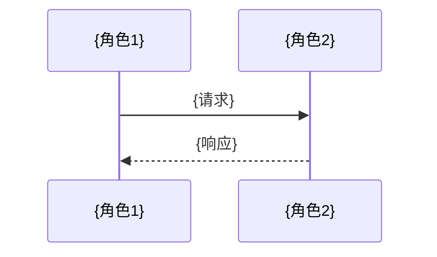

<!--
  专利IDEA评审材料 · Markdown 版页级骨架
  ────────────────────────────────────────────────
  使用说明：
  · 每页之间用分页注释（PAGE BREAK）标记，复制到PPT时按页拆分
  · 单页文字不超过150字（图表除外）
  · 整页配图页采用左图右文：用 HTML 两列表格实现
    （主流MD渲染器如 GitHub / VS Code / Typora 均支持，
     且能完整保留 mermaid 代码块，便于单独复制渲染成图）
  · 本骨架仅为结构示例，生成时按实际内容增删页面
    （Part 1 为 2~3 页，Part 2 为 3~6 页，其余按需）
-->

<!-- ═══════════════ 封面页 ═══════════════ -->

# {专利IDEA名称}

**专利IDEA评审材料**

> {一句话核心定位：面向什么问题、以什么核心手段、达成什么效果}

<!-- PAGE BREAK -->

<!-- ═══════════════ Part 1：发明背景和现有技术（2~3页） ═══════════════ -->

## Part 1：发明背景和现有技术

### P1-1 问题领域宏观背景

{问题产生根源：行业痛点/技术瓶颈/业务需求，≤150字}

<!-- PAGE BREAK -->

### P1-2 现有技术对比与缺陷

| 现有技术 | 出处/技术路线 | 核心机制 | 具体缺陷与不足 |
|---|---|---|---|
| {技术1} | {出处} | {一句话简述} | {具体缺陷} |
| {技术2} | {出处} | {一句话简述} | {具体缺陷} |

{缺陷总结一句 + 过渡引出本发明必要性，≤100字}

<!-- PAGE BREAK -->

### P1-3 技术演进趋势（可选页）

<table>
<tr>
<td width="55%" valign="top">

```mermaid
flowchart LR
    A[{阶段1}] --> B[{阶段2}] --> C[{本发明}]
```

</td>
<td width="45%" valign="top">

1. {演进驱动力}
2. {各阶段局限}
3. {本发明所处的演进位置}

</td>
</tr>
</table>

<!-- PAGE BREAK -->

<!-- ═══════════════ Part 2：本发明技术方案（3~6页） ═══════════════ -->

## Part 2：本发明技术方案

### P2-1 总体逻辑架构（必含）

<table>
<tr>
<td width="55%" valign="top">

```mermaid
flowchart TB
    A[{顶层模块}] --> B[{中层模块1}]
    A --> C[{中层模块2}]
    B --> D[{底层模块}]
```

</td>
<td width="45%" valign="top">

1. {层次/模块划分}
2. {关键模块职责}
3. {模块间关系与数据流}

</td>
</tr>
</table>

<!-- PAGE BREAK -->

### P2-2 关键业务流程时序（必含）

<table>
<tr>
<td width="55%" valign="top">



</td>
<td width="45%" valign="top">

1. {角色与触发条件}
2. {关键交互步骤}
3. {异常/回退路径}

</td>
</tr>
</table>

<!-- PAGE BREAK -->

### P2-3 {核心算法/数据结构/关键模块名称}

<table>
<tr>
<td width="55%" valign="top">

```mermaid
flowchart TB
    %% 按需改用 classDiagram / stateDiagram
    A[{输入}] --> B[{核心处理}]
    B --> C[{输出}]
```

</td>
<td width="45%" valign="top">

1. {输入/输出定义}
2. {核心逻辑步骤}
3. {关键参数/数据结构}

</td>
</tr>
</table>

<!-- 按需增加 P2-4 ~ P2-6，每页聚焦一个技术要点，不混杂 -->

<!-- PAGE BREAK -->

<!-- ═══════════════ Part 3：本发明的技术保护点（1~2页） ═══════════════ -->

## Part 3：本发明的技术保护点

### 保护点1：{保护点名称}

1. **技术特征**：{达到技术效果所依赖的具体技术特征}
2. **创新点**：{区别于现有技术之处，体现新颖性/创造性}
3. **外部表现**：{外部可感知特征：接口行为/交互流程/系统结构}
4. **取证手段**：{若友商使用，可通过抓包/逆向/功能表现等获取证据的方式}

### 保护点2：{保护点名称}

（同上四段式编号列表）

**差异性总结**：本发明与现有技术的最大技术特征差别——{一句话}

<!-- PAGE BREAK -->

<!-- ═══════════════ Part 4：本发明的技术效果（1~2页） ═══════════════ -->

## Part 4：本发明的技术效果

### 问题 → 方案 → 效果 闭环

| 现有技术问题（Part1） | 对应技术方案（Part2） | 产生的技术效果 | 量化指标（如有） |
|---|---|---|---|
| {问题1} | {对应方案/模块} | {效果} | {指标} |
| {问题2} | {对应方案/模块} | {效果} | {指标} |

**因果机制**：
- {效果1}：{为什么该方案能产生该效果——机制说明}
- {效果2}：{机制说明}

<!-- PAGE BREAK -->

<!-- ═══════════════ Part 5：本发明的有益效果（1页） ═══════════════ -->

## Part 5：本发明的有益效果

| 视角 | 正向收益 | 量化预期 |
|---|---|---|
| 🧑 C端用户 | {体验提升、效率改善等} | {如：首Token延迟降低xx%} |
| 🏢 企业用户/服务提供商 | {成本降低、收入增长、运营效率等} | {如：推理成本降低xx%} |
| 🔧 设备提供商 | {硬件适配、生态扩展等；若不适用说明原因} | {量化预期或—} |
