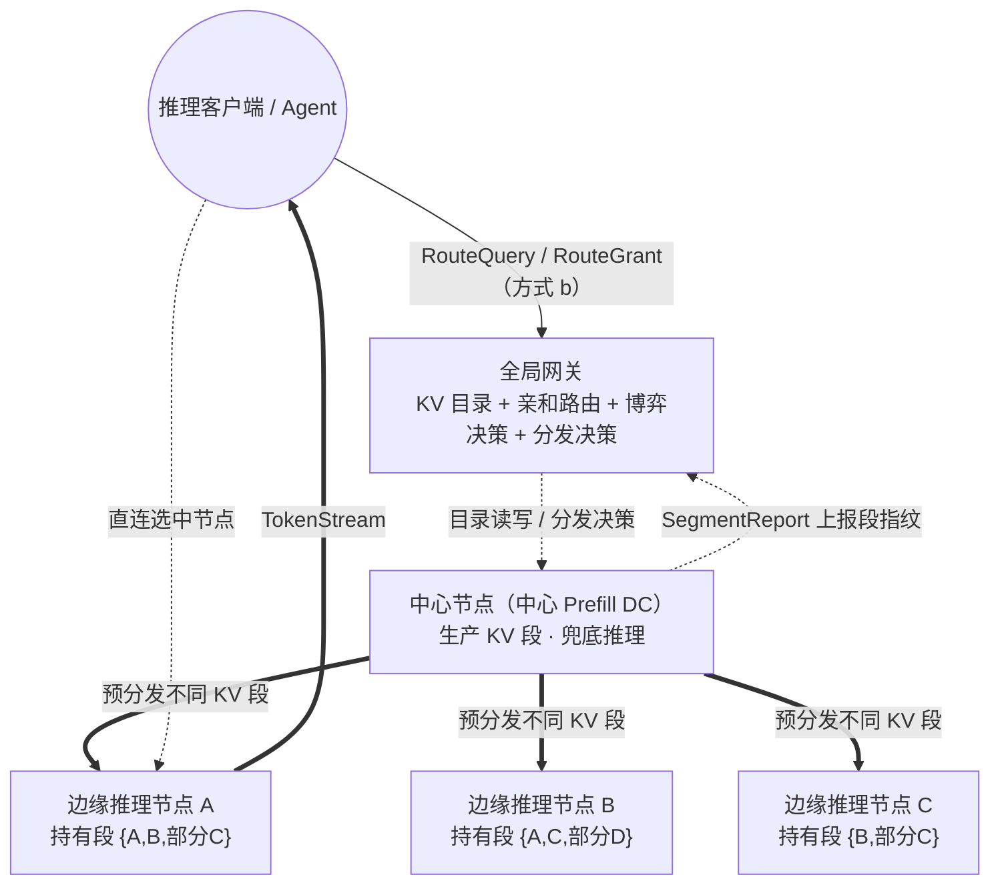
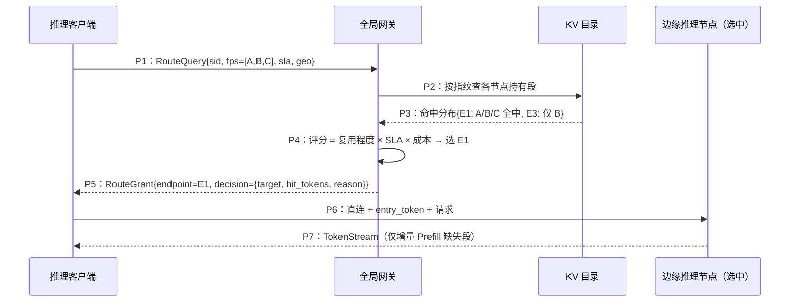
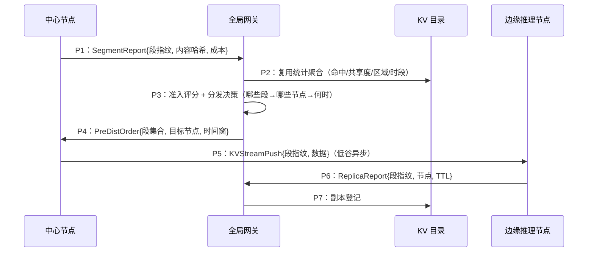
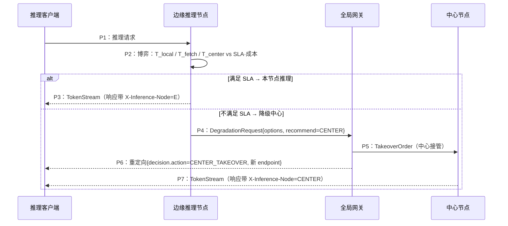

# 技术交底书

**发明名称**：一种基于 KV Cache 可复用推理对象的广域 CDN 分发方法及系统

**关键词**：KV Cache、内容寻址、亲和性路由、分段复用、经济博弈、SLA 降级、广域 CDN、边缘推理节点

---

## 一、技术领域

本发明涉及人工智能推理基础设施与内容分发网络（CDN）的交叉领域，具体涉及大语言模型（LLM）推理过程中的 KV Cache（Key-Value Cache，键值缓存）在广域网络中作为可复用"推理对象"的生成、分段、统计、分发、路由复用与降级调度方法及系统。

---

## 二、背景技术

### 2.1 KV Cache 的背景

Transformer 类大模型在生成（Decode）阶段，每个 token 都要与历史上下文的 Key/Value 向量做注意力计算。为避免每个生成步都重算历史，推理引擎把这些历史 Key/Value 向量缓存下来，即 KV Cache，其体量与上下文长度成正比。

LLM 推理瓶颈已由"计算密集"转向"访存与状态密集"：长上下文推理中 KV 相关内存、传输与重算开销占推理总成本 50% 以上；KV 读写带宽线性增长且每个解码步都要全量触碰，瓶颈从 FLOPs 转移到显存带宽与显存容量（"显存墙"）。

### 2.2 问题根源（三重爆炸）

1. **上下文窗口爆炸**：4K→128K→1M token。以 GQA-70B 模型（每 token 约 320 KB KV）计，100K 上下文单请求 KV 达 32 GB，压缩后仍需约 8 GB；百并发轻易突破 TB 级，远超单卡 HBM（80/144 GB）。
2. **复用浪费爆炸**：多轮对话、系统提示词、RAG、工具定义等存在大量重复前缀，重复 Prefill 造成的算力浪费达 30–70%——"一次计算理应多次消费"。
3. **地理分布爆炸**：全球/全国部署要求就近服务；算力异构（Prefill 吃算力、Decode 吃带宽）导致两类负载天然不在同一机房；区域电价/算力成本差 2–5 倍，时区潮汐造成利用率波动。

当 KV Cache 被逐层挤出单机（显存→内存→SSD→集群→广域网），其核心特征与 1990 年代静态内容分发同构——一个 CDN 问题就此成立。

### 2.3 现有技术及其缺陷

| 现有技术 | 技术路线 | 核心机制 | 具体缺陷与不足 |
|---|---|---|---|
| vLLM PagedAttention / SGLang RadixAttention | 单集群内跨请求前缀复用 | 以"连续 token 序列"为缓存单位，命中即复用 | 限定单 RDMA 域，无法跨地域；缓存单位是完整连续前缀，无法只复用离散高共享片段 |
| 跨 DC Prefill 卸载（PrfaaS 等） | 单向卸载 | 中心算力池集中 Prefill，KV 压缩后经 WAN 传回本地 decode | 是"单向卸载"而非"分发"，无多级缓存/就近服务/多节点差异化分发，无广域路由与复用统计 |
| 同机房分布式内存池（Mooncake 等） | 集群级 KV 池化 | VRAM/DRAM/SSD 三级分层 + 请求触发 Pull | 假设高速稳定网络（100G+ LAN）；平移到 1–10G WAN 时，实时拉取大 KV 为灾难（80s vs 10s 本地重算） |

**缺陷总结**：现有技术要么**跨不了地域**（前缀缓存/内存池），要么**只在单向上传、缺多节点分发与广域调度**（PrfaaS）。没有任何方案把 KV Cache 当作"内容寻址、可按段统计并分发到不同节点、再按 SLA+成本择优路由、并据经济博弈降级"的广域可复用对象。

---

## 三、发明内容

### 3.1 要解决的技术问题

本发明要解决的技术问题是：**在广域、受限且抖动的网络环境下，如何将 LLM 推理的 KV Cache 作为"可复用推理对象"进行跨节点、跨地域的高效共享**，以同时解决——① 显存墙（单请求 KV 突破单卡/单机容量）；② 地理墙（各地域都堆高配 GPU 成本极高）；③ 跨域复用（"连续前缀"粒度无法精细复用离散高共享片段）；④ SLA 稳定（广域带宽抖动下确定性"有缓存就拉"会崩溃）。

### 3.2 技术方案（核心）

总体思路：把 KV Cache 视为**内容寻址、可按段独立寻址与复用的"推理对象"**，在广域 CDN 网络中，以"全局网关 + KV 目录 + 中心节点 + 多个边缘推理节点"的分层结构承载，并以三大创新机制解决上述问题。

**总体架构**（图 1）：

- **中心节点**（中心 Prefill DC）：负责生产 KV 段（Prefill），并作为兜底推理节点；
- **边缘推理节点**：本发明将传统 CDN 中的"区域 POP"与"边缘节点"**合并为同一类节点**，统一称为"边缘推理节点"，负责持有 KV 段副本、就近命中并执行 Decode；
- **全局网关（含 KV 目录）**：唯一读写 KV 目录，承担亲和路由、分段分发决策、经济/SLA 博弈仲裁。

KV Cache 以"段"为单位组织，段以**内容寻址指纹**标识：`fp = hash(兼容性清单 × 段内容)`（兼容性清单绑定模型权重/结构、tokenizer、模板、量化精度、并行布局等）。**不同边缘推理节点可持有不同的 KV 段**（非全量复制）。

#### 创新点一：亲和性路由（方式 b 为主路径）

**要解决的问题**：现有 GSLB 按"地理就近"分配；现有缓存路由（如 Preble）以"延迟最优"为目标、缓存分布当作输入。二者都无法回答"哪个节点对我这个会话/上下文复用最多"。

**方案**：逆转调度方向——**让请求去找数据，而非数据去找请求**。

1. 全局网关维护 KV 目录，目录以段指纹为键，记录"每个段当前驻留在哪些边缘推理节点"。
2. 推理客户端发起请求前，向网关发送 `RouteQuery{会话ID, 上下文各段指纹 fps[], SLA 预算, geo}`。
3. 网关查目录，得到各候选边缘推理节点对本次上下文的**命中段集合与命中 token 数**。
4. 网关按综合评分从候选节点中选取**复用最多、最合适**的节点，评分由三项加权：**复用程度**（命中段总 token / 缺失段重算成本）、**SLA**（首字时延预算、吞吐下限）、**成本**（算力单价、带宽单价）——既非"地理最近"，也非"命中率唯一"。
5. 网关返回 `RouteGrant{目标节点 Endpoint, 授权 token, decision 决策依据}`，**只返回 Endpoint、不代理转发请求**（方式 b，先查后连，为此本发明的默认主路径）；客户端据此直连所选边缘推理节点。
6. 边缘推理节点校验授权后，命中已持有段，仅对缺失段做增量 Prefill，随后 Decode 流式返回。

**消息说明**（`P1`–`P7` 对应图中消息序号；字体约定：新增=加粗、增强=斜体、复用=常规）：

- **P1**：**【新增】`RouteQuery`** —— 推理客户端→全局网关，携带"会话ID、上下文各段指纹 fps[]、SLA 预算、geo"。本专利新增的"先查后连"查询消息，替代"客户端直接连就近节点"的既有行为。
- **P2**：【复用】`目录查询` —— 网关→KV 目录，按段指纹查询各节点持有段，复用内容寻址目录（如 LMCache）的既有查找流程。
- **P3**：【复用】`命中分布返回` —— KV 目录→网关，返回各节点命中的段集合。
- **P4**：**【新增】`综合评分择优选节点`** —— 网关内部决策，按"复用程度 × SLA × 成本"三因子打分，从持有不同段的候选节点中选出复用最多、最合适者——本专利路由决策的核心新增逻辑。
- **P5**：**【新增】`RouteGrant`** —— 网关→客户端，只返回"目标 Endpoint + 授权 token + decision 决策依据"，不代理转发（方式 b 主路径）。
- **P6**：*【增强】`直连 + entry_token`* —— 客户端→边缘推理节点，复用"DNS 解析后直连"模式，增强为携带授权 token（节点离线验签）。
- **P7**：*【增强】`TokenStream`* —— 边缘推理节点→客户端，复用既有解码流式输出，增强为"仅对缺失段做增量 Prefill"（命中段不重算）。

#### 创新点二：基于不同 KV 段的统计复用与分发

**要解决的问题**：现有缓存"什么热门缓存什么"或"全量复制到所有节点"，前者命中率低、后者存储与传输浪费；且缓存单位为"完整连续前缀"，无法按共享度精细取舍。

**方案**：把 KV Cache 从"完整前缀"解耦为"可独立寻址的段"，并据**复用统计**做**差异化分发**。

1. **分段**：一次上下文按共享度划分为若干段（系统提示词段、工具定义段、用户私有文档段、会话历史段等），每段以内容寻址指纹标识。
2. **上报统计**：中心节点生产 KV 段后，向网关上报 `SegmentReport{段指纹, 内容哈希, 生产耗时, 成本}`；网关累计每段的**命中次数、独立会话数（共享度）、区域分布、时段周期**。
3. **准入评分**：对每段计算 `准入评分 = 期望复用收益 − 分级存储成本 − 预期传输成本 − 缝合成本`；评分 >0 且共享度达标（跨会话命中 ≥ 阈值）才纳入分发。
4. **差异化分发决策**：网关据统计决定**哪些段、在什么时间窗口（低谷/预峰前）、分发到哪些边缘推理节点**——**不同节点收到不同的段**（按区域热度、业务归属分配），而非全量复制。
5. **异步预分发**：在夜间/网络低谷窗口执行，把传输从请求关键路径摘除。

**消息说明**（`P1`–`P7` 对应图中消息序号；字体约定同创新点一）：

- **P1**：**【新增】`SegmentReport`** —— 中心节点→网关，上报"段指纹、内容哈希、生产成本"，作为复用统计的原始数据源。
- **P2**：*【增强】`复用统计聚合`* —— 网关→KV 目录，在内容寻址目录上增强"命中次数、独立会话数（共享度）、区域分布、时段周期"统计维度（原目录只存位置，不存复用画像）。
- **P3**：**【新增】`准入评分 + 分发决策`** —— 网关内部，按"准入评分 = 复用收益 − 存储 − 传输 − 缝合"阈值筛选，并决定"哪些段→哪些边缘推理节点→何时"差异化分发。
- **P4**：**【新增】`PreDistOrder`** —— 网关→中心节点，下发"段集合、目标节点列表、时间窗、带宽预算"的分发指令。
- **P5**：【复用】`KVStreamPush` —— 中心节点→边缘推理节点，复用"内容批量下发/预热"（类比 CDN 软件更新式 Push）的既有流程，按段差异推送。
- **P6**：**【新增】`ReplicaReport`** —— 边缘推理节点→网关，回传"段指纹、节点、TTL"副本落位（目录仅网关可写）。
- **P7**：【复用】`副本登记` —— 网关→KV 目录，复用目录登记流程，把新副本位置写回目录。

#### 创新点三：经济与 SLA 博弈后的降级（决策结果外显）

**要解决的问题**：局域网内"有缓存就拉"是确定性逻辑；但广域网带宽抖动、丢包不可预测，一条名义 10 Gbps 链路拥塞时可退化到 0.1 GB/s。确定性拉取会忠实等待 15s 跨域传输，而本地重算只需 1–2s。

**方案**：为每个推理请求引入**经济与 SLA 的实时博弈**，并在博弈后执行两个动作之一——**本节点推理**或**降级由中心节点推理**；且博弈结果**显式写入外部接口，形成可观测的外部特征**。

1. **实时估算三候选耗时**（边缘推理节点在请求到达时/传输中持续评估）：
   - `T_local` = 缺失 token 数 ÷ 本地 Prefill 吞吐 + 本地排队（本地重算）；
   - `T_fetch` = 固定开销 + 缺失 KV 字节 ÷（实测带宽 × 压缩比）+ 解压 + 缝合（跨节点拉段）；
   - `T_center` = 到中心 RTT + 中心排队 + 部分 KV 上传 + 中心补算（降级中心接管）。
2. **博弈**：以 SLA 预算（首字时延、吞吐下限）与成本为约束，选取三候选中的最优者。
3. **动作**：
   - 若 `T_local` 或 `T_fetch` 满足 SLA 且成本划算 → **本节点推理**；
   - 否则 → 边缘推理节点向网关发起 `DegradationRequest{三候选评估, 建议}`，网关仲裁后向中心节点下发 `TakeoverOrder`，**降级由中心节点完成推理**。
4. **决策外显（外部特征）**：无论走哪条路径，博弈结果都以可观测形式写入外部接口：
   - 路由应答/推理响应携带 `decision.action ∈ {LOCAL, CENTER_TAKEOVER}`；
   - 推理响应头携带 `X-Inference-Node`（实际执行推理的节点标识）；
   - 降级时下发流迁移重定向（新 Endpoint + resume_token）。

据此，友商若采用本方案，通过抓包或观测接口即可取得"某请求被路由到非就近节点""某请求被中心接管"等外部特征，构成可举证证据。

**消息说明**（`P1`–`P7` 对应图中消息序号；字体约定同创新点一）：

- **P1**：【复用】`推理请求` —— 客户端→边缘推理节点，复用既有推理请求流程。
- **P2**：**【新增】`博弈评估`** —— 边缘推理节点内部，实时估算 T_local / T_fetch / T_center 三候选耗时，对照 SLA 预算与成本择优——本专利新增的"经济+SLA 博弈"决策逻辑。
- **P3**：*【增强】`本节点推理 TokenStream`* —— 边缘推理节点→客户端，复用既有解码流，增强为响应头携带 `X-Inference-Node=本节点`、`decision.action=LOCAL` 外显字段。
- **P4**：**【新增】`DegradationRequest`** —— 边缘推理节点→网关，上报"三候选评估 + 建议降级 CENTER"，请求仲裁。
- **P5**：**【新增】`TakeoverOrder`** —— 网关→中心节点，下发接管指令（含缺失段、增量补算方式）。
- **P6**：**【新增】`降级重定向 + decision.action=CENTER_TAKEOVER`** —— 网关→客户端，下发流迁移重定向（新 Endpoint + resume_token）并外显博弈结果——外显机制本身为本专利新增，是核心取证点。
- **P7**：*【增强】`中心推理 TokenStream`* —— 中心节点→客户端，复用解码流，增强为响应头 `X-Inference-Node=CENTER`。

### 3.3 有益效果

1. **跨域硬传清零、TTFT 大幅下降**：亲和路由用 KB 级路由决策替代 GB 级跨域传输，命中时 TTFT 从 10s 级压到 1–2s 级；较 1Gbps 公网硬传（80s）提升数十倍。
2. **复用算力、降低 TCO**：分段统计分发只推高共享段，多次命中摊薄一次 Prefill，复用浪费降低 30–70%；中心集中承担昂贵 Prefill、边缘用低成本硬件就近 Decode。
3. **广域 SLA 稳定**：经济/SLA 博弈为不可靠广域网兜底——每次跨域动作先算账，划算才拉/才存，否则本地重算或中心接管，宁可重算绝不硬等。
4. **可举证**：三大创新点的决策结果均显式暴露于外部接口，便于侵权判定与取证。

---

## 四、附图说明

- **图 1**：总体逻辑架构图（中心节点 + 边缘推理节点 + 全局网关/KV 目录）；
- **图 2**：创新点一亲和性路由时序图（方式 b 主路径）；
- **图 3**：创新点二分段统计复用与分发时序图；
- **图 4**：创新点三经济/SLA 博弈与降级时序图（含外部特征）。

---

## 五、具体实施方式（可复现实施）

**系统组成**：全局网关（含 KV 目录、路由模块、分发模块、仲裁模块）、至少一个中心节点、多个边缘推理节点；物理上边缘推理节点合并了"区域 POP 与边缘"。

**实施一（亲和路由）**：客户端维护会话 ID 与上下文各段指纹；请求前调 `RouteQuery`；网关查目录得各节点命中段集合，按 `score = w1·复用程度 + w2·(SLA 满足度) + w3·(成本倒数)` 排序取最高者；返回 `RouteGrant{endpoint, entry_token(JWT 含会话/节点/过期), decision}`；客户端直连；节点离线验签、增量 Prefill 缺失段。

**实施二（分段统计分发）**：中心 Prefill 后按共享度切段、算指纹，上报 `SegmentReport`；网关按指纹聚合"命中次数/独立会话数/区域/小时直方图"，计算准入评分；达标段进入分发计划（含目标节点列表、时间窗口、带宽预算），低谷异步推送到指定边缘推理节点，节点落盘后用 `ReplicaReport` 回传、网关写目录。

**实施三（博弈降级）**：边缘推理节点对每个请求评估 `T_local/T_fetch/T_center`；若本地/拉段满足 SLA 则本节点推理并回传（响应头 `X-Inference-Node=本节点`，`decision.action=LOCAL`）；否则 `DegradationRequest` 上报网关 → 网关 `TakeoverOrder` 中心 → 中心增量接管后流式返回（`decision.action=CENTER_TAKEOVER`、`X-Inference-Node=中心`），或向客户端下发流迁移重定向。

---

## 六、技术保护点汇总（供权利要求参考）

1. **亲和性路由方法**：以段指纹为索引的全局 KV 目录；按"复用程度 × SLA × 成本"从持有不同段的节点中选取复用最多、最合适者；先查后连（网关只返 Endpoint，客户端直连）；RouteGrant 携带 `decision` 决策依据字段。
2. **分段统计复用与分发方法**：把 KV 按共享度切段、内容寻址；按命中/共享度/区域/时段做复用统计；准入评分阈值筛选；差异化地把不同段分发给不同边缘推理节点（低谷异步预分发）。
3. **经济/SLA 博弈与降级方法**：对每个请求实时估算 T_local/T_fetch/T_center 博弈，SLA+成本约束下本节点推理或经仲裁降级中心推理；博弈结果外显（`decision.action`、`X-Inference-Node`、流迁移重定向），形成可取证外部特征。

---

> 注：本交底书为初稿，正式提交前请专利代理人复核；量化指标为依据现有论文与测算的预期值，不作为专利授权承诺。