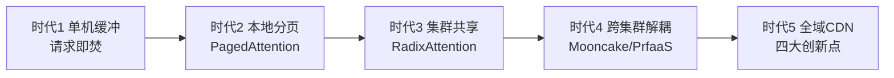
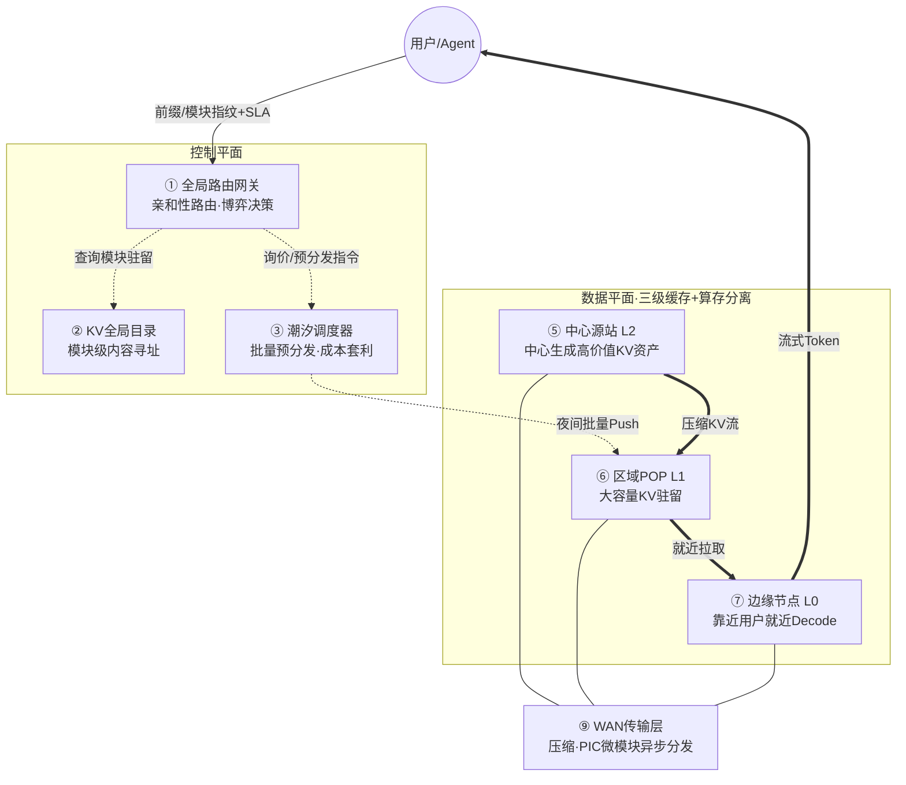
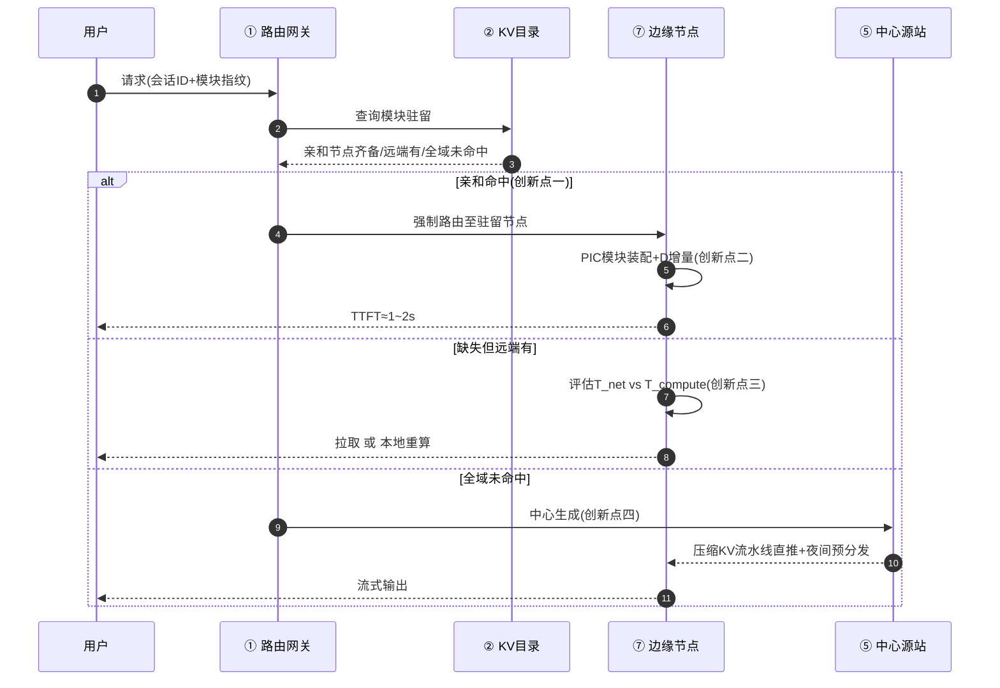
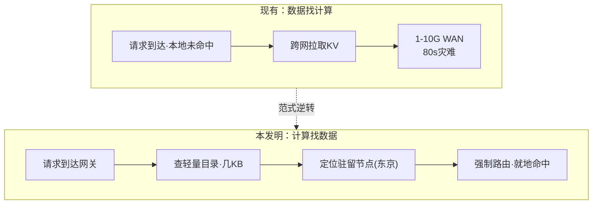
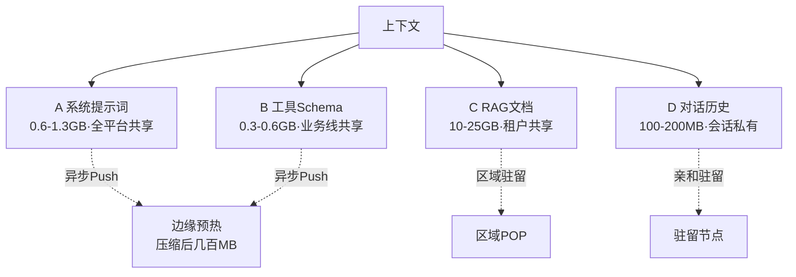
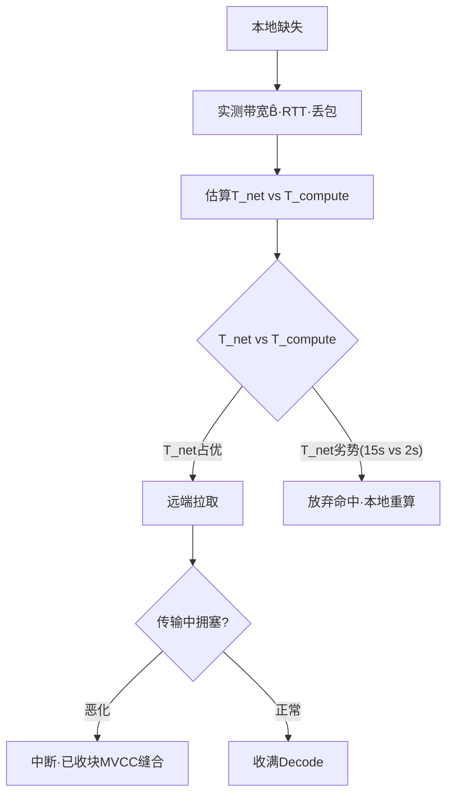
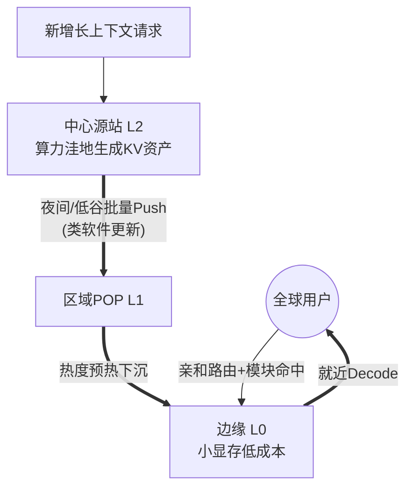

<!--
  KV Cache CDN 解决方案 · 专利IDEA评审材料（Markdown 版）
  · 每页以 PAGE BREAK 注释分隔，复制到PPT时按页拆分
  · 单页文字 ≤150字（图表除外）
  · 整页配图页采用左图右文：HTML 两列表格模拟
  · 图表统一使用 Mermaid 语法
-->

<!-- ═══════════════ 封面页 ═══════════════ -->

# KV Cache CDN 解决方案

**专利IDEA评审材料**

> 面向广域网环境下 KV Cache 跨请求复用与跨地域分发的难题，以四大范式重构——缓存亲和性路由、PIC 微模块异步分发、经济博弈自适应降级、算存地理分离——将 KV Cache 从"单集群内存管理"升级为"全球分布式状态共享网络"。

<!-- PAGE BREAK -->

<!-- ═══════════════ Part 1：发明背景和现有技术（3页） ═══════════════ -->

## Part 1：发明背景和现有技术

### P1-1 问题领域宏观背景

1. **Prefill 计算瓶颈**：复杂度 O(L²)，长上下文下 Prefill 占满 GPU 算力、推高 TTFT，限制 MaaS 平台吞吐与响应
2. **PD 分离跨域鸿沟**：PD 分离向跨 DC/WAN 演进，KV Cache 体量达文本数万倍且难压缩，跨域传输成本反超本地重算，物理与经济双重鸿沟
3. **全局复用错配**：海量并发依赖少数基座模型，重复 Prefill 普遍；Prefix Cache/Radix Tree 困于单机单 DC"缓存孤岛"，全局复用潜力无法兑现

<!-- PAGE BREAK -->

### P1-2 现有技术对比与缺陷

| 现有技术 | 出处/技术路线 | 核心机制 | 具体缺陷与不足 |
|---|---|---|---|
| 本地内存池 / 同机房 RDMA | vLLM / SGLang / Mooncake | 请求触发后节点主动 Pull 拉取 KV | 假设 100G+ LAN 稳定带宽，1–10G WAN 下 Pull 是死路 |
| 完整会话 / 连续前缀缓存 | Prefix Cache / RadixAttention | 缓存基本单位为连续 Token 序列 | "铁板一块"粒度，无法只传值得传的高共享部分 |
| 算存同机房强耦合部署 | 业界惯例 | 计算与缓存同机房/机架绑定 | 每地域堆高配 GPU、数据孤岛，CapEx 随地域线性膨胀 |

上述方案在调度方向、数据形态、未命中策略、部署拓扑四个维度均以"局域网"为前提，未围绕广域网物理局限重构——这正是本发明必要性所在。

<!-- PAGE BREAK -->

### P1-3 技术演进趋势

<table>
<tr>
<td width="55%" valign="top">

</td>
<td width="45%" valign="top">

1. 演进驱动力：上下文爆炸、算力异构、地理分布三重推动
2. 各代局限：共享范围逐代扩大，但仍以"局域网拉取+完整缓存"为前提
3. 本发明位置：时代5，以四大范式围绕广域网物理局限重构

</td>
</tr>
</table>

<!-- PAGE BREAK -->

<!-- ═══════════════ Part 2：本发明技术方案（7页，核心） ═══════════════ -->

## Part 2：本发明技术方案

### P2-1 总体逻辑架构

<table>
<tr>
<td width="55%" valign="top">

</td>
<td width="45%" valign="top">

1. 控制平面：路由网关（亲和路由+博弈）、KV目录（模块寻址）、潮汐调度（批量预分发）
2. 数据平面：中心源站（生成）/区域POP（驻留）/边缘（就近解码）三级，算存地理分离
3. WAN传输层：压缩+PIC微模块，承载全部 KV 数据流

</td>
</tr>
</table>

<!-- PAGE BREAK -->

### P2-2 本发明方案定位（两维对比）

本发明复用内容 CDN 三十年方法论、平移到 KV Cache，同时以四大范式区别于现有推理方案。

**对比一：本方案 vs 传统 CDN 方案**（内容 CDN 方法的 KV 语义平移）

| 传统 CDN | 本方案对应部件 | 关键差异（KV 特有） |
|---|---|---|
| 智能 DNS / GSLB | 全局路由网关 + KV 目录 | 路由依据从"地理位置"变为"前缀指纹 × 成本 × SLA × 潮汐" |
| 源站（Origin） | 中心 Prefill DC | 回源代价从带宽变为 GPU 算力（贵 100–1000×） |
| 边缘 POP | 区域 / 边缘节点 | 缓存对象是模型绑定张量（须匹配模型/tokenizer/LoRA） |
| 回源拉取 | 远端 Prefill 或 KV 传输 | 可压缩（3.5–4.3×）、可前缀部分命中 |
| 内容预热 | 潮汐调度预分发 | 预热的是"计算结果"——预热即预计算 |
| 缓存失效 | 版本/租户策略失效 | 失效键 = 模型 + tokenizer + LoRA 指纹 |

**对比二：本方案 vs 现有推理方案**（六维降维打击）

| 维度 | 现有推理方案（本地 HBM / 同机房 RDMA） | 本方案（KV Cache CDN） |
|---|---|---|
| 核心假设 | 网络带宽充足且稳定（100G+ LAN） | 网络带宽受限且存在抖动（1–10G WAN） |
| 数据移动方向 | 请求触发后节点主动拉取（Pull） | 后台异步推送（Push）+ 网关智能路由 |
| 缓存粒度 | 完整会话或长连续 Prefix | 基于 PIC 的独立微模块（System/Tools） |
| 未命中策略 | 本地 GPU 重新计算 | 动态博弈：T_net vs T_compute 择优执行 |
| 拓扑结构 | 算存强耦合（单机房内） | 算存地理分离（中心生成预热、边缘低成本服务） |
| 核心壁垒 | 硬件堆叠（大内存、RDMA 网卡） | 调度算法、数据压缩/拆解技术、异步工程化 |

<!-- PAGE BREAK -->

### P2-3 关键业务流程时序

<table>
<tr>
<td width="55%" valign="top">

</td>
<td width="45%" valign="top">

1. 触发：用户提交带会话ID与模块指纹的推理请求
2. 三条路径：亲和命中就地装配；缺失则博弈择优；全域未命中则中心生成
3. 回退：博弈判定不划算时，降级至本地重算 Prefill

</td>
</tr>
</table>

<!-- PAGE BREAK -->

### P2-4 创新点一：缓存亲和性路由（计算找数据）

<table>
<tr>
<td width="55%" valign="top">

</td>
<td width="45%" valign="top">

1. 机制：网关维护全局 KV 目录，查询历史会话 KV 驻留节点后强制路由
2. 价值：几 KB 路由决策替代几 GB 跨域传输
3. 边界：驻留节点故障时降级为就近+增量重算，亚秒级可承受

</td>
</tr>
</table>

<!-- PAGE BREAK -->

### P2-5 创新点二：PIC 微模块分解与异步分发

<table>
<tr>
<td width="55%" valign="top">

</td>
<td width="45%" valign="top">

1. 分解：按共享度拆为 A/B/C/D 四类独立寻址模块
2. 分发：仅异步后台分发高共享的 A/B（1–2GB→压缩后几百MB）
3. 收益：请求时仅缺 D 增量，WAN 传输由 80s 压到 1–2s/零感知

</td>
</tr>
</table>

<!-- PAGE BREAK -->

### P2-6 创新点三：经济博弈自适应降级决策引擎

<table>
<tr>
<td width="55%" valign="top">

</td>
<td width="45%" valign="top">

1. 机制：拉取前用 EWMA 实测带宽估计 T_net，与 T_compute 实时比较
2. 决策：拥塞时果断放弃缓存命中、本地重算（宁可重算绝不死等）
3. 加固：AIMD 拉取预算窗口 + 迟滞带防抖 + 传输中中断缝合

</td>
</tr>
</table>

<!-- PAGE BREAK -->

### P2-7 创新点四：算存地理分离的中心预热拓扑

<table>
<tr>
<td width="55%" valign="top">

</td>
<td width="45%" valign="top">

1. 解耦：KV 生成（中心 Prefill DC）与推理服务（边缘 Decode）地理解耦
2. 预热：夜间/低谷把高价值 KV 资产批量推送到边缘 SSD/MemoryPool
3. 收益：边缘只需小显存，全球扩张 CapEx 随地域数非线性下降

</td>
</tr>
</table>

<!-- PAGE BREAK -->

<!-- ═══════════════ Part 3：本发明的技术保护点（2页） ═══════════════ -->

## Part 3：本发明的技术保护点

### 保护点1：缓存亲和性路由（计算找数据）

1. **技术特征**：网关维护"模块/会话→驻留节点"全局目录，请求按驻留位置而非地理就近强制路由。
2. **创新点**：调度由"数据找计算(Pull)"逆转为"计算找数据(Routing)"，几 KB 决策替代 GB 级传输。
3. **外部表现**：同用户连续请求固定路由至驻留节点；网关对外暴露"模块驻留查询"接口。
4. **取证手段**：抓包见含会话指纹与目标节点标识的路由决策报文。

### 保护点2：PIC 微模块分解与异步分发

1. **技术特征**：上下文按共享度拆为 A/B/C/D 独立寻址模块，仅异步分发高共享 A/B 至边缘。
2. **创新点**：缓存粒度由"完整会话"重构为"PIC 微模块"，同步传输变后台异步分发。
3. **外部表现**：边缘预置 A/B 副本；请求仅补传 D 增量 100–200MB。
4. **取证手段**：抓包见模块级块 ID 与异步批量预分发流量。

<!-- PAGE BREAK -->

### 保护点3：T_net vs T_compute 自适应降级引擎

1. **技术特征**：以 EWMA 实测带宽估算 T_net 并与 T_compute 实时比较，拥塞时放弃命中、本地重算。
2. **创新点**：缓存命中由确定性逻辑变为动态博弈，类 TCP 的 AIMD 预算窗口 + 迟滞带防抖。
3. **外部表现**：同缺失条件下，拥塞时本地重算、畅通时远端拉取，决策随实时网络状态变化。
4. **取证手段**：抓包见拉取/重算路径切换随链路状态变化；逆向网关可证比较逻辑存在。

### 保护点4：算存地理分离的中心预热拓扑

1. **技术特征**：KV 生成（中心）与推理服务（边缘）地理解耦，夜间批量推送高价值 KV 资产至边缘。
2. **创新点**：打破算存同机房强耦合，实现"中心预热、边缘低成本推理"。
3. **外部表现**：边缘显存规格显著小于中心；夜间存在中心→边缘批量推送流量。
4. **取证手段**：观测拓扑（中心与边缘分离）与低谷批量推送模式，对比边缘硬件与能力。

**差异性总结**：现有技术以"拉取+完整缓存+确定性读+算存耦合"为特征，本发明以"路由+微模块+经济博弈+算存分离"四维范式重构，把 KV Cache 升级为全球分布式状态共享网络。

<!-- PAGE BREAK -->

<!-- ═══════════════ Part 4：本发明的技术效果（1页） ═══════════════ -->

## Part 4：本发明的技术效果

### 问题 → 方案 → 效果 闭环

| 现有技术问题（Part1） | 对应技术方案（Part2） | 产生的技术效果 | 量化指标 |
|---|---|---|---|
| 广域硬传几十 GB KV 需数十秒 | 亲和路由 + PIC 微模块异步分发 | 跨域传输从请求关键路径摘除 | 80s → 1–2s → 零感知 |
| 完整会话无法跨位置独立复用 | PIC 微模块分解 A/B/C/D | 只分发高共享小体量模块 | A/B 1–2GB → 压缩后几百 MB |
| 确定性读缓存在 WAN 失效 | 经济博弈决策引擎 | 拥塞时果断本地重算保 SLA | T_net 15s vs T_compute 2s 时 SLA 不崩 |
| 算存强耦合每地域高配 GPU | 算存分离中心预热 | 边缘小显存服务、CapEx 下降 | TCO −30%~−45% |

**因果机制**：
- 延迟：亲和路由消灭请求触发的跨域传输，微模块把必须跨域的压到可异步分发的规模，故 WAN 传输从 80s 压到 1–2s。
- 复用：PIC 把 KV 与位置/上下文解绑，相同语义块跨模板独立寻址，实现一次 Prefill 多次消费。
- 容错：博弈引擎用实测带宽做实时经济学论证，遇拥塞退回本地，SLA 不被网络拖垮。
- 成本：中心赚算力规模的钱、边缘赚命中的钱、传输赚低谷的钱，三者叠加使 TCO 下降。

<!-- PAGE BREAK -->

<!-- ═══════════════ Part 5：本发明的有益效果（1页） ═══════════════ -->

## Part 5：本发明的有益效果

| 视角 | 正向收益 | 量化预期 |
|---|---|---|
| 🧑 C端用户 | 首Token延迟降低、长上下文对话更流畅、多轮 Agent 响应更快 | 首Token延迟降 50–90%（P90 TTFT −64%），长会话每 token 延迟降约 90ms |
| 🏢 企业用户/服务提供商 | 推理算力成本下降、吞吐提升、跨区域服务能力增强 | 推理 TCO 降 30–45%，吞吐 +54%，同硬件多处理 115% 请求 |
| 🔧 设备提供商 | SmartNIC/DPU 传输卸载、CXL 内存池、Prefill 专用芯片新需求 | 开辟 KV 分发新市场，拉动 DPU/内存池/专用芯片与边缘小显存卡出货 |