# KV Cache CDN 完整解决方案构想报告

**版本**：完整版
**日期**：2026 年 9 月
**性质**：解决方案构想（Solution Vision）——面向长上下文与多模型 Agent 时代的 LLM 推理基础设施
**参考文献**：[P1]–[P16]（16 篇核心论文，附录 D 列全）

---

## 0. 导读：破除一个误区

### 0.1 一个必须首先破除的思维误区

重新审视 KV Cache CDN 方案，必须首先破除一个常见的思维误区：**KV Cache CDN 的核心创新，绝对不是"在低速的广域网（WAN）上实时硬传几十 GB 的完整 KV Cache"**。如果这样做，正如 §1.4.3 的测算所示，只会带来灾难性的延迟——100K 上下文（GQA-70B，32 GB KV，压缩后 8 GB）在 1 Gbps 公网上需要约 80 秒才能传完，是本地重算（10 秒）的 8 倍。

KV Cache CDN 相对于现有方案（本地 HBM、本地 CPU Memory Pool、本地 SSD、同机房 RDMA 分布式内存池）的真正创新，在于它引发了一场**"架构范式"的转变**：它不再试图用网络带宽去对抗物理定律，而是通过**调度逻辑、数据形态、经济模型与部署拓扑**的重构，来解决广域分布下的状态共享问题。

| 常见误区 | 本方案的真相 | 关键数字 |
|---|---|---|
| 在 WAN 上实时硬传完整 KV Cache | 亲和性路由：让请求去找数据，而非数据去找请求 | 几 KB 路由决策替代几 GB 跨域传输 |
| 缓存单位是完整会话/连续前缀 | PIC 微模块：只异步分发高共享模块 | 1–2 GB → 压缩后仅几百 MB |
| 有缓存命中就一定要读 | 经济博弈：实时评估拉取 vs 重算，择优执行 | 拥塞时 T_net 15 s vs T_compute 1–2 s，果断重算 |
| 每个地域都要堆高配 GPU 集群 | 算存分离：中心生成/预热，边缘低成本服务 | 完整形态 TCO −30% ~ −45% |

### 0.2 真正的创新：架构范式的转变

四大创新点总览（逐一深度解析见 §2–§5，六维总对比见 §8.1）：

| # | 创新点 | 范式转变 | 一句话机制 | 关键收益 |
|---|---|---|---|---|
| 一 | 调度范式逆转 | 数据找计算（Pull）→ 计算找数据（Routing） | 网关查全局 KV 目录，强制路由到缓存驻留节点 | 用几 KB 路由决策替代几 GB 跨域传输 |
| 二 | 数据形态重构 | 完整会话缓存 → PIC 微模块异步分发 | 上下文解耦为独立寻址模块，仅异步分发高共享部分 | 广域传输从几十秒压缩到 1–2 秒甚至零感知 |
| 三 | 经济博弈降级 | 确定性读缓存 → 动态博弈决策 | 实时评估 T_net vs T_compute，择优执行 | 恶劣网络下 SLA 不崩溃（宁可重算，绝不死等） |
| 四 | 部署拓扑解耦 | 算存强耦合同机房 → 全球算存分离 | 中心生成高价值 KV 资产，低谷期批量推送边缘 | 边缘只需小显存，全球扩张 CapEx 大幅下降 |

### 0.3 报告结构与阅读地图

本报告以四大创新点为主线组织：**§1** 给出问题背景、核心结论与全部可行性测算——其中"拉取 vs 重算"判据（§1.4）是创新点三的数学基础；**§2–§5** 逐一深度解析四大创新点（机制、量化价值、支撑技术、边界与风险）；**§6** 将四大创新点集成为总体架构、部件清单与关键流程；**§7** 给出挑战全景、框架生态与开放问题；**§8** 结论。演进史、四轴分类学与论文图谱归位至附录 A–C。

---

## 1. 问题背景、核心结论与可行性

### 1.1 为什么 KV Cache 变成了 CDN 的问题

大模型推理的瓶颈已经从"计算密集"全面转向"访存与状态密集"：长上下文推理中，KV 相关的内存开销、传输开销与重算成本**占推理总成本 50% 以上**；Attention 计算量随上下文平方增长，而 KV 的读写带宽线性增长且每个解码步都要全量触碰——瓶颈从 FLOPs 转移到内存带宽与显存容量（"显存墙"）。

三重爆炸把 KV Cache 逐层挤出单机：

1. **上下文窗口爆炸**：4K → 128K → 1M+（Kimi 200 万、Gemini 1000 万 token）。70B 级模型单请求 KV 从百 MB 膨胀至上百 GB（见 §1.4.2 密度表），百并发轻松突破 TB 级，远超单卡 HBM（80/144 GB）。
2. **复用浪费爆炸**：多轮对话、RAG、系统提示词场景存在大量重复前缀，重复 Prefill 造成的算力浪费达 30–70% [P2]。"一次计算、多次消费"——这正是 CDN 的经典经济学。
3. **地理分布爆炸**：全球/全国部署要求就近服务；算力异构（Prefill 吃算力、Decode 吃带宽，最优芯片不同）导致两类负载天然不在同一机房；不同区域电价与算力成本差 2–5×，时区潮汐造成利用率日内波动。

当缓存被逐层挤出单机——GPU 显存 → CPU DRAM → NVMe → RDMA 集群 → 广域网——它的核心特征与 1990 年代的静态内容分发完全同构，一个 CDN 问题就此成立。但要强调的是：**问题成立，不等于"用带宽硬传"的解法成立**——正确的解法是本报告 §2–§5 的范式重构。

### 1.2 核心论点与本质同构

**核心论点**：当 KV Cache 的体量（百 GB/请求）、成本（占推理总成本 50%+）、复用价值（前缀复用率 30–70%）和地理跨度（跨集群、跨地域、跨时区）同时突破单机与单集群边界时，它就不再是一个引擎内的内存管理问题，而是一个**内容分发网络（CDN）问题**。KV Cache 是大模型时代的"静态网页和视频流"。而本报告进一步明确：解决这个 CDN 问题的正确姿势，不是对抗广域网带宽，而是**围绕广域网的物理局限，重构系统的调度逻辑（§2）、数据形态（§3）、经济模型（§4）与部署拓扑（§5）**。

KV Cache 与传统静态内容的本质同构（及关键差异）：

| 维度 | 传统静态内容 CDN | KV Cache CDN |
|---|---|---|
| 内容属性 | 静态独立文件 | 模型绑定张量，须匹配模型版本、tokenizer、位置编码、LoRA |
| 增长特性 | 完整文件分发 | 增量追加：前缀复用、后缀持续生成 |
| 匹配粒度 | URL 完整匹配 | 前缀/语义块部分匹配，公共前缀越长收益越大 |
| 错误影响 | 404 / 文件损坏 | **静默的生成质量劣化、逻辑错乱、输出不可控** |
| 回源代价 | 仅带宽成本（拉文件） | 算力 + 时间成本极高（重跑 Prefill） |

回源代价不对称是关键：传统 CDN 未命中的代价只是带宽，KV CDN 未命中的代价是昂贵的 GPU 计算——**这使缓存命中的经济学价值更强，也使错误容忍度更低**。此外，全球算力分布极度不均（北美/东亚密集 vs 全球海量闲置消费级 GPU），把 KV 视为 CDN 资产还能通过 P2P 网络"吸附"长尾算力，形成 DC 骨干 + P2P 毛细血管的双层结构（部件⑧，见 §6.2）。

### 1.3 业界研究热点与技术演进方向

截至 2026 年 9 月，五个热点构成清晰的研究梯度：

1. **PD 分离已从论文变为默认架构**。DistServe [P4] 与 Splitwise [P5] 确立的 Prefill/Decode 分离，已被 NVIDIA Dynamo、llm-d、Ray Serve LLM 等全面采纳；DistServe 作者在 2025-11 回顾文章中公开承认"disaggregation 已成默认 playbook"。
2. **集群级 KV 池化进入生产**。Mooncake [P6]（FAST'25 最佳论文，VRAM/DRAM/SSD 三级分层 + KVCache-centric 调度，生产实测多处理 115% 请求）、MemServe [P10]、Preble [P12]（已被 AIBrix 采用）完成集群内闭环。
3. **KV 的"网络层"正在成型**。CacheGen [P7] 首次把 KV 当作网络流做专用压缩（3.5–4.3×）；EPIC [P9] 的位置无关缓存（PIC）打破"前缀必须从头匹配"的限制；ShadowServe [P15] 用 SmartNIC 把解压卸载到网卡，实现零干扰传输。
4. **跨数据中心是 2026 年的绝对前沿**。PrfaaS [P13] 完成业界首个跨 DC Prefill 卸载的产业级 PoC（吞吐 +54%，P90 TTFT −64%）；*An Internet for the KV Cache* [P14] 提出以 CDN 方法论重构 LLM 推理的纲领性愿景。
5. **模型架构与系统协同设计成为胜负手**。Kimi Linear 类混合注意力架构把 KV 生成/传输吞吐降低 4–36 倍，使跨机房传输从"百 G 专线专属"降级为"普通以太网即可承载"——PrfaaS 的全部底气来源于此。

**技术演进方向**（五个"从…到…"）：

| # | 方向 | 说明 |
|---|------|------|
| 1 | 从单向卸载到双向分发 | PrfaaS 式单向上行 → 多级缓存、双向流转的完整 CDN |
| 2 | 从性能优先到成本优先 | 初期拼吞吐与延迟，成熟期转向全局 TCO 优化与算力套利 |
| 3 | 从同构到异构协同 | Prefill 专用芯片（Rubin CPX）、高带宽解码芯片、CXL 内存池、DPU 各司其职 |
| 4 | 从单模型到多模型共享 | DroidSpeak [P11] 打通跨 LLM 关键层复用，支撑多模型 Agent |
| 5 | 从闭域到开放互联 | 单厂商内部 CDN → 标准化、可互通的"KV 缓存互联网" |

### 1.4 何时从远端拉取 KV 比本地重算更合适（含计算过程）

> 本节给出离线判据与全部测算，是**创新点三（§4）动态博弈引擎的数学基础**——§4 将本节的静态判据运行时化（T_fetch 在 §4 中记为 T_net，带宽 B 由实测估计 B̂ 替代）。

#### 1.4.1 决策模型

设上下文长度为 **L**（token 数），每 token 的 KV 字节数为 **s**，可用广域带宽为 **B**（字节/秒），压缩率为 **C**，本地 Prefill 吞吐为 **R**（token/秒），控制面与建链的固定开销为 **T₀**（秒）：

```
T_fetch      =  T₀  +  s·L / (B·C)                T_recompute  =  L / R  +  T_queue
（远端拉取）         （传输线性项）                （本地重算）      （计算线性项）
```

**远端拉取占优的充要条件**：

```
B·C  >  s·R          且          L  >  L*  =  T₀ / ( 1/R  −  s/(B·C) )
```

这条判据揭示了三个本质规律：

- **上下文长度无关的"密度竞争"**：两个时间都随 L 线性增长，胜负由 **"带宽×压缩积"（B·C，字节搬运能力）对"字节×算力积"（s·R，字节生成能力）** 的比值决定，与 L 本身无关；
- **临界上下文长度 L\***：固定开销 T₀ 只能靠长度摊销——短上下文必属本地，长上下文才有跨机房价值；
- **模型架构是第一杠杆**：s 缩小 10 倍（混合注意力架构），比带宽扩容 10 倍更便宜、更可控。

#### 1.4.2 基础参数（KV 密度表）

每 token KV 字节数 **s = 2（K 与 V）× 层数 × KV 头数 × 头维度 × 每元素字节数**（FP16/BF16 按 2 字节计）：

| 模型架构 | 机制 | s（每 token KV） | 100K 上下文 | 1M 上下文 |
|---|---|---|---|---|
| 70B 级 MHA（无 GQA，64 KV 头 × 80 层） | 全注意力 | 2.5 MB | 250 GB | 2.5 TB |
| Llama-3-70B（GQA：8 KV 头 × 80 层 × 128 维） | 分组查询 | **320 KB** | 32 GB | 320 GB |
| Llama-3.1-405B（GQA：8 × 126 层） | 分组查询 | 504 KB | 49 GB | 490 GB |
| DeepSeek-V3 级 MLA（576 维潜在 × 61 层） | 潜在压缩 | 69 KB | 6.6 GB | 66 GB |
| Kimi Linear 级混合（线性注意力 + 少量 MLA 层） | 混合架构 | ~20–70 KB（有效） | 2–7 GB | 20–70 GB |

**本地重算基线**：8×H100 节点（TP=8）Prefill 吞吐 R ≈ 10,000 token/s（70B 密集模型，保守 MFU），故 **s·R（GQA-70B）= 320 KB × 10K/s = 3.2 GB/s**。

**网络档位**（有效吞吐）：100 Gbps 专线 ≈ 10 GB/s；10 Gbps ≈ 1.2 GB/s；1 Gbps 公网 ≈ 0.1 GB/s。CacheGen 压缩 C ≈ 4（3.5–4.3×）。

#### 1.4.3 时间维度测算（100K 上下文，GQA-70B，32 GB KV）

| 路径 | 计算过程 | TTFT | 对比本地重算 |
|---|---|---|---|
| 本地重算（8×H100） | 100K ÷ 10K/s | **10.0 s** | 基线（兜底路径） |
| 100 Gbps 专线拉取 + CacheGen 4× | 8 GB ÷ 10 GB/s + ~0.1 s（RTT+建链+排队） | **~0.9 s** | ✅ **11× 更快** |
| 10 Gbps 拉取 + 4× 压缩 | 8 GB ÷ 1.2 GB/s + 0.1 s | **~6.8 s** | ✅ 1.5×（边际） |
| 1 Gbps 公网 + 4× 压缩 | 8 GB ÷ 0.1 GB/s | ~80 s | ❌ 差 8× |
| 1 Gbps 公网 + 混合架构模型（KV 仅 0.8 GB 压缩后） | 0.8 GB ÷ 0.1 GB/s | **~8.1 s** | ✅ 1.2×（普通以太网即可跨机房） |

这张表是全报告的"物理边界坐标"：它同时解释了为什么 Pull 范式在 1G–10G WAN 上是死局（§2.1）、为什么必须把跨域传输压缩到"仅剩动态模块增量"（§3.4）、以及为什么需要动态博弈来决定何时放弃拉取（§4.1）。

#### 1.4.4 盈亏平衡：B·C vs s·R

| 模型架构 | s·R（R=10K tok/s） | 打平所需 B·C | 100G+4×（50 GB/s） | 10G+4×（5 GB/s） | 1G+4×（0.5 GB/s） |
|---|---|---|---|---|---|
| MHA-70B | 25 GB/s | ≥ 25 GB/s（约 200 Gbps） | ❌ | ❌ | ❌ |
| GQA-70B | 3.2 GB/s | ≥ 3.2 GB/s（约 26 Gbps） | ✅ 余量 15.6× | ✅ 余量 1.6× | ❌ |
| MLA（DeepSeek-V3 级） | 0.69 GB/s | ≥ 0.7 GB/s | ✅ 72× | ✅ 7× | ⚠️ 边界 |
| 混合（Kimi Linear 级，s≈32 KB） | 0.32 GB/s | ≥ 0.32 GB/s | ✅ | ✅ | ✅ 1.6× |

**临界上下文长度 L\***（取 T₀ = 100 ms，GQA-70B）：

| 网络档位 | B·C | L* |
|---|---|---|
| 100 Gbps + 4× 压缩 | 50 GB/s | ~1.1K token |
| 10 Gbps + 4× 压缩 | 5 GB/s | ~2.8K token |

即：在百 G 专线 + 4× 压缩下，**1K token 以上的上下文跨机房拉取即开始占优**；上下文越长，固定开销摊销越充分，长上下文（100K+）场景收益最大。这就是为什么 KV Cache CDN 的第一落点是长上下文 RAG、多轮 Agent 与超大系统提示词业务。

### 1.5 解码侧经济学：为什么 KV 要向边缘移动

拉取优势只是"入场券"，CDN 形态的第二重收益来自**解码就近**。交互式解码中，用户感知的每 token 延迟 ≈ max(解码计算时间, 网络 RTT)：

- 解码节点离用户 RTT = 100 ms：即便解码本身 20 ms/token，用户感知节奏被网络钳制在 ~10 token/s；
- 将解码下沉到 RTT = 10 ms 的边缘节点：一次性支付 0.9 s 的 KV 传输（100 Gbps 档），换取整个会话每 token 节省 90 ms。对 1000 token 的生成，累计节省约 60–90 s 的感知延迟。

**结论**：传输是"一次性成本"，RTT 是"持续性税"。长生成会话中，KV 向边缘迁移的收益随输出长度线性放大——这正是创新点四（§5）把解码下沉到轻量边缘节点的经济学依据。

### 1.6 技术可行性：成立

| 证据 | 数据 | 来源 |
|---|---|---|
| PagedAttention 批容量 | 提升 10–100 倍 | [P1] SOSP'23 |
| 前缀缓存 Prefill 算力节省 | 30–70% | [P2] SGLang |
| PD 分离 goodput | 提升 2–4.8× | [P4] OSDI'24 |
| 集群 KV 池 | 模拟吞吐 +525%，生产多处理 115% 请求 | [P6] FAST'25 |
| 传输压缩 | KV 体积 −3.5~4.3× | [P7] SIGCOMM'24 |
| 非前缀复用 | TTFT −2.2~3.3×，吞吐 +2.8~5× | [P8] EuroSys'25 |
| 分布式缓存栈 | 配合 vLLM 吞吐最高 +15×，延迟 ≥−2× | [P16] LMCache |
| 跨 DC 卸载（产业 PoC） | 吞吐 +54%，P90 TTFT −64%（20× 扩容拓扑） | [P13] PrfaaS |
| SmartNIC 卸载 | GPU 通信干扰 −90%+，传输延迟 −30% | [P15] ShadowServe |
| 跨模型 KV 共享 | 多模型 Prefill 算力 −20~40% | [P11] NSDI'26 |

**结论**：模型侧（混合/MLA 架构）、系统侧（分离、池化、压缩、位置无关复用）、硬件侧（CXL、SmartNIC、专用 Prefill 芯片）三条线均已就位，**当前不存在不可逾越的技术障碍，瓶颈在工程化与标准**。

### 1.7 商业可行性：场景成立，且可精确刻画

#### 单位经济学（每次 100K-token 请求，GQA-70B，8 GB 压缩后传输）

成本参数：8×H100 节点 16 美元/时（2 美元/GPU·时）→ 本地重算 10 s = **0.044 美元/次**；带宽按零售专线 0.02 美元/GB、骨干批发 0.002 美元/GB 计。

| 场景 | 计算 | 结论 |
|---|---|---|
| 缓存命中 + 零售专线带宽 | 0（无算力）+ 8 GB × 0.02 = 0.16 美元 > 0.044 美元 | ❌ 纯成本角度不划算（但仍是 11× 时延优化，是"时延玩法"） |
| 缓存命中 + 批发/自营骨干 | 0 + 8 GB × 0.002 = 0.016 美元 < 0.044 美元 | ✅ 便宜 64% 且快 11× |
| 潮汐卸载（远端算力 1/10 价格）+ 批发带宽 | 0.0044 + 0.016 = 0.020 美元 < 0.044 美元 | ✅ 便宜 55% |
| 混合架构模型（压缩后 0.8 GB）+ 零售专线 | 0.016（命中）或 0.0044+0.016（潮汐） | ✅ 零售带宽下也成立 |

**盈亏平衡带宽单价**（f 为远端算力价格折扣）：

```
P_bw*  =  (1 − f) · P_node · C / (R · s)
```

GQA-70B + 4× 压缩下，P_bw* ≈ 0.0055 美元/GB；换用混合架构（s 缩小 10×）后，P_bw* ≈ 0.055 美元/GB，**全面覆盖市场专线价格**。

> **商业可行性的两大开关**：① 带宽单价（批发/自营骨干 vs 零售专线）；② 模型 KV 密度（混合/MLA 架构 vs 传统 GQA/MHA）。二者满足其一，跨机房分发即进入经济可行区——这正是 Moonshot 选择 Kimi Linear 作为 PrfaaS 载体的经济动因。

#### TCO 测算（多区域部署、长上下文占比 30%+、前缀复用率 40%+）

| 部署形态 | TCO 变化 | 主要来源 |
|---|---|---|
| 单集群同构（基线） | 1.0 | — |
| 跨集群 PrfaaS 模式 | **−15% ~ −25%** | 算力节省 > 带宽与新增硬件成本 |
| 完整 KV Cache CDN（三级缓存 + 智能路由 + 跨模型复用） | **−30% ~ −45%** | 算力节省贡献 ~65%（复用 + 套利 + 跨模型共享）；资源效率贡献 ~35%（异构专业化 + 调度 + 硬件卸载） |

#### 正向收益的适用边界

KV Cache CDN 不是普适方案。满足以下条件越多，收益越大：长上下文请求占比 > 20%；前缀可复用率 > 30%（系统提示词、RAG、热门问题）；多区域部署且区域算力成本差异大（2–5×）；单集群显存瓶颈明显、扩容昂贵；多模型 Agent 场景占比高。

---

## 2. 创新点一：调度范式的逆转 — 从"数据找计算（Pull）"到"计算找数据（Routing）"

### 2.1 Pull 模式的广域死局

**现有方案（本地内存池 / 同机房 RDMA 分布式内存池）的隐含假设**：当请求到达某个节点、发现本地没有缓存时，系统主动发起网络请求，去其他节点**拉取（Pull）** KV Cache。这在 100G+ 的局域网内完全可行——§1.4.3 已测算，100 Gbps 专线 + 4× 压缩下拉取 100K 上下文仅需 ~0.9 秒，比本地重算快 11 倍。

**但把同样的逻辑平移到广域网（1G–10Gbps），数学上就不成立**：

| 网络档位（100K 上下文，8 GB 压缩后） | 拉取 TTFT | 对比本地重算（10 s） | 判定 |
|---|---|---|---|
| 100 Gbps 专线 + 4× 压缩 | ~0.9 s | ✅ 11× 更快 | LAN/专线专属红利 |
| 10 Gbps + 4× 压缩 | ~6.8 s | ⚠️ 仅 1.5×（边际） | 一次拥塞/排队即翻盘 |
| 1 Gbps 公网 + 4× 压缩 | ~80 s | ❌ 差 8× | 灾难性延迟 |

注意 10 Gbps 档：名义上仍"占优"，但优势只剩 1.5×——只要链路发生一次带宽抖动或目标节点排队，拉取立即劣于重算。**在广域网环境下，请求触发后主动拉取大数据的 Pull 范式，不是"优化空间有限"，而是死路。**

### 2.2 机制：Cache-Affinity Routing（缓存亲和性路由）

KV Cache CDN 的第一个创新在于**逆转调度的方向**：不再让数据去找计算，而是让计算去找数据。

- **机制**：API 网关维护一个轻量级的全局 KV 目录。当用户请求到达时，网关**不随机分配**节点（也不只按地理就近分配），而是先查询该用户的历史会话 KV Cache 驻留在哪个边缘节点（例如"东京节点"），然后**强制将该用户的请求路由到东京节点**。
- **价值**：彻底消除跨域传输庞大 KV Cache 的需求。用极小的元数据（几 KB 的路由决策）替代了庞大的数据传输（几 GB 的 KV Cache）。**让请求移动的成本，远低于数据移动的成本。**

成本不对称可以量化到数量级：一条目录记录（前缀/会话指纹 16–32 字节 + 节点句柄 + 生命周期元数据）对比 KV 本体（GQA-70B 每 token 320 KB，见 §1.4.2），**相差 5–6 个数量级**；路由决策在网关本地完成，耗时微秒~毫秒级，且**不占用任何跨域带宽**。

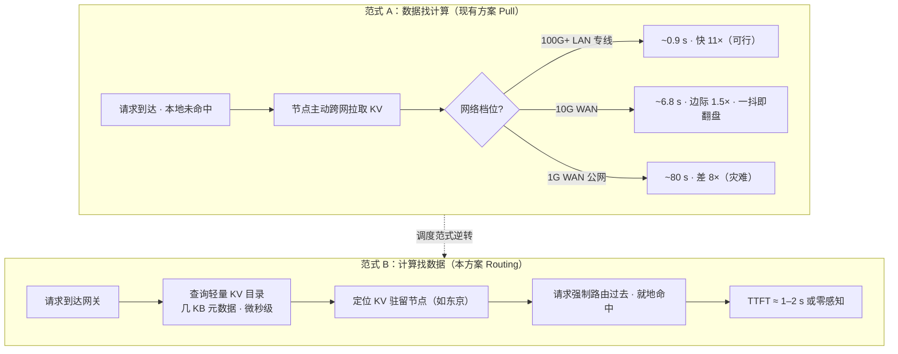

> 图例：范式 A 的每条路径都在 §1.4.3 测算表中；范式 B 的目录查询即部件②（§6.2）的轻量读取，不触发 KV 数据移动。

### 2.3 技术现状：缓存感知路由已经启程

这一范式并非凭空设想，产业界已经沿该方向走出关键一步。以 Preble [P12]（已被 AIBrix 采用）与 GORGO 为代表的多区域架构引入了缓存路由维度：每个区域维护本地前缀缓存；请求到达时**联合评估"本地缓存长度 × 跨区域传输延迟 × 目标节点排队"三要素**，选择端到端延迟最优路径（而非命中率最优），端到端延迟再降 ~18%。此时"KV 就近访问、算力按需调度"的雏形已经出现。

本方案与现状的差异在于**约束的优先级**：Preble 们仍以"延迟最优"为目标、把缓存分布当作输入；KV Cache CDN 则把"**会话/模块 KV 驻留**"提升为路由的第一约束——先保证请求流向状态所在之地（亲和性），再在多个候选驻留节点间做延迟/成本/负载的次级优化（部件①的四要素加权决策，见 §6.2）。

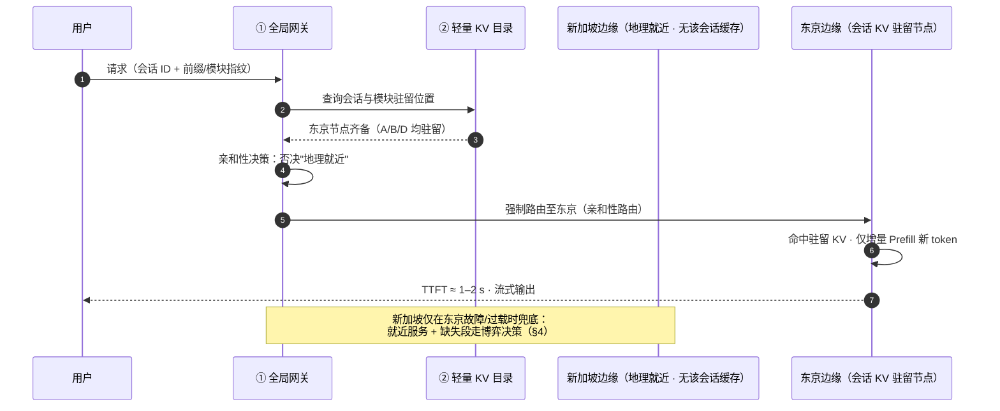

### 2.4 亲和性的边界与降级代价

亲和性是**软约束**而非硬绑定，三类场景必须允许"弃亲和"：

1. **驻留节点故障或过载**：熔断切换至就近节点，缺失部分按 §4 博弈决策（拉取或重算）；
2. **首次请求（无历史会话）**：退化为地理就近 + 共享模块预热命中（§3），随会话建立自然形成新的亲和锚点；
3. **负载均衡与容灾再平衡**：亲和权重需与全局负载、潮汐成本（§5.4）联合折中。

关键在于**降级代价的量化**：假设会话上下文 100K，因故障丢失亲和、切换到已预热共享模块 A/B 的备选节点，缺失的只是动态部分。以 §6.4 流程 A 的参数为例，缺失 8K token 本地重算仅需 8K ÷ 10K token/s ≈ **0.8 秒**——与正常路径的秒级 TTFT 同量级。

> **亲和性的经济学**：命中亲和，省下的是 GB 级跨域传输（80 s / 8 GB 档）；丢失亲和，付出的只是亚秒级增量重算。收益与代价的严重不对称，正是这一调度范式成立的根本原因。

### 2.5 小结与系统落点

创新点一把"跨域 KV 传输问题"转化为"路由问题"：数据不动、请求流动。它是一切后续创新的前提——只有先消灭了请求触发的实时跨域传输，广域 KV 共享才有可行性。系统落点：§6.2 部件①（全局路由网关的亲和性决策）与部件②（轻量全局 KV 目录）。

---

## 3. 创新点二：数据形态的重构 — 从"完整会话缓存"到"基于 PIC 的微模块异步分发"

### 3.1 现有缓存粒度的局限

无论是 vLLM 的 Prefix Cache 还是 SGLang 的 Radix Tree，缓存的基本单位通常是**"连续的 Token 序列"或"完整的会话历史"**。这种"铁板一块"的粒度在单机/集群内没有问题，但放到广域分发场景是致命的：要么整段传输（几十 GB）、要么整段重算——没有中间态，也就没有"只传值得传的部分"这一选项。

### 3.2 位置无关缓存（PIC）：微模块化的数学根基

把 KV 从"铁板一块"解耦为"可独立寻址的微模块"，依赖位置无关缓存（Position-Independent Caching，PIC）技术的成熟。不同于仅支持"前缀从头匹配"的传统缓存，PIC 把 KV 从"位置绑定"中解放，使**任意语义块可以独立寻址、独立存储、独立分发**——这是把一个 Agent 上下文拆成微模块、并只分发其中高共享部分的技术前提（各论文完整贡献见附录 C；PIC 在四轴分类学中的位置见附录 B 轴四）。

思想起点是 Prompt Cache [P3]（用 PML 显式声明可重用片段），EPIC [P9] 正式化了 PIC 概念，CacheBlend [P8] 落地了多块融合（非前缀拼接时选择性重算 ~10% token，TTFT −2.2~3.3×，已内置 LMCache）。但要真正理解"为什么 PIC 让微模块化成为可能"，必须看清它跨越的**两道数学鸿沟**。

#### 3.2.1 为什么传统前缀缓存无法跨位置复用：两道鸿沟

以请求 [A] [B] [C] 与 [B] [A] [D] 为例——后者想复用前者的 KV(B)、KV(A)，传统 Prefix Cache 却完全失效，原因有两层：

**鸿沟一：位置编码绑定（Positional Binding）**。Transformer 需要位置信息理解语序，现代模型（Llama、Qwen、Mistral）用 RoPE（旋转位置编码）把位置编码进 Key/Query 的复数相位。**同一个文本块 [B]，在请求 1 中位于位置 1000、在请求 2 中位于位置 0，两者的 Key 向量数学上完全不同**——即使文本逐字相同，缓存也无法直接复用。

**鸿沟二：上下文缺失（Contextual Incompleteness）**。这是更隐蔽、也更致命的问题。因果注意力中，位置 t 的 token 的 KV 是所有前置 token 的函数：

```
K_t = f( embedding(x_t), K_{t-1}, K_{t-2}, ..., K_0 )
```

独立预计算的 [B]（从位置 0 开始）只"看到"了自身前置内容，缺失了"未来它会被放在 [A] 之后"这一信息。**不是位置变了，而是语义依赖链断了。**

#### 3.2.2 跨越鸿沟一：RoPE 重旋转（Re-rotation）

RoPE 对 Key 向量每两个相邻维度做一次旋转，旋转角正比于 token 的绝对位置；它的核心数学性质是**旋转矩阵复合等于角度相加**：

```
R(θ·a) · R(θ·b) = R(θ·(a+b))
```

由此直接导出"重旋转"能力：若 [B] 缓存时位于位置 0（记为 K_cached），要把它放到新位置 m_new，只需对缓存 Key 再旋转一次：

```
K_new = R(θ·m_new) · K_cached
```

**这是纯数学、逐元素、极低开销的操作**，无需重跑 Transformer 前向。实际 PIC 系统（MEPIC、KVLink）会把重旋转融合进 Attention Kernel（如 FlashAttention），在寄存器级别完成旋转、直接参与 Q·K 运算，避免对整张 KV 做全量读写。

#### 3.2.3 跨越鸿沟二：上下文缺失的三种修复策略

位置问题可以用数学旋转解决，但语义层面的上下文缺失**无法用简单变换弥补**，需要借助模型的稀疏性规律修复。主流有三条路线：

**策略一：边界重算（Boundary Recomputation）——代表 EPIC/LegoLink、CacheBlend**。研究发现，直接拼接独立预计算块会出现"注意力汇聚（Attention Sink）"：每块开头几个 token 异常吸收注意力、阻断跨块关注。LegoLink 精准利用这一洞察——拼接时**只重算每块开头 k ≤ 32 个 token**，让它们对完整拼接序列做注意力计算、再用新 KV 覆盖缓存，块内 token 则通过逐层自注意力自动继承修正后的上下文。由于注意力逐层传递且静态稀疏，"只修边界"即可接近无损。

**策略二：离线训练适配（Native PIC）——代表 SemPIC、COMB**。不依赖运行时重算，改用"Writer（预训练模型 + LoRA 适配器）+ Reader（冻结原模型）"范式：编译阶段用行为蒸馏（KL 散度对齐）训练 Writer，让它"写出"对上下文位置不敏感、语义鲁棒的 KV；推理时 Reader 直接消费，**零重算**。

**策略三：零重算边界封装——代表 KV Packet**。每个文档封装为不可变的 packet，两端包裹可训练的边界嵌入（header + trailer），吸收拼接处的上下文断裂误差、充当块间语义桥梁，推理时零重算直接拼接。

三条路线的复杂度/成本权衡：

| 方案 | 重算复杂度 | 关键特点 |
|---|---|---|
| 完全重算（FR） | O(N²) | 失去缓存意义 |
| CacheBlend | O(15%·N²) | 动态稀疏，运行时判断开销大 |
| EPIC LegoLink | O(k·N)，k ≤ 32 | 静态稀疏，预先确定，开销极低 |

一个完整的 PIC 流程如下：

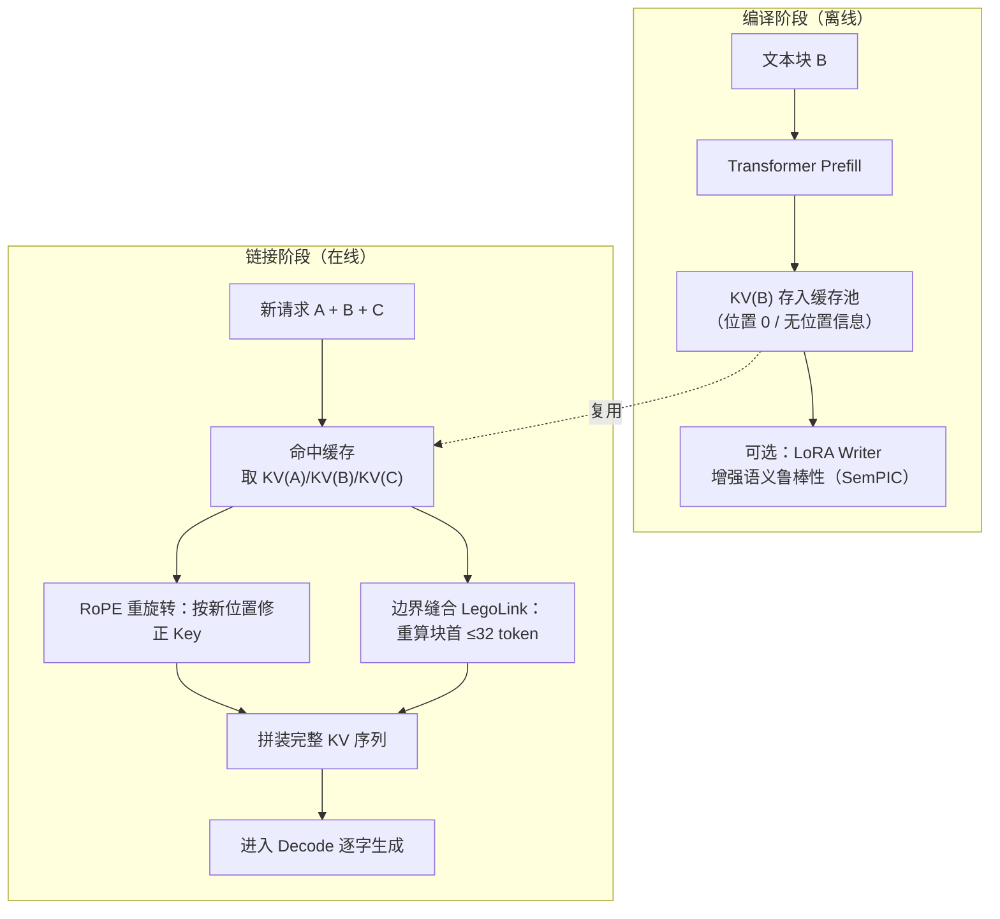

#### 3.2.4 对微模块分发的启示

PIC 原理直接决定了微模块分发的落地决策。**位置编码层面**：DeepSeek 的 MLA 架构因缓存的是无位置信息的隐向量、位置信息在 Attention 计算时才动态注入，**天然免去重旋转开销，是 PIC 的最佳载体**（呼应 §1.4.2 密度表中 MLA 的 69 KB/token）。**上下文修复层面**是工程成本的大头：追求低延迟高吞吐就选 LegoLink 类边界重算（只需少量定制 Kernel），追求极致零重算就投入离线训练（SemPIC），把成本转移到编译阶段。重算 token 数 k 是精度与成本的核心旋钮——k=0 损失精度、k 越大越接近全量重算，生产环境取 k=2~16 即可接近无损。

> **一句话总结**：PIC 的本质是——用数学旋转解决"位置"问题，用边界修复或离线训练解决"上下文"问题，从而把"绑死在特定位置的整段缓存"解构成"可自由拼装、全球流通的乐高积木"。这正是创新点二把上下文拆成 A/B/C/D 微模块、并跨节点异步分发的数学根基。

### 3.3 上下文的模块化解剖：A / B / C / D

把一个 Agent 的上下文按**共享度**拆分为四类可独立寻址的微模块：

| 模块 | 内容 | 典型体量（GQA-70B，s = 320 KB/token） | 共享度 | 四轴坐标（附录 B） |
|---|---|---|---|---|
| **A：全局 System Prompt** | 平台级系统提示词、角色设定、安全规范 | 2–4K token ≈ 0.6–1.3 GB | 极高（全平台共享） | B3 / L0–L1 |
| **B：标准 Tool Schema** | 工具/函数定义、Agent 工作流模板 | 1–2K token ≈ 0.3–0.6 GB | 高（按业务线共享） | B2–B3 / L0–L1 |
| **C：用户特定 RAG 文档** | 租户私有知识库前缀 | 30–80K token ≈ 10–25 GB | 低（租户内共享） | B2–B3 / L1–L2 |
| **D：动态对话历史** | 会话多轮累积 | 单轮增量 300–600 token ≈ 100–200 MB | ≈ 1（会话私有） | B1 / 本地节点 |

这张表同时完成了前缀分类体系（系统提示词模板 / RAG 知识库 / 热门公共上下文 / 多轮会话 / 高度个性化前缀五类）的**模块化重投影**——原有五类的统计特征与处置策略全部映射到模块坐标上：A/B 即"系统提示词与工具模板"类（全量准入 + 主动预分发 + 长 TTL）；C 即"RAG 知识库"类（准入 + 版本化存储 + 知识库变更时批量失效重算；"热门问题/公共上下文"归入 C 的公共子集，按周期窗口预分发）；D 即"多轮会话上下文"类（会话内复用、跨会话零共享，只在亲和节点本地保留）；D 的纯私有子集即"高度个性化前缀"，其处置见 §4.4。

**关键观察**：A + B 合计仅 **1–2 GB**——高共享、小体量、低变更频率，正是"黄金分发对象"；经 INT4 量化与 CacheGen 压缩后仅**几百 MB**。而真正庞大的 C（10–25 GB）与动态的 D 天然不适合全球分发——它们的正确归宿分别是"租户级区域驻留"与"亲和节点会话驻留"（§2）。

### 3.4 异步分发：从"几十秒"到"1–2 秒"甚至"零感知"

CDN 不需要实时同步整个会话。它只需要在后台**异步地（Asynchronously）**将高度共享的模块 A 和模块 B 分发到全球各个边缘节点的本地 Memory Pool 中。当边缘节点收到请求时，缺失的只是极小的动态模块：

| 场景 | 边缘已有 | 缺失 | 传输/计算量 | 用户感知 |
|---|---|---|---|---|
| 亲和命中（请求路由到 D 驻留节点，§2） | A + B + C + D 全部 | 仅新 token | 增量 Prefill | **零感知** |
| 亲和 miss / 新会话 | A + B（预热） | D 增量 100–200 MB | 1 Gbps 公网下 1–2 s | 1–2 秒 |
| 对照：无模块化的全量硬传 | 无 | 全量 8 GB（压缩后） | 1 Gbps 下 ~80 s | 灾难 |

**80 秒 → 1–2 秒 → 零感知**——这就是数据形态重构对广域延迟的压缩比。传输从"请求关键路径上的同步动作"变成了"后台低谷期的异步动作"。

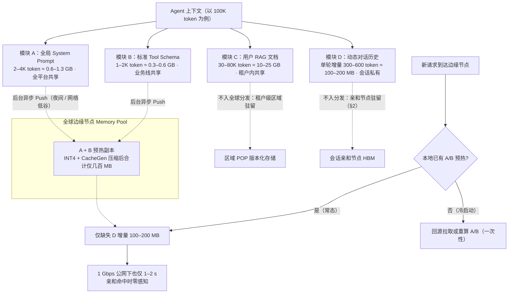

> 三处"Push"的分工：本节回答"**推什么**"（A/B 模块）；§5.4 回答"**何时何地推**"（夜间/低谷窗口、中心→区域→边缘的路径）；§6.5.2 回答"**推多少**"（准入评分与 T−30 min 预分发窗口）。

### 3.5 分发经济学：一次夜间分发 vs 每请求零售硬传

| 方案 | 计算过程 | 成本 | 请求时延 |
|---|---|---|---|
| 微模块异步分发（A+B，20 个边缘节点） | ~300 MB 压缩后 × 20 = 6 GB，低谷期批发价 0.002 美元/GB | **≈ 0.012 美元/天**，摊到全天所有请求 | 传输已摘出关键路径 |
| 每请求零售硬传全量（对照） | 8 GB × 0.02 美元/GB | 0.16 美元/次（> 本地重算 0.044） | ~80 s |

一次预分发的总成本比**单次**硬传还便宜 13 倍，且把传输从请求关键路径上完全摘除。对照 §1.7 单位经济学：本地重算 0.044 美元/次、批发拉取 0.016 美元/次——而预分发模式下，请求侧的带宽成本趋近于零，只剩增量计算。**这是三种路径中最优的一种，且不依赖零售带宽降价。**

### 3.6 小结与系统落点

创新点二把"必须实时同步的庞大状态"重构为"可异步分发的小模块"：只有高共享、小体量的部分才值得跨域，其余按归属驻留。它与创新点一互为表里——路由解决"动态部分 D 在哪"，模块化解决"静态部分 A/B 提前到哪"。系统落点：§6.2 部件②（模块级内容寻址目录）、部件③（预分发调度）、部件⑨（压缩传输层）。

---

## 4. 创新点三：经济博弈的自适应降级 — 传输成本 vs 重算成本

### 4.1 局域网的确定性逻辑在广域网失效

在局域网内，只要缓存命中，读取缓存的收益几乎总是大于重新计算的成本——同机房 RDMA 读 GB 级数据不到 1 秒，而重算要 10 秒。因此现有系统的逻辑是确定性的：**有缓存就读，没缓存就算**。

广域网环境完全不同：带宽波动、丢包、RTT 抖动高度不可预测。一条名义 10 Gbps 的链路在拥塞时可能退化到 0.1 GB/s。确定性逻辑在这里会导致灾难：系统忠实地等待一个 15 秒的跨域传输，而本地 GPU 重算只需 1–2 秒。**KV Cache CDN 引入类似 TCP 拥塞控制的"动态博弈决策引擎"**——这是传统局域网缓存方案不需要考虑、但对广域服务生死攸关的复杂逻辑。

### 4.2 实时估算模型：T_net vs T_compute

§1.4.1 给出了离线判据（T_fetch vs T_recompute，胜负由 B·C 对 s·R 的比值决定）。创新点三把这个判据**运行时化**：在决定是否从远端 CDN 节点拉取 KV 前，调度器实时评估两个量（T_net ≡ §1.4.1 的 T_fetch；T_compute ≡ T_recompute）：

```
T_net      =  T₀ + s·L_miss / (B̂·C)              T_compute  =  L_miss / R + T_queue
（实时拉取）     （B̂ 为 EWMA 实测带宽）            （本地重算）
```

关键差异在于 **B̂ 不再是名义带宽，而是指数加权滑动平均（EWMA）的实测有效带宽**——来自主动探测与历史传输的连续反馈，随网络状态实时更新。

**数值示例**（沿用 §1.4 参数）：L_miss = 20K token → 原始 KV 6.4 GB → 4× 压缩后 1.6 GB；名义 10 Gbps 链路拥塞退化为 ~0.1 GB/s → **T_net ≈ 15 s**；而 **T_compute = 20K ÷ 10K token/s ≈ 2 s**。博弈结论：果断放弃缓存命中，本地重算。

### 4.3 类 TCP 拥塞控制的决策引擎

借鉴 TCP 拥塞控制三十年的成熟工程经验，决策引擎包含五个机制：

1. **连续探测**：EWMA 带宽估计 + RTT 抖动/丢包率监测，为每条跨域链路维护实时画像；
2. **拉取预算窗口（AIMD）**：和性增长/乘性回退地调节单次拉取的字节预算——链路健康时逐步放大微块并发，劣化时立即收缩；
3. **SLA 守卫**：若预估 T_net > min(T_compute, T_SLA)，直接放弃拉取、本地重算——**"宁可重算，绝不死等"**；
4. **迟滞带防抖**：在 T_net ≈ T_compute 的临界区设置迟滞窗口，避免拉取/重算决策随链路噪声反复震荡；
5. **传输中降级**：拉取过程中若拥塞恶化（超出预算窗口），中断传输——已收块经 MVCC 标记保留，剩余缺失段转本地重算并无缝缝合（衔接 §6.4 流程 D 的容错回退）。

价值：在恶劣网络条件下，MaaS 服务的 SLA（首字延迟）依然不会崩溃——缓存命中从"必然收益"变成"需要实时论证的命题"，而论证的代价只是微秒级的估算。

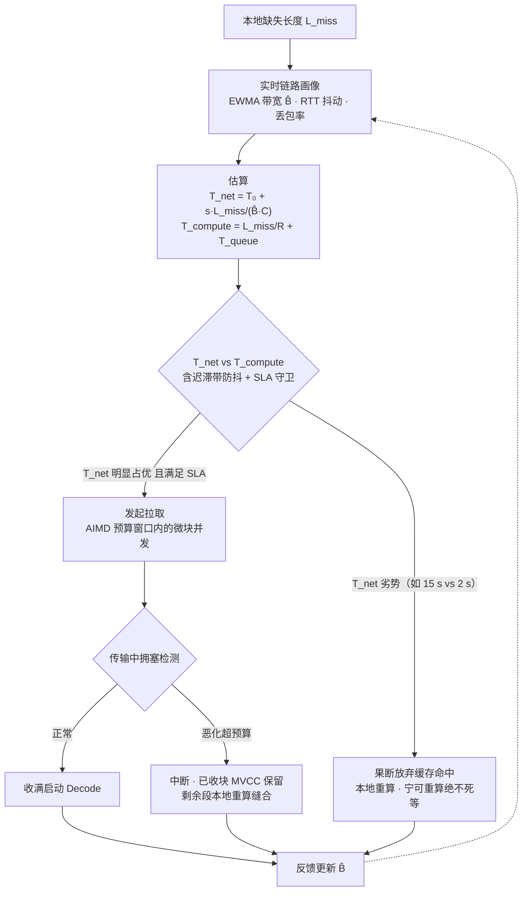

### 4.4 逐类别的经济博弈处置：个性化数据怎么办

博弈引擎不只作用于"要不要拉取"，也作用于"要不要存储/分发"——对"太个性化"的模块（用户私有历史、个人记忆、一次性长文档，即 §3.3 中 D 的纯私有子集），按成本择一处置。这本质上是**逐前缀类别地执行 §1.4 的拉取/重算判据**：

1. **不存储（No-Store）**：期望复用次数 ≈ 1 的前缀（如一次性长文档问答），Prefill 结果即算即焚（B0），完全不进目录——省下三级存储与目录维护开销。判断依据：历史统计显示该类前缀的复用分布集中于 1 次。
2. **不拉取（No-Fetch）**：允许本地会话级保留（B1），但**不进入跨节点预分发与跨机房拉取清单**。个性化 KV 的传输大概率是一次性消费；按 §1.4 判据，低共享度意味着传输成本无人摊销，跨机房拉取必亏。
3. **调整更新时间（差异化 TTL / 刷新策略）**：对介于冷热之间的"温数据"，不做实时保鲜：
   - 低热前缀：短 TTL + 无命中即降层（HBM → DRAM → NVMe），到期驱逐；
   - 中热前缀：按访问周期设定刷新点（如每个工作日高峰前统一刷新一次）；
   - "隔天回访"型会话上下文：**延迟重算**——不驻留 KV，只保留触发重算的摘要指纹，回访时按需重算，用便宜的重算替代昂贵的驻留。

### 4.5 小结与系统落点

创新点三为不可预测的广域网兜底：每一次跨域动作都要先通过实时的经济学论证，论证不通过就退回本地。它与创新点一/二共同构成"广域可行性三角"——路由消灭大部分传输需求（一），模块化把剩余传输压缩到可忽略（二），博弈引擎为漏网场景兜底（三）。系统落点：§6.2 部件①（网关内嵌决策引擎）、部件⑩（成本加权驱逐）、部件⑪（MVCC 缝合）。

---

## 5. 创新点四：部署拓扑的解耦 — 真正的"全球化算存分离"

### 5.1 算存强耦合的代价

现有方案中，计算和缓存必须紧密耦合在同一个物理机房（甚至同一个机架）内，以维持低延迟。对 MaaS 提供商而言，代价有三：

- 必须在**每个服务地域**都部署昂贵的高配 GPU 集群（既要有 Prefill 算力，又要有大缓存容量）；
- 各集群之间是"**数据孤岛**"，缓存红利无法跨地域共享——同一个热门系统提示词/工具模板在每个地域都要重复预计算、重复占用显存（正是 §3 中模块 A/B 被重复计算 N 次的浪费）；
- 边缘节点被迫"小而全"，硬件规格降不下来，全球扩张的资本支出（CapEx）随地域数线性膨胀。

### 5.2 解耦机制：中心生成/预热，边缘低成本服务

KV Cache CDN 允许把 **"KV Cache 的生成与存储"** 和 **"最终的推理服务"** 在地理上完全解耦：

- **中心生成**：在算力成本极低、电力充裕的中心节点（如偏远地区的大型数据中心），集中处理所有新出现的、长上下文的复杂 Agent 请求，生成高质量的 KV Cache；
- **低谷批量推送**：利用夜间或网络低谷期，将这些"高价值 KV 资产"**像分发软件更新一样，批量推送（Push）到全球各个边缘节点的 SSD 或 Memory Pool 中**；
- **边缘轻量服务**：边缘节点只需要具备较小的显存，即可通过命中 CDN 预热的资产，提供极快的响应（就近 Decode 压 RTT 的收益见 §1.5）。

三级拓扑的成本档位（相对单位成本）：

| 层级 | 角色 | 硬件画像 | 相对成本档 |
|---|---|---|---|
| L2 中心源站 | Prefill 生成 + 全量 KV 版本库 | Rubin CPX/B200 级重算力池（万卡规模摊薄） | 1.0（但单位算力成本最低） |
| L1 区域 POP | 大容量 KV 驻留 + 跨域传输引擎 | CXL 内存池 + NVMe，少量 GPU | 0.3–0.5 |
| L0 边缘节点 | 就近 Decode + 轻量增量 Prefill | 小显存 Decode 卡 + SmartNIC | 0.1–0.2 |

TCO 印证（§1.7）：跨集群 PrfaaS 模式 −15% ~ −25%，完整 KV Cache CDN −30% ~ −45%。P2P Prefill 池（部件⑧）是本创新点的**可选激进扩展**——用 Token 激励吸附全球长尾消费级算力充当"夜间 Prefill 工厂"（实现细节与挑战见 §6.2/§7.3）。

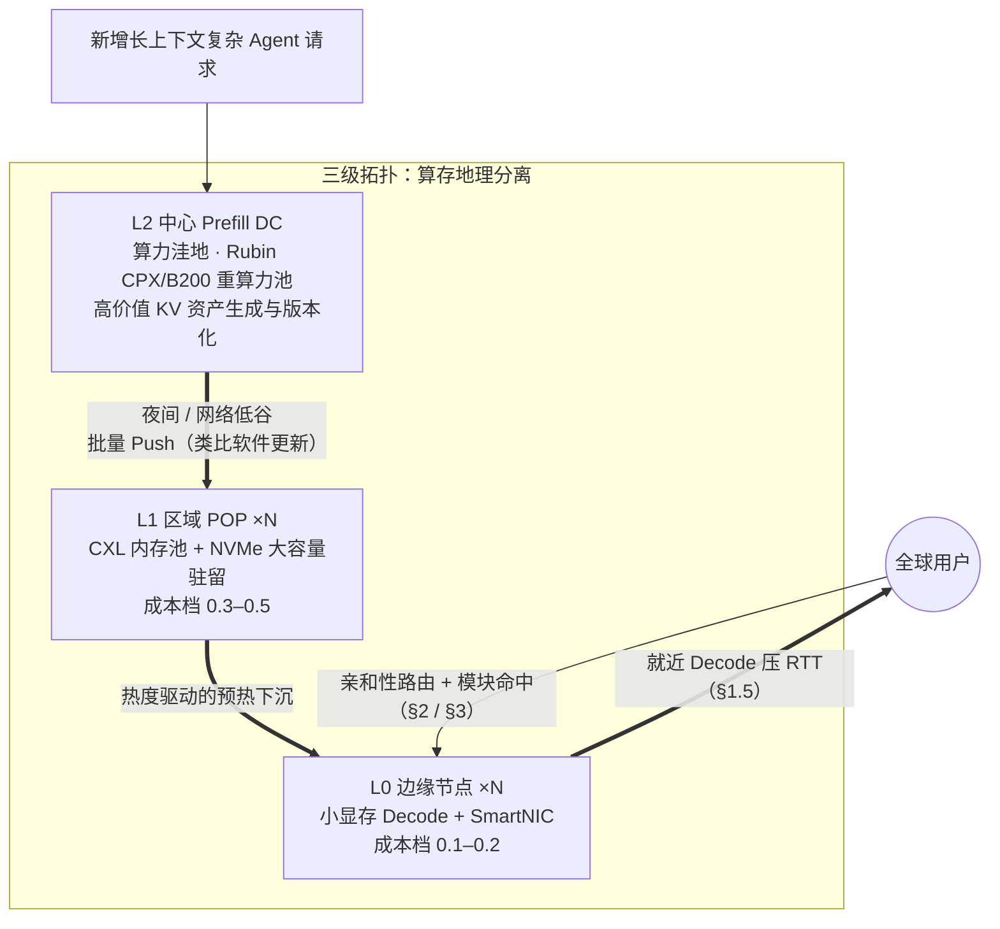

### 5.3 三阶段演进与本章定位

跨机房 KV 分发正在经历三个阶段，本报告的四大创新点恰好铺满第三阶段的空白：

| 阶段 | 代表系统 | 核心动作 | 本报告对应 |
|---|---|---|---|
| **一：单向卸载** | PrfaaS [P13] | 高并发 Prefill 放在超大规模低成本集群，KV 压缩后经 WAN 传回本地 Decode；Kimi Linear 混合模型把 KV 吞吐降低 4–36×，普通以太网即可承载；20× 扩容拓扑实测吞吐 +54%、P90 TTFT −64% | §5.2 中心生成路径的产业实证 |
| **二：路由智能** | Preble [P12]、GORGO | 联合评估"缓存 × 延迟 × 排队"，端到端延迟最优路由（再降 ~18%） | §2 亲和性路由的技术前身 |
| **三：潮汐 CDN** | *An Internet for the KV Cache* [P14] | 多级缓存、双向分发、潮汐套利的完整 CDN | 本方案（§2–§5 四大创新点 + §6 架构） |

阶段一的本质是"算力单向流动、KV 单向传输"——解决了"算力不够/太贵"，但还不是 CDN：没有多级缓存、没有双向分发、没有就近服务。从阶段一到阶段三，缺的正是本报告的四大创新点。

### 5.4 潮汐 KV：四股潮汐的全域形态

当跨区域调度与多级缓存结合，形成 [P14] 愿景中的"潮汐 KV"网络，四股潮汐叠加：

1. **算力潮汐**：地球自转带来时区套利——美西夜间闲置算力承接亚洲白天峰值，业务低峰反向调度。DC 模式下利用跨区域专线 + Kimi Linear 级压缩；P2P 模式下，东半球夜间海量开机闲置的消费级 GPU 组成"夜间 Prefill 工厂"，以 Token 激励吞吐西半球白天溢出的异步 RAG/Agent 批处理任务（本方案 Mode B）。
2. **缓存潮汐**：热点 KV 按访问热度逐级下沉到边缘（预热/预分发，即 §3.4 的"软件更新式"异步推送在时间维度的展开——夜间低谷批量推、白天高峰就近命中），冷 KV 回收到中心与冷存储层。
3. **多模型共享潮汐**：DroidSpeak [P11] 式关键层复用，让多个模型共享同一份底座 KV，多模型 Agent 的上下文只算一次。
4. **成本潮汐**：动态跟踪各地电价、算力价差、带宽价差，在延迟约束下最小化全局 TCO。

> **核心洞察**：KV Cache CDN 不是简单的"把缓存放各地"，而是**算力、缓存、带宽三者的全局动态调度——KV 跟着请求走，算力跟着 KV 走，成本跟着调度优化**。

### 5.5 硬件层配套：NVMe、CXL、SmartNIC、Rubin CPX

跨机房 CDN 的落地高度依赖四类硬件，各自卡位一层：

| 硬件 | 卡位层级 | 角色与价值 | 关键技术/代表 | 对 CDN 的意义 |
|---|---|---|---|---|
| **NVMe / SSD** | 冷存储层（D5/L3） | 单机 TB 级、廉价高速持久化，保存低频历史 KV 与长上下文冷前缀；1/10 成本存冷数据，预取召回 DRAM | 块级对齐存储、增量写入、预读流水线；企业级 NVMe + 对象存储网关 | 三级缓存的容量底座；Mooncake 第三级；边缘节点低成本承接批量预分发的落盘层 |
| **CXL 共享内存** | 区域缓存池（D6） | 机架/区域级内存池化：CPU 透明低延迟访问远端内存，打破单节点显存墙，无需 RDMA 协议栈 | CXL 3.0 交换机、TraCT/Beluga 架构 | 区域 POP 用更低成本构建大容量 KV 池 → 命中率提升 → 回源减少 |
| **SmartNIC / DPU** | 传输卸载层（D7） | 网卡直接解压与反量化 KV，零拷贝显存收发，绕开 CPU；块校验、版本校验、流量整形 | ShadowServe [P15]（BlueField 类 DPU）：GPU 通信干扰 −90%+，传输延迟 −30%，CPU 占用 −50% | 解决"传输挤占推理 GPU 带宽"的核心痛点，释放的算力直接转化为 goodput |
| **Rubin CPX 类 Prefill 专用芯片** | 中心计算层（L2） | Prefill 吞吐为通用 GPU 的 2–4×，单位算力成本更低 | NVIDIA Rubin CPX 等专用算力 | **让源站回源成本大幅下降 → "本地重算 vs 远端拉取"的盈亏平衡点整体下移（§1.4 的 s·R 上升）→ CDN 的成本模型更优** |

P2P 侧的硬件配套走"轻量双轨"：WebRTC/libp2p 的 NAT 穿透 + WebGPU/CUDA 消费级 API 的轻量推理引擎，解决异构长尾设备的兼容性。

### 5.6 小结与系统落点

创新点四把 CapEx 从"每地域全额堆叠"重构为"中心集中 + 边缘轻量"：中心赚算力规模的钱，边缘赚缓存命中的钱，传输赚低谷带宽的钱。它让前三个创新点的红利落进真实的资产负债表。系统落点：§6.2 部件⑤⑥⑦（+⑧可选扩展）。

---

## 6. 总体架构与关键流程（四大创新点的系统集成）

### 6.1 设计原则：从"内容 CDN"到"计算 CDN"的映射

本方案不是发明新范式，而是把内容 CDN 三十年成熟方法论**平移到"计算产物"上**，并在每个环节替换为 KV 语义。值得注意的是：传统 CDN 的智能 DNS/GSLB 从一开始就是"**请求找内容**"——创新点一的亲和性路由，本质上是把 CDN 的这一原始智慧应用到 KV 语义之下。

| 传统内容 CDN | 本方案对应部件 | 关键差异（KV 特有） |
|---|---|---|
| 智能 DNS / GSLB | 全局路由网关 + KV 目录 | 路由依据从"地理位置"变为"前缀指纹 × 成本 × SLA × 潮汐 × 信任" |
| 源站（Origin） | Core Prefill DC | **回源代价从带宽变为 GPU 算力（贵 100–1000×）**，命中率的经济学价值更强 |
| 边缘 POP | Regional / Edge 节点 | 缓存对象是模型绑定张量（须匹配模型版本、tokenizer、位置编码、LoRA） |
| 回源拉取 | 远端 Prefill 或 KV 块传输 | 可压缩（3.5–4.3×）、可**前缀部分命中**（URL 只能整文件匹配） |
| 内容预热 | 潮汐调度预分发 | 预热的是"计算结果"——预热即预计算 |
| 缓存失效 | 版本/租户策略失效 | 失效键 = 模型 + tokenizer + LoRA 指纹；错误不报 404，而是**静默的生成质量劣化** |

### 6.2 部件清单与职责

#### 控制平面（4 个部件）

| # | 部件 | 职责 | 主要支撑创新点 | 当前可用实现 |
|---|---|---|---|---|
| ① | **全局路由网关（Global Gateway / GSLB）** | 请求接入；提取前缀/模块指纹；**缓存亲和性路由（创新点一：查目录 → 强制路由到 KV 驻留节点）**；SLA 分类（实时/异步）；基于"命中率 × 端到端时延 × 成本 × 潮汐 × 信任"加权决策；**内嵌 T_net vs T_compute 动态博弈决策引擎（创新点三）**；熔断与降级（fallback to local recompute）。传统 CDN 的智能 DNS + 全局负载均衡对应物 | 一、三 | AIBrix 路由思想、GORGO |
| ② | **KV 全局目录与索引（KV Catalog）** | 前缀/**PIC 模块**→位置映射（分布式 Radix 树 + DHT 双层，模块级内容寻址）；内容寻址块 ID（哈希 = 模型 × tokenizer × 量化 × 分块内容）；元数据与版本管理；租约发放与失效广播；冷启动影子统计与热度画像（§6.5） | 一、二 | LMCache 内容寻址、etcd/一致性哈希 |
| ③ | **潮汐调度与成本优化器（Tidal Scheduler）** | 时区感知的 Prefill 放置（夜间闲置算力承接对侧白天峰值）；电价/算力价差套利；热点预测与**主动预分发/批量预热（创新点二推什么、创新点四何时推，预分发窗口由周期/区域热度统计驱动，见 §6.5）**；全局 TCO 优化 | 二、四 | PrfaaS 双时间尺度调度、Preble 联合优化 [P12] |
| ④ | **信任与验证引擎（Trust Engine）**（P2P 模式专属） | 节点信任评分（历史行为 × 硬件画像 × 带宽实测）；蜜罐 Prompt 注入与注意力采样校验；ZKP 验证；Token 激励结算 | 四（P2P 扩展） | 研究前沿（§7.1/§7.3） |

#### 数据平面（5 个部件）

| # | 部件 | 职责 | 主要支撑创新点 | 当前可用实现 |
|---|---|---|---|---|
| ⑤ | **Core Prefill DC（中心源站，L2）** | 万卡级重算力池（Rubin CPX/B200 级）；长上下文 Prefill 计算（**创新点四的中心生成**）；CacheGen 编码与版本化产出（Origin Store）；作为全局"回源"终点 | 四 | PrfaaS 远端集群、Mooncake Prefill 池 |
| ⑥ | **Regional Cache Node（区域 POP，L1）** | Mooncake 式三级分层（VRAM / CXL-DRAM / NVMe）；区域热前缀驻留；跨集群 KV 传输引擎；请求内/请求间联合优化 | 四 | Mooncake Transfer Engine [P6]、MemServe MemPool [P10] |
| ⑦ | **Edge Decode DC（边缘节点，L0）** | 靠近用户解码，压 RTT；SmartNIC 线速解压；轻量增量 Prefill（仅缺失后缀）；**命中预热的 A/B 模块即服务（创新点二的边缘落点）**；潮汐算力（白天本地服务，夜间承接对侧） | 二、四 | ShadowServe [P15]、Groq 边缘形态 |
| ⑧ | **P2P Prefill 池（Mode B，可选扩展）** | 吸附全球长尾算力（消费级 GPU）；NAT 穿透（STUN/TURN/打洞）；极限压缩或仅回传关键层；**就地 Decode（计算向数据移动）**；防投毒校验后结算 | 四（可选激进扩展） | Petals/io.net（实验形态） |
| ⑨ | **WAN 传输加速层** | CacheGen 自适应压缩（按实时带宽调档，**为创新点三提供 B̂ 反馈**）；RDMA（短距）/QUIC（长距）双模；BitTorrent 式微块多源聚合；**PIC 微模块异步分发流（创新点二）**；FEC 与抖动缓冲；SmartNIC/DPU 硬件卸载 | 二、三 | CacheGen [P7]、ShadowServe [P15]、NIXL |

#### 节点内组件（2 个部件，部署于 ⑤⑥⑦⑧ 之上）

| # | 部件 | 职责 | 主要支撑创新点 | 当前可用实现 |
|---|---|---|---|---|
| ⑩ | **KV Router 与分层存储管理器** | PagedAttention 块管理；L0–L3 冷热置换；预取流水线；**成本加权驱逐**（驱逐代价 = 重算成本 × 传输成本 × 未来命中率，越上层权重越偏重算成本）；**执行差异化 TTL/延迟重算等逐类别处置（§4.4）** | 三 | vLLM/SGLang 块管理、Mooncake 分层 |
| ⑪ | **MVCC 与一致性管理器** | 版本快照（模型升级/LoRA 热切换时新旧并行、原子切换）；副本一致性；损坏检测（校验和 + 抽样注意力验证）；**传输中断时的已收块保留与重算缝合（创新点三的降级支点）**；回退语义定义 | 三（全系统底座） | 研究前沿（§7.3） |

### 6.3 总体架构图

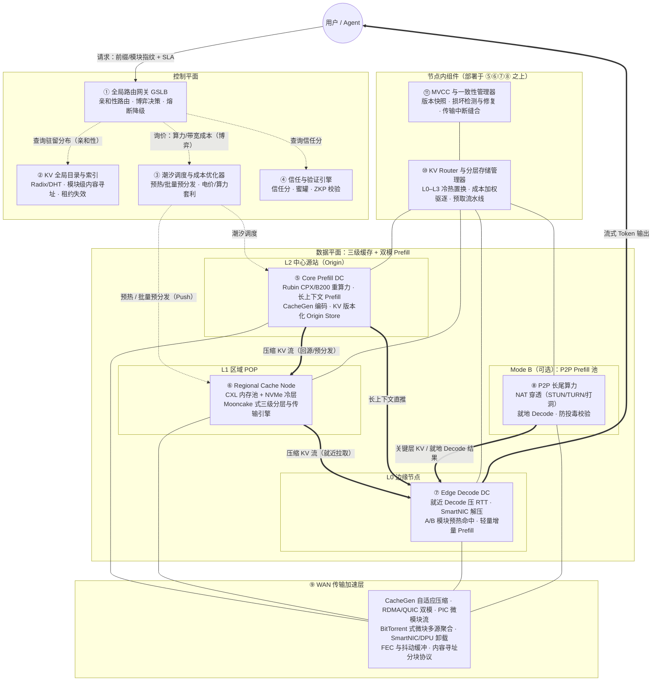

> 图例：**虚线箭头 = 控制流**（路由查询/调度指令）；**粗箭头 = KV 数据流**（压缩字节流，均由 ⑨ WAN 传输加速层承载，其中大部分由后台异步 Push 而非请求触发）；**细实线 = 承载/部署关系**。各部件支撑的创新点标注见 §6.2，创新点机制详见 §2–§5。

### 6.4 关键流程的逻辑数据流图

#### 流程 A：亲和命中（最优路径：请求路由到 KV 驻留节点）

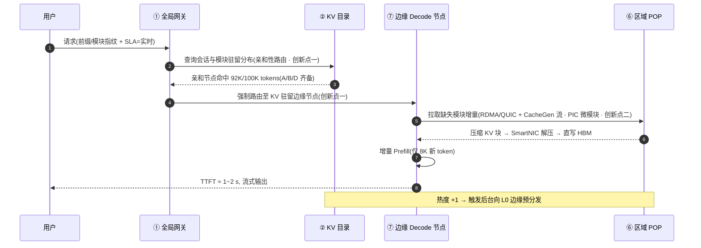

#### 流程 B：全域未命中（潮汐回源 + 流水线直推：中心生成路径）

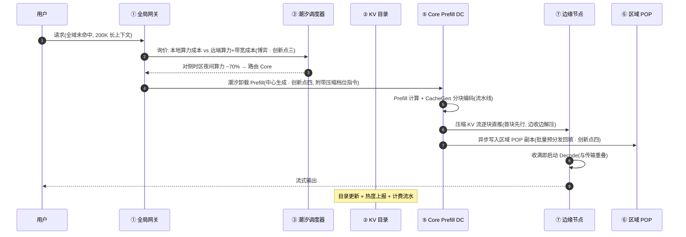

#### 流程 C：双模式调度（实时走 DC 骨干，异步走 P2P 长尾）

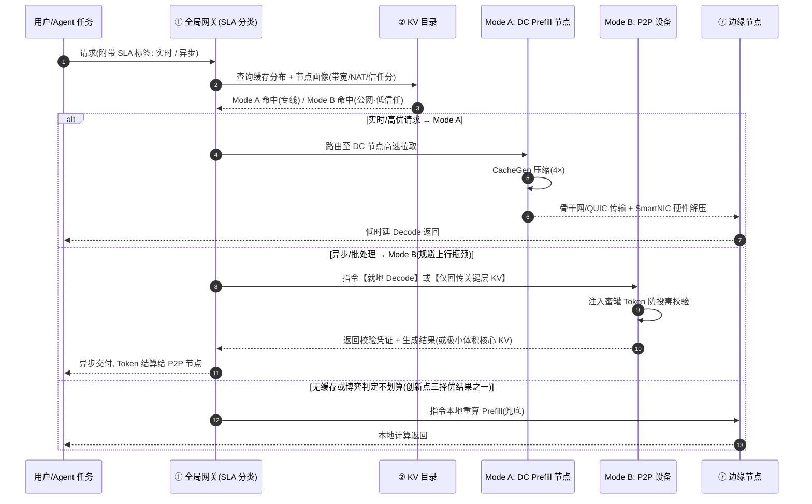

#### 流程 D：容错与回退（链路抖动 / 校验失败 / 版本切换）

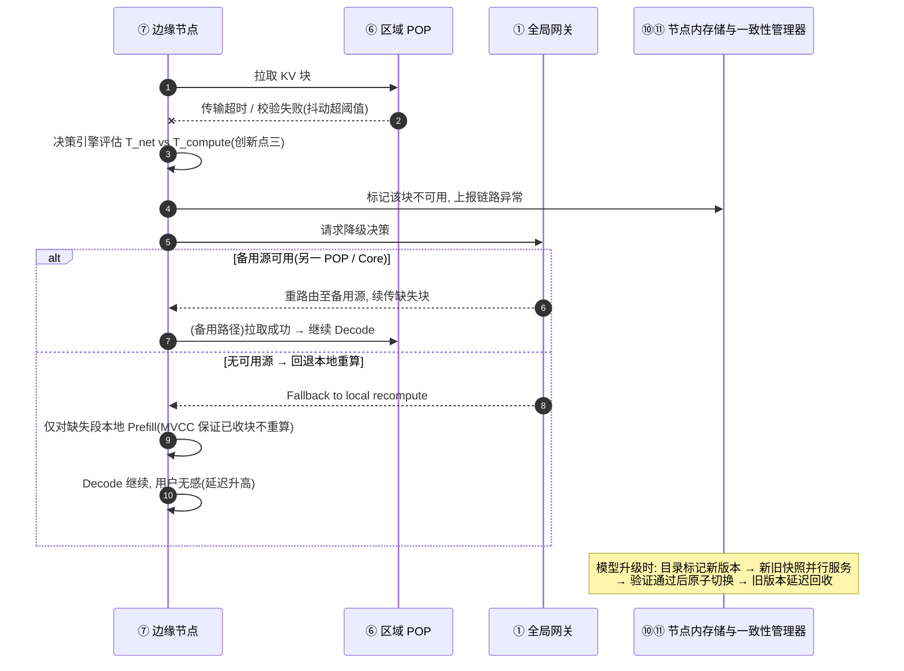

#### 流程 E：四大创新点协同总览

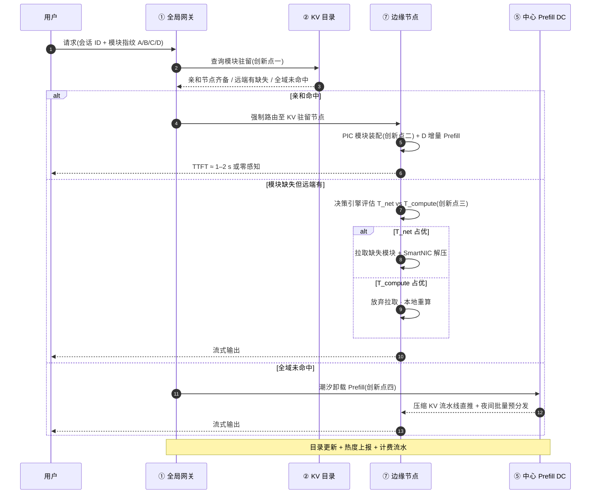

### 6.5 KV 目录的初始化与热度驱动的准入控制

目录（部件②）与预分发（部件③）不能"什么都存、什么都推"：存储与带宽是稀缺资源，无差别准入会稀释命中率、抬高成本。因此引入一个数据驱动的**准入控制闭环**：先观察、后决策、持续再评估。它在四轴分类学（附录 B）上的意义是：**为每类前缀动态分配 B 轴（生命周期）与 L 轴（局部性层级）坐标**。前缀的模块化分类与体量解剖见 §3.3；个性化数据的逐类别经济处置（No-Store / No-Fetch / 差异化 TTL）见 §4.4。

#### 6.5.1 三阶段时间线

| 阶段 | 时间窗 | 目录与缓存行为 | 目标 |
|---|---|---|---|
| **阶段 0：冷启动** | Day 0–7（可配置） | 目录以"影子模式"运行：只记录前缀指纹、业务标签、来源区域、时间戳与 SLA，**不做准入、不触发预分发**；请求正常执行（本地重算/回源） | 无偏采样，积累三维统计 |
| **阶段 1：准入决策** | Day 7（首次 + 之后每日增量） | 按前缀类别聚合统计 → 计算准入评分 → 生成复用白名单与分级（L 层级 × B 生命周期） | 从"全量观察"切换到"选择性缓存" |
| **阶段 2：稳态闭环** | Day 7 起持续 | 双时间尺度滚动统计 + 命中率反馈 → 周期性升降层与准入复审 | 目录与真实访问分布保持同步 |

#### 6.5.2 热数据的三维统计（周期 / 区域 / 特征）

对每类前缀（按类别聚合，而非逐个前缀）统计三个维度：

1. **周期性（When）**：按小时/星期的访问分布。识别"办公时间热"（企业 RAG）、"晚间峰值"（C 端助手）、"跨时区潮汐"（可复用潮汐调度）。用途：**预分发窗口**——在预期高峰前（如 T−30 min）把热前缀推到 L0/L1 边缘（这正是 §3.4/§5.4 中"何时推"的数据来源）。
2. **区域性（Where）**：各区域 POP 的访问占比。单区域热 → 副本只存本区域 POP；全局热 → 多区域副本 + 中心全量；区域错峰访问同一前缀时可"接力"复用同一副本，进一步摊薄存储。
3. **特征性（What/Who）**：业务类型（系统提示词模板 / RAG 知识块 / 多轮会话 / Agent 工作流）、上下文长度分布、**跨请求共享度**（不同用户/会话命中同一前缀的比例）、个性化程度。**共享度是准入的核心判据**。

#### 6.5.3 准入评分与决策

对每类前缀计算（均为统计周期内的期望值）：

```
准入评分 = 期望复用次数/天 × 单次重算成本
          − 分级存储成本/天 − 预期传输成本/天
```

决策规则（阈值按业务调参）：

- 共享度 ≥ 阈值（如 ≥ 5 独立会话/天）**且**评分 > 0 → **准入**：按热度分配层级（L0–L3）与生命周期（B1–B3）；
- 命中率高但共享度低 → 可能只是单用户重复行为，仅按 B1 会话级本地保留；
- 共享度 ≈ 1（纯个性化）→ **拒绝准入**（处置见 §4.4）。

#### 6.5.4 初始化与热度闭环流程图

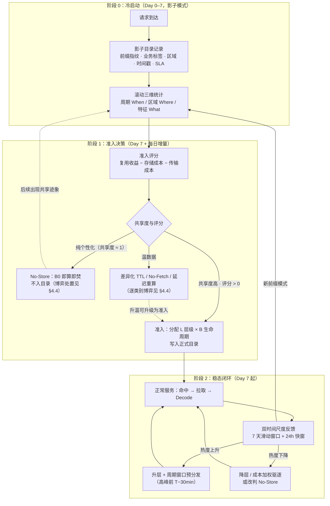

> 模型或知识库版本变更时（MVCC 部件⑪）：目录对受影响类别**批量失效 → 重算 KV 本体，但统计画像与准入决策沿用**，无需重新冷启动——冷启动成本只在首次部署与新业务接入时支付一次。

### 6.6 与现有系统的关系

本方案不是推倒重来，而是现有系统的**统一超集**：Mooncake [P6] 是本方案的"单集群切片"（部件⑥⑩），PrfaaS [P13] 是"跨机房单向切片"（部件⑤⑨），LMCache [P16] 是最接近的开源实现（部件②⑨⑩ 的雏形），ShadowServe [P15] 补齐硬件传输层（部件⑨），Internet for KV Cache [P14] 是其纲领愿景。**四大创新点（§2–§5）正是这些切片之上缺失的增量**：亲和性路由（一）补网关智能，PIC 微模块（二）补数据形态，经济博弈（三）补广域容错，算存分离（四）补拓扑自由度。CDN 化的增量集中在控制平面（①②③④）与全局一致性（⑪）。

---

## 7. 挑战全景、框架生态与开放问题

### 7.1 关键挑战与解决方案全景图

| # | 核心挑战 | 对应解决方案 | 成熟度（2026） | 仍然未解决的难题 |
|---|---|---|---|---|
| 1 | **跨地域 WAN 带宽受限** | CacheGen 自适应张量压缩 [P7] + 混合注意力架构模型（KV 吞吐 −4~36×） | **高**（PrfaaS 产业验证） | 传统 MHA/GQA 老模型跨机房仍不经济（需 ≥200 Gbps） |
| 2 | **非前缀文本无法复用** | 位置无关缓存 EPIC [P9] + 融合重算 CacheBlend [P8] | **中**（已内置 LMCache） | 跨模板复用的精度损失边界；选择性重算比例的自适应确定 |
| 3 | **KV 传输挤占 GPU/PCIe 带宽** | SmartNIC/DPU 带外解压（ShadowServe [P15]） | **中高**（硬件就位，驱动适配中） | 异构 DPU 生态碎片化；消费级设备无 DPU 可卸载 |
| 4 | **缓存一致性与故障容错** | MVCC 版本快照 + 租约 + 回退本地重算 | **低–中**（工程化初期） | 跨 DC 多副本一致性语义无标准；分区/副本损坏的修复策略空白 |
| 5 | **多租户安全与隔离** | 命名空间隔离 + 传输加密 + 延迟混淆 | **低**（研究前沿） | 时序侧信道：命中/未命中延迟差可泄露他人前缀内容 |
| 6 | **跨模型/跨芯片壁垒** | DroidSpeak [P11] 关键层共享；量化感知传输 | **低** | 跨微调模型的版本兼容与精度边界；异构芯片数值对齐 |
| 7 | **P2P 上行带宽"物理死结"** | 就地 Decode（计算向数据移动）+ 关键层/Anchor 极限压缩 + 同区域横向分发 | **中**（方案清晰，未规模化） | 非对称路由协议缺失：KV 如何"就近"入边缘而非经脆弱家庭宽带上云 |
| 8 | **P2P 拜占庭投毒** | 蜜罐 Prompt 注入 + 注意力权重采样校验 + ZKP | **低** | ZKP 证明生成开销大于推理本身；高级恶意节点可识别并绕过蜜罐 |
| 9 | **全局调度复杂性** | 端到端延迟最优路由（Preble [P12]）+ 双时间尺度潮汐调度 | **中高** | 结合算力/带宽/存储/电价的全局 TCO 优化模型缺失 |

### 7.2 当前主流推理框架对 KV Cache CDN 的支持程度

（CDN 就绪度 = 控制面/数据面/传输面/硬件面的综合定性评估，仅供选型参考）

| 框架/系统 | 类型 | CDN 就绪度 | 已具备能力 | 关键缺口 |
|---|---|---|---|---|
| **vLLM** | 生产引擎（生态基石） | ~30% | PagedAttention、前缀缓存、外部 KV Connector API、与 LMCache 组合吞吐最高 +15× | 广域网传输、全局目录、调度全部依赖外挂 |
| **SGLang** | 生产引擎 | ~25% | RadixAttention 前缀复用（集群内最优）、HiCache 跨实例缓存 | 仅局域网；无跨机房与 P2P 能力 |
| **TensorRT-LLM** | 生产引擎（NVIDIA 系） | ~20% | 单机多卡 NVLink 域内 KV 转移、极致单节点性能 | 强绑定硬件生态，广域网官方支持弱 |
| **NVIDIA Dynamo** | 生产编排 | ~35% | PD 分离事实标准、NIXL 传输抽象、KV 感知路由 | 集群级思维，无多级缓存与潮汐调度 |
| **LMCache** | 开源 KV 缓存中间件 | **~80%（最接近愿景）** | 内容寻址、跨节点共享、CacheBlend 融合、多后端解耦、分布式存储 | 原生为 DC/跨集群设计；无 P2P 长尾接入、无防投毒、无全球目录 |
| **AIBrix** | 云原生推理平台 | ~30% | Preble 式缓存感知调度、多集群管理 | 缓存路由停留在集群内 |
| **DistServe** | 研究系统 | ~20% | PD 解耦原型、RDMA 传输、goodput 优化 | 单集群设定 |
| **Petals / io.net** | P2P 实验 | P2P 维度 100% | 纯 P2P 算力共享、去中心化 | 无高性能 KV 传输优化，延迟极高；无企业级 DC 能力 |
| **本方案构想** | 愿景 | 100%（目标态） | 四大创新点（亲和性路由 / PIC 微模块异步分发 / 经济博弈降级 / 算存分离）+ 三级缓存 + 双模 Prefill + 潮汐调度 + 防投毒 | 见 §7.3 |

**产业落地现状**（2026-09）：Moonshot 落地 PrfaaS 跨 DC 卸载（吞吐 +54%）；字节、通义部署区域级前缀缓存池；微软 Azure 探索跨区域 KV 路由（DroidSpeak 为其研究产出）；Groq 基于 LPU 的全球部署天然倾向"就近 Decode + 远端 Prefill"。总体判断：**单集群前缀缓存已普及，跨集群解耦开始落地，跨区域 CDN 处于试点与构想阶段**——正处在"时代 4 向时代 5"（附录 A）过渡的节点。

### 7.3 仍然需要克服的关键挑战（开放问题）

以下八项是建成"大模型时代通信网"必须攻克的深水区，按"技术死结程度"排序：

1. **极端网络抖动与弱一致容错语义**。跨洋专线的毫秒级抖动随时可能打断分块传输。需要设计无锁/弱一致性目录 + 租约机制 + **成本感知的回退策略**（fallback to local recompute 何时触发、已收块如何与新算块无缝缝合——本方案 MVCC 部件⑪与 §4.3 传输中降级的职责，但语义标准仍空白）。跨 DC 多副本 KV 的一致性语义（强一致/最终一致/写时复制）、并发扩展同一前缀的语义、失效通知的延迟边界、分区与副本损坏的修复策略，均无系统研究——而 KV 错误会直接导致生成质量劣化，比传统 CDN 严重得多。
2. **加密 KV 与零知识解码（学术真空）**。多租户下，敏感 Prompt 经 Prefill 后化为 KV 流转到不受信任的边缘/P2P 节点。如何在不解密张量的情况下完成高效 Decode？ZKP-for-LLM 仍处实验室阶段，证明生成开销甚至超过推理本身。突破方向：针对注意力结构的轻量验证协议、可信执行环境（TEE）与密码学的混合方案。
3. **跨芯片算力等价映射（"KV 漂移"）**。核心源站是 NVIDIA B200/Rubin CPX，边缘可能是 AMD MI300 或昇腾——不同精度格式（FP8 变体）、不同张量排布、不同 RoPE/归一化实现之间的 KV 无缝迁移与数值对齐，目前无任何框架支持。
4. **多租户时序侧信道**。共享 CDN 下命中/未命中的延迟差异可推断其他租户前缀内容，现有方案完全没有防御设计——这是企业级与公有云落地的硬性障碍。
5. **P2P 上行带宽的"物理死结"**。家庭/企业宽带上行通常仅下行的 1/10，P2P 节点算出 10 GB KV 后几乎不可能传回中心。突破方向：**非对称路由协议**——P2P 节点只做就地 Prefill+Decode、或仅回传关键层/Anchor Token（压至 100 MB 级）、或经 P2P 网络横向传递给同区域节点，彻底避开跨洋上行。
6. **拜占庭环境下的低成本验证**。恶意节点伪造 KV 骗取 Token 激励。目标是"注意力权重采样校验 + 动态蜜罐"的轻量协议，在不显著增加计算负担的前提下以 ≥99% 概率捕获投毒——目前远未达成。
7. **统一抽象与互操作标准（含全局 TCO 模型）**。DC 节点是 Linux + CUDA + RDMA，P2P 节点可能是 Windows + WSL + WebGPU 或 Mac + Metal。需要一套跨平台的 **KV 统一序列化与传输协议**（类比 HTTP 之于 Web、WebRTC DataChannel 之于实时通信），屏蔽硬件与 OS 差异，并定义模型版本/tokenizer/LoRA 指纹的命名空间——这是"跨厂商 KV 互联网"的前提。同时，缺全局 TCO 优化模型（算力/带宽/存储/电价联合）。
8. **新范式工作流的 KV 语义**。MoE 专家路由的 all-to-all 流量与 KV 传输竞争带宽，专家 KV 的跨 DC 放置无人研究；推测解码需要分支 KV 的回滚语义；Agent 的非线性上下文生命周期（分支、回溯、恢复）与现有线性前缀缓存模型根本不匹配——需要为"树状/图状 KV 生命周期"重新设计缓存数据结构。

---

## 8. 结论

### 8.1 降维打击：KV Cache CDN vs 现有方案六维总对比

| 维度 | 现有方案（本地内存/同机房 RDMA） | KV Cache CDN 方案（广域分布式） |
|---|---|---|
| **核心假设** | 网络带宽充足且稳定（100G+ LAN） | 网络带宽受限且存在抖动（1G–10G WAN） |
| **数据移动方向** | 请求触发后，节点主动**拉取（Pull）**数据 | 后台**异步推送（Push）**+ 网关**智能路由**（请求移动 0.9 s vs 80 s 的选择权交给调度） |
| **缓存粒度** | 完整会话或长连续 Prefix | 基于 PIC 的**独立微模块**（System/Tools，1–2 GB → 压缩后几百 MB） |
| **未命中策略** | 本地 GPU 重新计算 | **动态博弈**：评估 T_net vs T_compute 择优执行（15 s vs 1–2 s 时果断重算） |
| **拓扑结构** | 算存强耦合（单机房内） | **算存地理分离**（中心生成预热，边缘低成本服务，TCO −30%~−45%） |
| **核心壁垒** | 硬件堆叠（大内存、RDMA 网卡） | **调度算法、数据压缩/拆解技术、异步工程化** |

### 8.2 最终结论

KV Cache CDN 方案的创新点，**不在于它发明了一种更快的广域网传输协议，而在于它承认了广域网的物理局限，并围绕这一局限重新设计了整个系统的运行逻辑**。

四大创新点环环相扣，构成一个完整的闭环：

- **亲和性路由（一）**消灭了请求触发时的跨域传输需求——数据不动，请求流动；
- **PIC 微模块（二）**把确实需要跨域的部分压缩到可异步分发的规模——同步变异步，整块变模块；
- **经济博弈（三）**为漏网的、不可预测的广域场景兜底——每次跨域动作都要通过实时经济学论证；
- **算存分离（四）**让前三者的红利落进真实的资产负债表——中心赚规模的钱，边缘赚命中的钱，传输赚低谷的钱。

它将 LLM 推理从"单机/单机房的状态计算"，升级为一种**"全球分布式的状态共享网络"**。

### 8.3 对 Agent MaaS 的战略意义与分阶段落地路径

对于 Agent MaaS 服务而言，如果未来面临**多地域部署、长上下文复用率高、且希望控制边缘节点硬件成本**的场景（采纳条件的量化边界见 §1.7：长上下文占比 >20%、复用率 >30%、区域成本差 2–5×），KV Cache CDN（结合 PIC 微模块和智能路由）将是打破"算力孤岛"、实现规模化盈利的终极架构演进方向。

分阶段落地路径（风险递增、收益递增）：

1. **第一步（单集群内，现有组件起步）**：模块化 Prefix Cache + 准入控制（§3.3/§6.5）——vLLM/SGLang + LMCache 即可落地，验证 A/B/C/D 模块划分的命中率收益；
2. **第二步（跨集群/多地域）**：亲和性路由 + 经济博弈引擎（§2/§4）——在现有网关上叠加全局目录与 T_net/T_compute 决策，消灭跨域硬传；
3. **第三步（完整 CDN 形态）**：中心预热 + 潮汐调度 + 算存分离（§5）——重购全球拓扑，收获 −30%~−45% 的 TCO 红利。

---

## 附录 A：KV Cache 发展的五个时代

每一代都在突破上一代的部署边界与资源边界；16 篇核心论文恰好铺满整条演进路径。

| 时代 | 定位 | 核心抽象 | 代表系统 | 解决的问题 | 遗留局限 |
|---|---|---|---|---|---|
| **时代 1：朴素张量时代**（~2023 初） | 请求内临时缓冲区 | 连续张量分配，请求结束即焚 | 早期 Transformers、HF 原生推理 | 最基础的注意力状态存储 | 碎片严重、零复用、利用率极低 |
| **时代 2：本地分页时代**（2023） | 单实例块级内存管理 | OS 分页思想引入 KV：块表、离散块分配、连续批处理 | **[P1] PagedAttention / vLLM**（SOSP'23） | 显存碎片；批容量从数十到数千 | 仅单 GPU/单节点，跨节点无法共享 |
| **时代 3：结构化复用时代**（2023–2024） | 单集群内跨请求共享 | 基数树前缀缓存、模块化注意力重用、内存池化 | **[P2] SGLang/RadixAttention、[P3] Prompt Cache、[P10] MemServe、[P12] Preble** | 跨请求重复计算；集群内 KV 池化 | 严格限定单 RDMA 域，无法跨集群 |
| **时代 4：分离与池化时代**（2024–2025） | 跨集群相位分离 + KV 网络层 | Prefill/Decode 分离、集群级三级分层、KV 流压缩、位置无关缓存、跨模型共享 | **[P4] DistServe、[P5] Splitwise、[P6] Mooncake、[P7] CacheGen、[P8] CacheBlend、[P9] EPIC、[P16] LMCache** | 异构算力不共址；单集群瓶颈；传输带宽墙 | 以单向卸载为主，缺多级缓存与全域分发 |
| **时代 5：全域分发时代**（2025–2026→） | 跨地域 KV 内容分发网络 | 多级缓存、智能路由、主动预分发、硬件卸载、潮汐套利、跨模型协同 | **[P13] PrfaaS、[P14] An Internet for the KV Cache、[P15] ShadowServe、[P11] DroidSpeak** | 跨区域就近服务；全球算力套利；容灾弹性 | 架构标准、一致性语义、成本模型尚未成熟 |

> **演进规律**：KV 的**活动范围**不断扩大（GPU → 节点 → 集群 → 数据中心 → 广域网），**生命周期**不断变长（请求级 → 会话级 → 持久化），**所有权**从引擎私有走向分布式共享，**载体**从片上内存延伸到网络本身。每一代都在上一代之上再突破一层物理边界——这与内容分发从单机 Web 服务器 → 集群 → 反向代理 → Akamai 式全球 CDN 的历史轨迹严格同构。

## 附录 B：KV Cache 的四轴分类学

任何 KV Cache 管理系统（包括本方案与全部 16 篇论文对应的系统）都可定位在四轴空间中：**存哪里（局部性）、存多久（生命周期）、归谁管（所有权）、用什么存和传（载体与编码）**。

### 轴一：局部性（Locality）——KV 在哪里被访问

| 层级 | 定义 | 存放内容 | 访问延迟 | 对应物 |
|---|---|---|---|---|
| **L0 边缘节点** | 接入点/边缘机房 | 极高频短前缀 | 微秒~毫秒 | CDN 边缘 POP |
| **L1 区域集群** | 区域数据中心 | 本区域热前缀 | 毫秒级 | CDN 区域 POP |
| **L2 核心中心** | 核心数据中心 | 全量前缀库 + Prefill 算力池 | 十毫秒级 | CDN 源站 |
| **L3 冷存储层** | SSD/对象存储 | 冷历史 KV | 百毫秒级（需预取召回） | CDN 冷备/归档 |

### 轴二：生命周期（Lifetime）——KV 保留多久

| 层级 | 定义 | 触发释放 | 代表 |
|---|---|---|---|
| **B0 请求级** | 单次请求即焚 | 请求结束 | 传统推理框架 |
| **B1 会话级** | 单用户多轮对话持有 | 会话超时 | SGLang 多轮 [P2] |
| **B2 跨会话级** | 跨用户共享热门前缀 | 驱逐策略（LRU/成本加权） | RadixAttention [P2]、CacheBlend [P8] |
| **B3 全局持久级** | 长期驻留 + 主动分发 | 模型版本退役 | Internet for KV Cache [P14]、LMCache [P16] |

### 轴三：所有权（Ownership）——谁管理放置、驱逐与共享

| 层级 | 定义 | 优点/风险 | 代表 |
|---|---|---|---|
| **C0 节点自治** | 各节点独立 LRU | 简单；全局次优 | vLLM 默认 |
| **C1 中心化调度** | 全局调度器统一放置/路由/驱逐/预分发 | 全局最优；单点风险 | Mooncake [P6]、Preble [P12] |
| **C2 分布式目录** | DHT/目录服务定位，节点对等协作 | 可扩展；一致性复杂 | MemServe [P10]、LMCache [P16] |
| **C3 内容寻址** | 按内容哈希寻址，支持 P2P 分发与跨模型复用 | 天然去重；需防投毒 | LMCache 内容寻址、P2P 模式（本方案 Mode B） |

**共享范围维度**（正交子轴）：租户私有 → 跨租户公共模板共享（RadixAttention）→ 跨模型兼容复用（DroidSpeak [P11] 关键层共享）。

### 轴四：载体与编码（Substrate & Format）——用什么存、用什么传

**存储介质阶梯**：

| 层级 | 介质 | 角色 |
|---|---|---|
| **D0** | GPU HBM/显存 | 活跃热数据，最高带宽最低延迟 |
| **D1** | 主机 DRAM | 温数据层，容量大成本低（Mooncake 二级） |
| **D2** | RDMA/InfiniBand | 集群内高速传输 |
| **D3** | 数据中心以太网 | 跨集群传输，百 Gbps 级 |
| **D4** | 广域网/互联网（含 P2P 非对称公网） | 跨地域传输；**P2P 上下行极不对称，决定其更适合"计算节点"而非"存储拉取节点"** |
| **D5** | NVMe/对象存储 | 冷存储层，TB~PB 级（Mooncake 三级） |
| **D6** | CXL 共享内存池 | 机架/区域级内存池化 |
| **D7** | SmartNIC/DPU | 传输硬件卸载（ShadowServe [P15]） |

**编码格式阶梯**（传输/存储语义；创新点二的 PIC 即此阶梯的顶层）：

| 格式 | 特点 | 代表 |
|---|---|---|
| Raw FP16/BF16 张量 | 原始高保真，体量大 | Splitwise [P5] 集群内传输 |
| 量化/稀疏化张量 | 非对称量化、稀疏化，存储优先 | KIVI/H2O 类（存储场景） |
| 网络流压缩编码 | 比特流、带宽自适应、可流式增量解码 | **CacheGen [P7]、PrfaaS [P13]** |
| 位置无关编码（PIC） | KV 与位置解绑，任意语义块可跨模板复用 | **EPIC [P9]、CacheBlend [P8]、Prompt Cache [P3]** |

> **本方案的典型四轴坐标**：(L0/L1/L2/L3 全层级, B2/B3 跨会话+持久, C1+C2+C3 混合调度, D0–D7 全载体 + PIC 编码)。四轴取值越往右/往下，系统越接近完整 CDN 形态——这也是判断任何"KV Cache CDN"方案成熟度的坐标系。

## 附录 C：关键论文研究（16 篇 → CDN 组件映射）

**四大创新点 × 支撑论文**速查：创新点一（亲和性路由）← Preble [P12]、MemServe [P10]、PrfaaS [P13]；创新点二（PIC 微模块）← Prompt Cache [P3]、EPIC [P9]、CacheBlend [P8]、CacheGen [P7]、DroidSpeak [P11]；创新点三（经济博弈）← CacheGen [P7]（自适应压缩档位）、Mooncake [P6]（KVCache-centric 调度）；创新点四（算存分离）← DistServe [P4]、Splitwise [P5]、Mooncake [P6]、PrfaaS [P13]、ShadowServe [P15]、Internet for KV Cache [P14]。

### C.1 奠基层：单机与前缀复用

| 论文 | 出处 | 核心贡献 | 在 CDN 中的角色 |
|---|---|---|---|
| **[P1] PagedAttention / vLLM** | SOSP'23, UC Berkeley | OS 分页思想管理 KV，块表消除碎片，批容量 ×10–100 | 一切缓存粒度（KV Block）的定义者 |
| **[P2] SGLang / RadixAttention** | 2023, CMU/清华/微软 | 基数树组织 KV，跨请求前缀重用首次生产落地 | "缓存目录"与命中判定的原型 |
| **[P3] Prompt Cache** | MLSys'24, Yale | PML 显式声明可重用片段，位置无关缓存的思想起点 | 打破"前缀必须从头匹配"的第一步 |

### C.2 架构层：分离式推理（产业化引爆点）

| 论文 | 出处 | 核心贡献 | 在 CDN 中的角色 |
|---|---|---|---|
| **[P4] DistServe** | OSDI'24, UCSD | 正式提出 PD 分离，独立扩缩容；已成工业默认 playbook | "源站（Prefill）与边缘（Decode）分置"的架构原点 |
| **[P5] Splitwise** | ISCA'24, Microsoft | 异构硬件相位分离（H100 Prefill / A100 Decode）优化 TCO | 证明异构分层部署的经济性 |
| **[P6] Mooncake** | FAST'25 最佳论文, Moonshot+清华 | 集群级 KVCache-centric 调度 + VRAM/DRAM/SSD 三级分层；模拟吞吐 +525%，生产 +115% 请求 | 区域 POP（部件⑥⑩）的完整蓝本 |

### C.3 网络层：压缩与传输（KV 的 TCP/IP）

| 论文 | 出处 | 核心贡献 | 在 CDN 中的角色 |
|---|---|---|---|
| **[P7] CacheGen** | SIGCOMM'24, UChicago | KV 专用张量编码器，带宽自适应压缩 3.5–4.3×，可流式增量解码 | WAN 传输层（部件⑨）的编解码标准 |
| **[P8] CacheBlend** | EuroSys'25 最佳论文, UChicago | 非前缀多块缓存融合 + 选择性重算（~10% token），TTFT −2.2~3.3×；已内置 LMCache | RAG 场景"部分命中"的缝合机制 |
| **[P9] EPIC** | ICML'25, Sea AI Lab/NUS | 正式化位置无关缓存（PIC），任意语义块跨模板复用 | 把可缓存内容从"头部前缀"扩展到"全部语义块" |

### C.4 分布式与跨模型层

| 论文 | 出处 | 核心贡献 | 在 CDN 中的角色 |
|---|---|---|---|
| **[P10] MemServe** | 2024, 华为诺亚 | MemPool 弹性内存池抽象，请求内/间联合优化 | 集群内存池化的抽象接口 |
| **[P11] DroidSpeak** | NSDI'26, Microsoft | 跨 LLM KV 共享：识别 critical layers 部分复用，Prefill 省 20–40% | 多模型 Agent 场景的跨模型缓存复用 |
| **[P12] Preble** | ICLR'24, UVA/GMU | KV 复用与负载均衡联合优化的分布式调度器；被 AIBrix 采用 | 缓存感知路由（部件①）的标杆算法 |

### C.5 CDN 化层：跨机房与全球分发（2026 最新突破）

| 论文 | 出处 | 核心贡献 | 在 CDN 中的角色 |
|---|---|---|---|
| **[P13] PrfaaS** | arXiv 2026.04, Moonshot（Mooncake 团队下一代） | 跨 DC Prefill 卸载的产业级 PoC：Kimi Linear 混合模型压缩 KV 至可跨 WAN 规模；20× 扩容拓扑验证，吞吐 +54%，P90 TTFT −64% | "源站↔边缘"首次跨机房贯通的工程实证 |
| **[P14] An Internet for the KV Cache** | arXiv 2026.08, UChicago/LMCache/TensorMesh | 纲领性愿景：把 KV 当作互联网规模的内容分发对象，用 CDN 方法论重构推理架构 | 本方向的"总纲"与本报告的标题来源 |
| **[P15] ShadowServe** | arXiv 2025.09 | SmartNIC 卸载 KV 解压，零干扰分布式前缀缓存获取；GPU 通信干扰 −90%+ | 传输层硬件卸载（部件⑨）的标杆 |
| **[P16] LMCache 技术报告** | arXiv 2025.10 | 最成熟开源栈：内容寻址、跨节点共享、CacheBlend 融合；配 vLLM 吞吐最高 +15×，延迟 ≥−2× | 当前最接近愿景的开源基座（部件②⑨⑩） |

## 附录 D：核心论文（16 篇）

| # | 论文 | 出处 | 链接 |
|---|---|---|---|
| P1 | Efficient Memory Management for LLM Serving with PagedAttention | SOSP'23 | https://arxiv.org/abs/2309.06180 |
| P2 | SGLang: Efficient Execution of Structured Language Model Programs | 2023 | https://arxiv.org/abs/2312.07104 |
| P3 | Prompt Cache: Modular Attention Reuse for Low-Latency Inference | MLSys'24 | https://arxiv.org/abs/2311.04934 |
| P4 | DistServe: Disaggregating Prefill and Decoding for Goodput-optimized LLM Serving | OSDI'24 | https://arxiv.org/abs/2401.09670 |
| P5 | Splitwise: Efficient Generative LLM Inference using Phase Splitting | ISCA'24 | https://arxiv.org/abs/2403.08511 |
| P6 | Mooncake: A KVCache-centric Disaggregated Architecture for LLM Serving | FAST'25 最佳论文 | https://arxiv.org/abs/2407.00079 |
| P7 | CacheGen: KV Cache Compression and Streaming for Fast LLM Serving | SIGCOMM'24 | https://arxiv.org/abs/2310.07240 |
| P8 | CacheBlend: Fast LLM Serving for RAG with Cached Knowledge Fusion | EuroSys'25 最佳论文 | https://arxiv.org/abs/2405.16444 |
| P9 | EPIC: Efficient Position-Independent Caching for Large Language Models | ICML'25 | https://arxiv.org/abs/2410.15332 |
| P10 | MemServe: Context Caching for Disaggregated LLM Serving with Elastic Memory Pool | 2024 | https://arxiv.org/abs/2406.17565 |
| P11 | DroidSpeak: Cross-LLM KV Cache Sharing for Multi-LLM Agentic Systems | NSDI'26 | https://arxiv.org/abs/2411.02820 |
| P12 | Preble: Efficient Distributed Prompt Scheduling for LLM Serving | ICLR'24 | OpenReview 可查 |
| P13 | Prefill-as-a-Service: KVCache of Next-Generation Models Could Go Cross-Datacenter | arXiv 2026.04 | https://arxiv.org/abs/2604.15039 |
| P14 | An Internet for the KV Cache | arXiv 2026.08 | https://arxiv.org/abs/2608.01526 |
| P15 | ShadowServe: Zero-Interference Distributed Prefetch Cache for LLM Serving with SmartNIC Offloading | arXiv 2025.09 | https://arxiv.org/abs/2509.16857 |
| P16 | LMCache: An Efficient KV Cache Layer for Enterprise-scale LLM Inference | arXiv 2025.10 | https://arxiv.org/abs/2510.09665 |

## 附录 E：开源项目

- vLLM：https://github.com/vllm-project/vllm
- SGLang：https://github.com/sgl-project/sglang
- LMCache：https://github.com/LMCache/LMCache
- DistServe：https://github.com/LLMServe/DistServe

---

© 2026 · 本报告依赖 [P1]–[P16] 提出的架构框架与实测数据；§1.4 计算过程可按文中参数复现。


