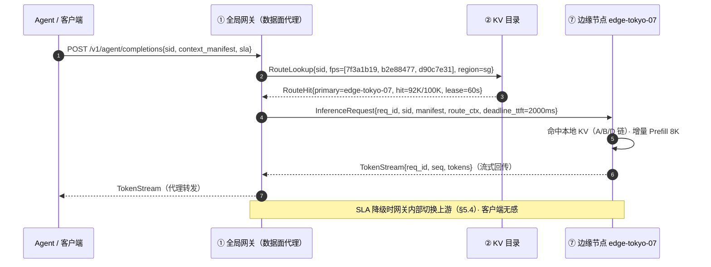
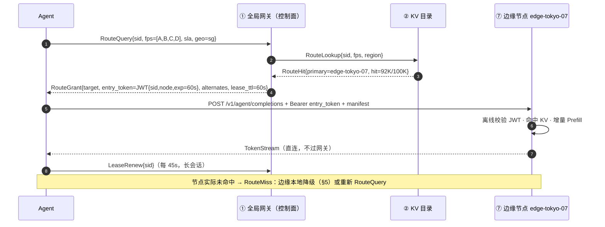
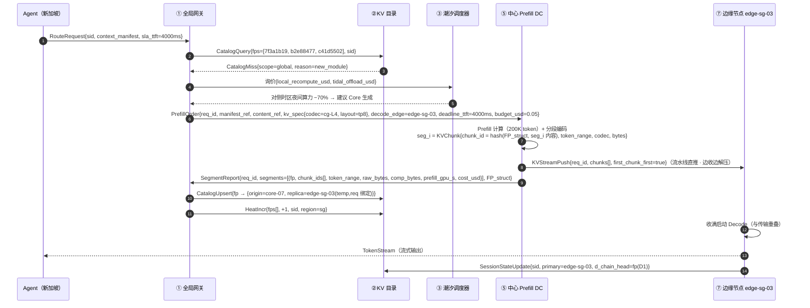
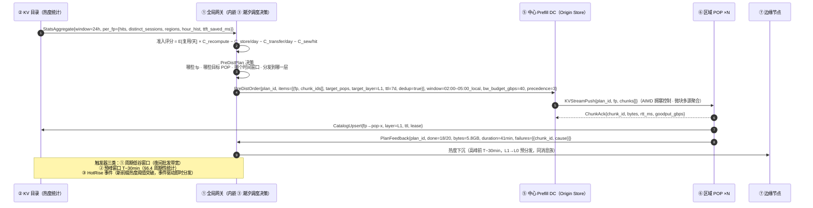
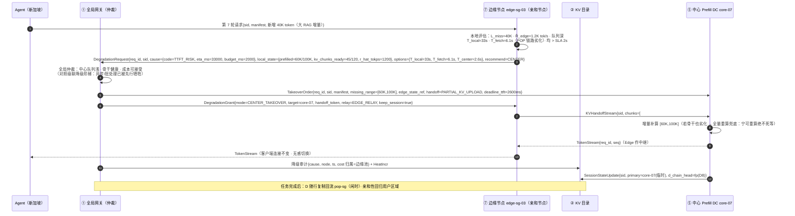
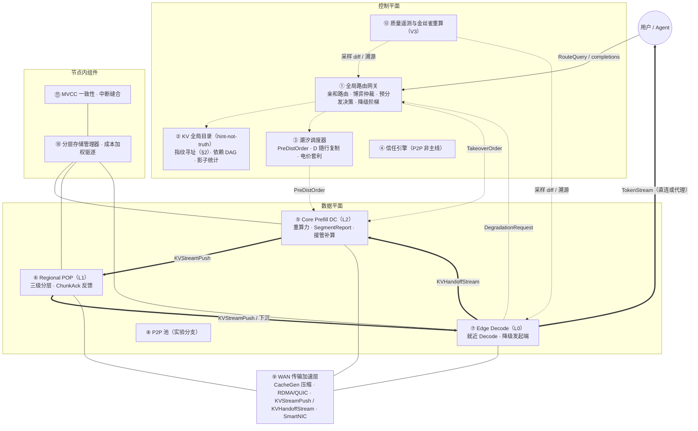
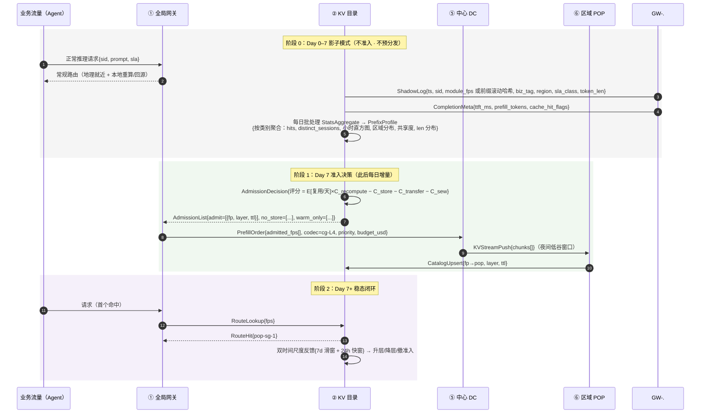

# KV Cache CDN 完整解决方案构想报告

**版本**：完整版 V3（V2 评审修订 + 接口与消息级设计）
**日期**：2026 年 9 月
**性质**：解决方案构想（Solution Vision）——面向长上下文与多模型 Agent 时代的 LLM 推理基础设施
**参考文献**：[P1]–[P16]（16 篇核心论文，附录 D 列全）

---

## 版本变更记录（V2 → V3）

| # | 变更 | 类型 | 来源 |
|---|---|---|---|
| 1 | 修正 §1.5 解码 RTT 经济学（V2 混淆延迟与吞吐），重构边缘层价值论证与拓扑结论 | **勘误** | 架构评审·挑战 1 |
| 2 | 澄清"新会话/亲和 miss"的真实缺失量（新会话缺 C 全量、亲和 miss 缺 D 全量），新增 **D 随行复制**机制 | 勘误+机制 | 评审·挑战 2 |
| 3 | 新增 **§2 KV 指纹与兼容性清单规范**（组成、字段表、A/B/C/D 实例、会话句柄） | 新增 | 本版要求 2 |
| 4 | 创新点一新增**请求接口样例**（结构声明 API）与**两种路由实现方式**（网关直连式 / 先查后连式），含时序图 | 新增 | 本版要求 3 |
| 5 | 原创新点二（PIC 微模块）与原创新点四（算存分离）**合并**为新创新点二"生产—分发—消费管线"，新增两条消息时序图：a) 冷未命中中心推理与 KV 段上报 b) 网关预分发决策 | 结构重构 | 本版要求 4 |
| 6 | 创新点三新增"**边缘 SLA 降级与中心接管**"决策逻辑与消息时序图 | 新增 | 本版要求 5 |
| 7 | 新增**冷启动三阶段时序图**（ShadowLog / AdmissionDecision 等消息与参数）+ ModuleDeclare 快速接入 | 新增 | 本版要求 1 |
| 8 | T_net 公式补解压/缝合项（T_decomp + T_sew）、逐节点 R̂、hedged 拉取、级联降级阶梯 | 修正 | 评审·挑战 6 |
| 9 | 新增部件⑫**质量遥测与金丝雀重算**；目录确立 **hint-not-truth** 原则；TCO 补底座成本并前置 Phase 0 验证 | 补强 | 评审·挑战 3/5/7 |

---

## 0. 导读：破除一个误区

### 0.1 一个必须首先破除的思维误区

KV Cache CDN 的核心创新，**绝对不是"在低速的广域网（WAN）上实时硬传几十 GB 的完整 KV Cache"**。100K 上下文（GQA-70B，32 GB KV，压缩后 8 GB）在 1 Gbps 公网上需要约 80 秒才能传完，是本地重算（10 秒）的 8 倍。

KV Cache CDN 相对于现有方案（本地 HBM、本地 CPU Memory Pool、本地 SSD、同机房 RDMA 分布式内存池）的真正创新，在于一场**"架构范式"的转变**：不再用网络带宽去对抗物理定律，而是通过**调度逻辑、数据形态、经济模型与部署拓扑**的重构，解决广域分布下的状态共享问题。

| 常见误区 | 本方案的真相 | 关键数字 |
|---|---|---|
| 在 WAN 上实时硬传完整 KV Cache | 亲和性路由：让请求去找数据，而非数据去找请求 | 几 KB 路由决策替代几 GB 跨域传输 |
| 缓存单位是完整会话/连续前缀 | PIC 微模块：只异步分发高共享模块 | 1–2 GB → 压缩后仅几百 MB |
| 有缓存命中就一定要读 | 经济博弈：实时评估拉取 vs 重算 vs 中心接管，择优执行 | 拥塞时 T_net 15 s vs T_compute 1–2 s，果断重算 |
| 每个地域都要堆高配 GPU 集群 | 算存分离：中心生成/预热，边缘低成本服务 | 完整形态 TCO −30% ~ −45%（待 Phase 0 验证） |

### 0.2 真正的创新：架构范式的转变

V3 将原四大创新点重组为**三大创新点**（原二与原四合并，理由见下）：

| # | 创新点 | 范式转变 | 一句话机制 | 关键收益 |
|---|---|---|---|---|
| 一 | 调度范式逆转 | 数据找计算（Pull）→ 计算找数据（Routing） | 网关查全局 KV 目录，将 KV 驻留作为路由的高权重因子 | 用几 KB 路由决策替代几 GB 跨域传输 |
| 二 | 数据形态与部署拓扑的联合重构（原二+原四） | 完整会话缓存 + 算存强耦合同机房 → PIC 微模块异步分发 + 全球算存分离 | 中心生成 KV 资产并上报指纹，网关决策哪些段、何时、发给哪些 POP | 广域传输压缩到 1–2 s 甚至零感知，边缘免大 Prefill 算力池 |
| 三 | 经济博弈与全局降级 | 确定性读缓存 → 动态博弈决策 + 中心接管兜底 | 实时评估 T_net vs T_compute vs T_center，择优执行 | 恶劣网络下 SLA 不崩溃（宁可重算/上移，绝不死等） |

**合并说明**：原创新点二（数据形态："推什么"）与原创新点四（部署拓扑："何时何地推、谁生产谁消费"）实为同一条**"生产（中心推理）→ 上报（指纹与热度）→ 决策（网关）→ 分发（预推 POP）→ 消费（边缘命中）"流水线的两端**。V3 将其合并为创新点二，并按消息流组织章节（§4.5/§4.6 两条时序图即该流水线的两端）。

### 0.3 报告结构与阅读地图

**§1** 问题背景与全部可行性测算（含 V3 修正后的解码侧经济学）→ **§2** KV 指纹与兼容性清单规范（全系统寻址基础，V3 新增）→ **§3–§5** 三大创新点（含接口样例与消息时序图）→ **§6** 总体架构、部件清单与冷启动流程 → **§7** 挑战全景与开放问题 → **§8** 结论与分阶段落地路径 → 附录 A–E。

---

## 1. 问题背景、核心结论与可行性

### 1.1 为什么 KV Cache 变成了 CDN 的问题

大模型推理的瓶颈已从"计算密集"全面转向"访存与状态密集"：长上下文推理中，KV 相关的内存开销、传输开销与重算成本**占推理总成本 50% 以上**；Attention 计算量随上下文平方增长，而 KV 的读写带宽线性增长且每个解码步都要全量触碰——瓶颈从 FLOPs 转移到内存带宽与显存容量（"显存墙"）。

三重爆炸把 KV Cache 逐层挤出单机：

1. **上下文窗口爆炸**：4K → 128K → 1M+（Kimi 200 万、Gemini 1000 万 token）。70B 级模型单请求 KV 从百 MB 膨胀至上百 GB，百并发轻松突破 TB 级，远超单卡 HBM（80/144 GB）。
2. **复用浪费爆炸**：多轮对话、RAG、系统提示词场景存在大量重复前缀，重复 Prefill 造成的算力浪费达 30–70% [P2]。"一次计算、多次消费"——这正是 CDN 的经典经济学。
3. **地理分布爆炸**：全球/全国部署要求就近服务；算力异构（Prefill 吃算力、Decode 吃带宽，最优芯片不同）导致两类负载天然不在同一机房；不同区域电价与算力成本差 2–5×，时区潮汐造成利用率日内波动。

当缓存被逐层挤出单机——GPU 显存 → CPU DRAM → NVMe → RDMA 集群 → 广域网——其核心特征与 1990 年代的静态内容分发完全同构，一个 CDN 问题就此成立。但**问题成立，不等于"用带宽硬传"的解法成立**——正确的解法是 §3–§5 的范式重构。

### 1.2 核心论点与本质同构

**核心论点**：当 KV Cache 的体量（百 GB/请求）、成本（占推理总成本 50%+）、复用价值（前缀复用率 30–70%）和地理跨度（跨集群、跨地域、跨时区）同时突破单机与单集群边界时，它就不再是一个引擎内的内存管理问题，而是一个**内容分发网络（CDN）问题**。解决这个 CDN 问题的正确姿势，不是对抗广域网带宽，而是**围绕广域网的物理局限，重构系统的调度逻辑（§3）、数据形态与部署拓扑（§4）、经济模型（§5）**。

KV Cache 与传统静态内容的关键差异（错误影响行是本质差异）：

| 维度 | 传统静态内容 CDN | KV Cache CDN |
|---|---|---|
| 内容属性 | 静态独立文件，可跨机器/厂商/版本读取 | **模型绑定张量——严格绑定模型权重/结构、tokenizer/模板/RoPE、精度量化/张量布局/TP-PP、LoRA/系统版本/引擎实现，任一不匹配即不可流用** |
| 匹配粒度 | URL 完整匹配 | 前缀/语义块部分匹配，公共前缀越长收益越大 |
| 错误影响 | 404 / 文件损坏 | **静默的生成质量劣化、逻辑错乱、输出不可控** |
| 回源代价 | 仅带宽成本（拉文件） | 算力 + 时间成本极高（重跑 Prefill）——**命中经济学价值更强，错误容忍度更低** |

块级寻址必须携带**不可变的 KV 兼容性清单（Compatibility Manifest）**，内容寻址 = 哈希(兼容性清单 × 块内容)——完整规范见 **§2（V3 新增）**。

### 1.3 业界研究热点与技术演进方向（2026-09）

1. **PD 分离已从论文变为默认架构**：DistServe [P4]、Splitwise [P5] 确立的分离式推理已被 NVIDIA Dynamo、llm-d 等全面采纳。
2. **集群级 KV 池化进入生产**：Mooncake [P6]（FAST'25 最佳论文，生产实测多处理 115% 请求）、MemServe [P10]、Preble [P12]（已被 AIBrix 采用）。
3. **KV 的"网络层"正在成型**：CacheGen [P7]（KV 专用压缩 3.5–4.3×）、EPIC [P9]（位置无关缓存）、ShadowServe [P15]（SmartNIC 卸载解压）。
4. **跨数据中心是 2026 年的绝对前沿**：PrfaaS [P13]（跨 DC Prefill 卸载产业级 PoC：吞吐 +54%，P90 TTFT −64%）；*An Internet for the KV Cache* [P14] 提出纲领性愿景。
5. **模型架构与系统协同设计成为胜负手**：Kimi Linear 类混合注意力架构把 KV 生成/传输吞吐降低 4–36 倍，使跨机房传输从"百 G 专线专属"降级为"普通以太网即可承载"——PrfaaS 的全部底气来源于此。

技术演进五方向：单向卸载→双向分发；性能优先→成本优先；同构→异构协同；单模型→多模型共享（DroidSpeak [P11]）；闭域→开放互联。

### 1.4 何时从远端拉取 KV 比本地重算更合适（含计算过程）

> 本节是创新点三（§5）动态博弈引擎的数学基础。决策模型：

```
T_fetch      =  T₀  +  s·L / (B·C)                T_recompute  =  L / R  +  T_queue
（远端拉取）         （传输线性项）                （本地重算）      （计算线性项）
```

**远端拉取占优的充要条件**：

```
B·C  >  s·R          且          L  >  L*  =  T₀ / ( 1/R  −  s/(B·C) )
```

三个本质规律：①胜负由 **"带宽×压缩积"（B·C）对"字节×算力积"（s·R）** 的比值决定，与 L 无关；②固定开销 T₀ 只能靠长度摊销——短上下文必属本地；③模型架构是第一杠杆——s 缩小 10 倍比带宽扩容 10 倍更便宜。

#### 1.4.1 基础参数（KV 密度表）

s = 2（K/V）× 层数 × KV 头数 × 头维度 × 每元素字节数（FP16/BF16 按 2 字节计）：

| 模型架构 | 机制 | s（每 token KV） | 100K 上下文 | 1M 上下文 |
|---|---|---|---|---|
| 70B 级 MHA（64 KV 头 × 80 层） | 全注意力 | 2.5 MB | 250 GB | 2.5 TB |
| Llama-3-70B（GQA：8 × 80 × 128） | 分组查询 | **320 KB** | 32 GB | 320 GB |
| DeepSeek-V3 级 MLA（576 维 × 61 层） | 潜在压缩 | 69 KB | 6.6 GB | 66 GB |
| Kimi Linear 级混合 | 混合架构 | ~20–70 KB（有效） | 2–7 GB | 20–70 GB |

本地重算基线：8×H100 节点（TP=8）Prefill 吞吐 R ≈ 10,000 token/s（70B 密集，保守 MFU）→ **s·R（GQA-70B）= 3.2 GB/s**。网络档位（有效吞吐）：100 Gbps ≈ 10 GB/s；10 Gbps ≈ 1.2 GB/s；1 Gbps ≈ 0.1 GB/s。CacheGen 压缩 C ≈ 4。

#### 1.4.2 时间维度测算（100K 上下文，GQA-70B，32 GB KV）

| 路径 | 计算过程 | TTFT | 对比本地重算 |
|---|---|---|---|
| 本地重算（8×H100） | 100K ÷ 10K/s | **10.0 s** | 基线（兜底路径） |
| 100 Gbps 专线 + CacheGen 4× | 8 GB ÷ 10 GB/s + 0.1 s | **~0.9 s** | ✅ 11× 更快 |
| 10 Gbps + 4× 压缩 | 8 GB ÷ 1.2 GB/s + 0.1 s | ~6.8 s | ⚠️ 1.5×（边际） |
| 1 Gbps 公网 + 4× 压缩 | 8 GB ÷ 0.1 GB/s | ~80 s | ❌ 差 8× |
| 1 Gbps + 混合架构（压缩后 0.8 GB） | 0.8 GB ÷ 0.1 GB/s | ~8.1 s | ✅ 1.2×（普通以太网即可跨机房） |

这张表是全报告的"物理边界坐标"：Pull 范式在 1G–10G WAN 上是死局（§3.1）、跨域传输必须压缩到"仅动态模块增量"（§4.5）、需要动态博弈决定何时放弃拉取（§5.2）。

#### 1.4.3 盈亏平衡：B·C vs s·R 与临界长度 L\*

| 模型架构 | s·R（R=10K tok/s） | 打平所需 B·C | 100G+4× | 10G+4× | 1G+4× |
|---|---|---|---|---|---|
| MHA-70B | 25 GB/s | ≥ 25 GB/s | ❌ | ❌ | ❌ |
| GQA-70B | 3.2 GB/s | ≥ 3.2 GB/s | ✅ 15.6× | ✅ 1.6× | ❌ |
| MLA | 0.69 GB/s | ≥ 0.7 GB/s | ✅ 72× | ✅ 7× | ⚠️ 边界 |
| 混合（s≈32 KB） | 0.32 GB/s | ≥ 0.32 GB/s | ✅ | ✅ | ✅ 1.6× |

临界长度 L\*（T₀ = 100 ms，GQA-70B）：100G+4× → ~1.1K token；10G+4× → ~2.8K token。即百 G 专线 + 4× 压缩下，**1K token 以上跨机房拉取即开始占优**，长上下文（100K+）收益最大——这就是 KV Cache CDN 的第一落点是长上下文 RAG、多轮 Agent 与超大系统提示词业务的原因。

### 1.5 解码侧经济学（V3 修正版：为什么 KV 要向边缘移动）

> **V2 勘误**：V2 表述"用户感知的每 token 延迟 ≈ max(解码计算时间, 网络 RTT)"混淆了**延迟（latency）与吞吐（throughput）**，并由此推导出"RTT=100ms 钳制用户在 ~10 token/s、千 token 会话累计节省 60–90 s"。V3 修正如下。

流式生成是**单向字节流**：token 以生成节奏持续进入网络管道，在客户端以相同节奏流出。RTT 只贡献一个**固定的一次性偏移**，不约束稳态速率——除非协议是"逐 token 停等确认"，而 LLM 流式输出不是。修正后的用户感知模型：

```
单轮流式：token 到达间隔 ≈ max(t_gen, 抖动停顿)     RTT 只加常数偏移 + 抖动停顿
多轮/Agent 循环（K 轮）：每轮一次 RTT + KV 状态迁移    RTT 累积 = K × RTT
```

| 场景 | RTT 100ms → 10ms 的真实节省 | 量级 |
|---|---|---|
| 单轮流式输出 1000 token | ≈ 90 ms（一次性偏移）+ 抖动停顿减少 | **毫秒级**（V2 高估约 1000×） |
| Agent 循环 K=30 轮 | ≈ 30 × 90 ms = 2.7 s | 秒级——对 Agent MaaS 仍是真实收益 |
| 语音级交互（轮转延迟敏感） | 每轮 90 ms | 感知显著 |

**修正后的结论**：

1. 就近 Decode 的价值从"每 token 持续税"修正为"**每轮一次的固定税**"——对多轮 Agent（轮数多、每轮短）收益真实且随轮数累积，但对单轮长生成远小于 V2 声称；
2. **拓扑含义**：L0 边缘无需密集部署（每区域/国家一个即可），**两层拓扑（中心 + 区域 POP）是多数场景的更优默认**；L0 加密仅在语音级交互、合规数据驻留、故障域隔离三类需求下发生（§4.4）；
3. **反向强化创新点一**：远端亲和路由的持续代价从"会话节奏灾难"降为"每轮 ~90 ms + 抖动"——**亲和性可以比 V2 设计的更"硬"**（§3.5 的弃亲和场景因此收窄）。

### 1.6 技术可行性：成立

| 证据 | 数据 | 来源 |
|---|---|---|
| PagedAttention 批容量 | 提升 10–100 倍 | [P1] SOSP'23 |
| 前缀缓存 Prefill 算力节省 | 30–70% | [P2] SGLang |
| PD 分离 goodput | 提升 2–4.8× | [P4] OSDI'24 |
| 集群 KV 池 | 模拟吞吐 +525%，生产多处理 115% 请求 | [P6] FAST'25 |
| 传输压缩 | KV 体积 −3.5~4.3× | [P7] SIGCOMM'24 |
| 非前缀复用 | TTFT −2.2~3.3×，吞吐 +2.8~5× | [P8] EuroSys'25 |
| 分布式缓存栈 | 配合 vLLM 吞吐最高 +15× | [P16] LMCache |
| 跨 DC 卸载（产业 PoC） | 吞吐 +54%，P90 TTFT −64% | [P13] PrfaaS |
| SmartNIC 卸载 | GPU 通信干扰 −90%+，传输延迟 −30% | [P15] ShadowServe |
| 跨模型 KV 共享 | 多模型 Prefill 算力 −20~40% | [P11] NSDI'26 |

**结论**：模型侧（混合/MLA）、系统侧（分离、池化、压缩、位置无关复用）、硬件侧（CXL、SmartNIC、专用 Prefill 芯片）三条线均已就位，**当前不存在不可逾越的技术障碍，瓶颈在工程化与标准**。

### 1.7 商业可行性：场景成立，且可精确刻画

#### 单位经济学（每次 100K-token 请求，GQA-70B，8 GB 压缩后传输）

成本参数：8×H100 节点 16 美元/时 → 本地重算 10 s = **0.044 美元/次**；带宽按零售专线 0.02 美元/GB、骨干批发 0.002 美元/GB 计。

| 场景 | 计算 | 结论 |
|---|---|---|
| 缓存命中 + 零售专线带宽 | 8 GB × 0.02 = 0.16 美元 > 0.044 | ❌ 纯成本角度不划算（但是 11× 时延优化，"时延玩法"） |
| 缓存命中 + 批发/自营骨干 | 8 GB × 0.002 = 0.016 < 0.044 | ✅ 便宜 64% 且快 11× |
| 潮汐卸载（远端算力 1/10 价格）+ 批发 | 0.0044 + 0.016 = 0.020 | ✅ 便宜 55% |
| 混合架构（压缩后 0.8 GB）+ 零售专线 | 0.016 或 0.0044+0.016 | ✅ 零售带宽下也成立 |

盈亏平衡带宽单价：`P_bw* = (1−f)·P_node·C/(R·s)`。GQA-70B + 4× 压缩下 P_bw* ≈ 0.0055 美元/GB；混合架构（s 缩小 10×）下 P_bw* ≈ 0.055 美元/GB，**全面覆盖市场专线价格**。

> **商业可行性的两大开关**：① 带宽单价（批发/自营骨干 vs 零售专线）；② 模型 KV 密度（混合/MLA vs 传统 GQA/MHA）。二者满足其一，跨机房分发即进入经济可行区——这正是 Moonshot 选择 Kimi Linear 作为 PrfaaS 载体的经济动因。

#### TCO 测算（多区域、长上下文占比 30%+、前缀复用率 40%+）——V3 增补底座成本

| 部署形态 | TCO 变化 | 主要来源 |
|---|---|---|
| 单集群同构（基线） | 1.0 | — |
| 跨集群 PrfaaS 模式 | −15% ~ −25% | 算力节省 > 带宽与新增硬件成本 |
| 完整 KV Cache CDN | **−30% ~ −45%（待 Phase 0 验证）** | 算力节省 ~65% + 资源效率 ~35% |

> **V3 增补（评审意见）**：上述区间未含三项底座成本，V3 将其显式列入推导框架，并在 §8.3 前置 **Phase 0 验证**：① **边缘权重驻留冗余**——边缘仍需完整权重驻留 HBM（70B ≈ 140 GB/模型 × N 模型 × M 边缘；MoE 前沿模型 671B 边缘不可驻留），这是与传统 CDN"边缘存储近乎免费"的本质断裂；② 目录/控制平面的建设与运营成本；③ Prefill 中心的峰值排队与 N+1 冗余容量。**KPI 修正**：北极星从"缓存命中率"改为 **"每美元节省的 Prefill token 数 + TTFT SLO 达成率 + 输出散度 SLO"**——因为命中 ≠ 免费（缝合/解压成本，见 §5.2）。

#### 正向收益的适用边界

满足越多收益越大：长上下文请求占比 > 20%；前缀可复用率 > 30%；多区域部署且区域算力成本差异大（2–5×）；单集群显存瓶颈明显；多模型 Agent 场景占比高。

---

## 2. KV 指纹与兼容性清单规范（V3 新增）

KV 指纹（Fingerprint）是全系统的寻址基础：目录以它为键（部件②）、路由以它为输入（§3.3 接口）、预分发决策以它的热度统计为依据（§4.6）、复用统计以它为聚合单位（§6.4）。本节给出其组成与实例。

### 2.1 设计目标与总体结构

指纹要同时回答三个问题：**唯一命名**（内容寻址、跨节点去重）、**兼容判定**（结构指纹先行，避免张量错配的静默劣化）、**依赖表达**（装配顺序由 DAG 决定，PIC 不等于任意拼装）。

```
模块指纹   fp(M)  = Trunc128( SHA-256( FP_struct ‖ FP_content ‖ type_tag ) )

结构指纹   FP_struct = SHA-256( canonical_CBOR( CompatibilityManifest ) )
内容指纹   FP_content = SHA-256( canonical_CBOR( ModuleContent ) )
```

两级分离的用途：**结构指纹相同**的一切模块进入同一"命名空间"（一次模型部署位），目录可按 FP_struct 分区、按 FP_content 寻址；模型/引擎升级时只需迁移 FP_struct 变化的部分，统计画像与准入决策可跨结构指纹沿用（§6.4）。

### 2.2 结构指纹：Compatibility Manifest 字段表

| 字段 | 示例值 | 变更后果 |
|---|---|---|
| `model.id / weights` | `qwen3-72b-instruct` / 权重 SHA-256 前 16 位 | 全部失效 |
| `arch` | 80 层 × 8 KV 头 × 128 维；RoPE base 1M + yarn-0.1 | 全部失效 |
| `tokenizer` | tokenizer id + merges 文件哈希 | 全部失效 |
| `chat_template` | `tpl-acme-agent-v3` | 全部失效 |
| `kv_format` | dtype=BF16，codec=cachegen-L4，KV 量化=null | 需重编码 |
| `layout` | TP=8，PP=1，head→shard 映射 v2 | 可转换（换布局需重排） |
| `lora` | null 或 `lora-csr-77@v2` | LoRA 相关块失效 |
| `engine` | vllm-0.11.2 + fa3 内核 | 默认失效；经"数值等价性认证"后可放宽（§2.6） |
| `pic_profile` | epic-v1，边界重算 k=8，重旋转方案 | 同 |

### 2.3 内容指纹：ModuleContent 字段表

| 字段 | 说明 |
|---|---|
| `type` | 模块类型标签：SYSTEM（A）/ TOOLS（B）/ RAG（C）/ HISTORY（D） |
| `tokens_sha` | 归一化 token id 序列的 SHA-256（模块内容的身份） |
| `len` | token 数 |
| `deps` | 上游依赖模块指纹列表（KV 依赖 DAG 的边，§4.2） |
| `boundary` | 边界元信息（首 token 是否需边界重算及其深度 k） |

### 2.4 具体示例（贯穿全文的运行样例）

运行样例设定：**ACME Copilot 平台**，模型 Qwen3-72B-Instruct @ w-2026.06.15，Agent 上下文 100K token。

**第一步：结构指纹（该部署下所有模块共享）**

```json
{
  "ver": 1,
  "model":   {"id": "qwen3-72b-instruct", "weights": "sha256:e3b0c442…[0:16]"},
  "arch":    {"layers": 80, "kv_heads": 8, "head_dim": 128,
              "rope": {"base": 1000000, "scaling": "yarn-0.1"}},
  "tokenizer": {"id": "tk-qwen3-v15", "merges_sha": "7ad3f2c1…"},
  "chat_template": "tpl-acme-agent-v3",
  "kv_format": {"dtype": "BF16", "codec": "cachegen-L4", "quant": null},
  "layout":  {"tp": 8, "pp": 1, "head_map": "v2"},
  "lora":    null,
  "engine":  {"name": "vllm", "version": "0.11.2", "kernel": "fa3"},
  "pic_profile": {"scheme": "epic-v1", "boundary_k": 8}
}
```

→ canonical CBOR（键排序、UTF-8 NFC）→ SHA-256 → **FP_struct = `9c41a7e2…`**（展示取前 16 hex）

**第二步：四类模块的内容指纹**

| 模块 | 内容 | len | tokens_sha | deps | 模块指纹 fp(M) |
|---|---|---|---|---|---|
| A（SYSTEM） | ACME 平台系统提示词 v3 | 3,072 | `5b02f0aa…` | ∅（根模块） | **`7f3a1b19`** |
| B（TOOLS） | 工具库 v3（search/code/run） | 512 | `3e77c2d0…` | [fp(A)] | **`b2e88477`** |
| C（RAG） | 租户知识库文档集（文档级各自成块） | 48,000 | `a1930f6c…` | [fp(A), fp(B)] | **`c41d5502`**（文档集句柄；文档级另有 `c4-doc#i`） |
| D₇（HISTORY） | 会话第 7 轮增量 | 420 | `f4e8123a…` | [fp(A), fp(B), fp(C), fp(D₆)] | **`d90c7e31`** |

计算例：`fp(A) = Trunc128(SHA-256("9c41a7e2…" ‖ "5b02f0aa…" ‖ "SYSTEM")) = 7f3a1b19`。

**D 链**：每轮 HISTORY 模块指纹链接前一轮（deps 含 fp(D_{n−1})），构成**逐轮链式的会话 KV 链**——这同时是 Agent 树状/图状上下文生命周期（分支、回溯、恢复）的最小实现基础：分支 = 在 fp(D₆) 上挂多个后继。

### 2.5 会话句柄（SessionHandle）与模块指纹的分离

**路由用会话句柄，复用统计用模块指纹**——二者分离是创新点一与创新点二协作的关键：

```
SessionHandle: sess_9f2c71ab →
{
  "primary_node": "edge-tokyo-07",          // 会话 KV（D 链）驻留节点
  "d_chain_head": "d90c7e31",               // = fp(D₇)
  "assembled":    ["7f3a1b19", "b2e88477", "c41d5502", "d90c7e31"],
  "region_home":  "sg",                      // 用户归属区域（D 随行复制目标）
  "seq": 7,
  "lease_exp":    "2026-09-17T09:31:00Z"
}
```

**目录条目**（部件② 中一个模块指纹的登记形态）：

```
"7f3a1b19" →
{
  "struct": "9c41a7e2…", "type": "SYSTEM",
  "replicas": [
    {"node": "core-07",       "layer": "L2-origin", "ttl": null},
    {"node": "pop-sg-1",      "layer": "L1",         "ttl": "7d"},
    {"node": "edge-tokyo-07", "layer": "L0",         "ttl": "24h", "lease": "…"}
  ],
  "heat":     {"hits_24h": 18204, "distinct_sessions": 4211},
  "sew_cost": {"recompute_tokens": 8, "rope": "re-rotate"}   // 命中≠免费（§5.2）
}
```

### 2.6 工程规则

1. **canonical 序列化**：CBOR、键排序、UTF-8 NFC——同一清单在任何节点算出同一哈希；
2. **128-bit 截断**：生日碰撞界 2^64，远超全局模块总量，wire 上 16 字节；
3. **版本前缀字节**：指纹方案自身演进（ver 字段）；
4. **生产者计算、消费者重验**：边缘收块时对内容重算哈希（trust-but-verify），防投毒与静默损坏；
5. **数值等价性认证**：引擎/内核升级时，金标集上"新旧引擎输出散度 < 阈值"即可认证为同一 FP_struct（放宽 engine 绑定），避免每次 vLLM 升级全平台缓存作废——MVCC 双版本窗口只在未认证时启用；
6. **目录条目携带 sew_cost**：缝合/重旋/解压成本随指纹登记，供 §5 博弈引擎与 §6.4 准入评分取用。

---

## 3. 创新点一：调度范式的逆转 — 从"数据找计算（Pull）"到"计算找数据（Routing）"

### 3.1 Pull 模式的广域死局

现有方案的隐含假设：请求到达节点发现本地无缓存时，主动跨网拉取（Pull）KV。这在 100G+ 局域网内完全可行（§1.4.2：~0.9 s，快 11 倍），但平移到广域网数学上不成立：

| 网络档位（100K 上下文，8 GB 压缩后） | 拉取 TTFT | 对比本地重算（10 s） | 判定 |
|---|---|---|---|
| 100 Gbps 专线 + 4× 压缩 | ~0.9 s | ✅ 11× 更快 | LAN/专线专属红利 |
| 10 Gbps + 4× 压缩 | ~6.8 s | ⚠️ 仅 1.5×（边际） | 一次拥塞/排队即翻盘 |
| 1 Gbps 公网 + 4× 压缩 | ~80 s | ❌ 差 8× | 灾难性延迟 |

10 Gbps 档名义上仍"占优"，但优势只剩 1.5×——链路一次抖动或目标节点排队，拉取立即劣于重算。**在广域网环境下，请求触发后主动拉取大数据的 Pull 范式，不是"优化空间有限"，而是死路。**

### 3.2 机制：Cache-Affinity Routing（缓存亲和性路由）

逆转调度方向：不再让数据去找计算，而是让计算去找数据。

- **机制**：API 网关维护轻量级全局 KV 目录（部件②）。请求到达时，网关**不随机分配**、也不只按地理就近分配，而是把"KV 驻留位置"作为路由决策的**高权重因子**：查得会话 D 链驻留东京后，综合考量下**优先**路由到东京——同时权衡持续 Decode 的 RTT（按 §1.5 修正后的每轮模型折算）、跨境合规与故障集中度。
- **价值**：一条目录记录（前缀/会话指纹 16–32 字节 + 节点句柄 + 生命周期元数据）对比 KV 本体（GQA-70B 每 token 320 KB），**相差 5–6 个数量级**；路由决策在网关本地完成，微秒~毫秒级，**不占用任何跨域带宽**。

技术现状：Preble [P12]（已被 AIBrix 采用）与 GORGO 已引入缓存路由维度（联合评估"本地缓存长度 × 跨区域传输延迟 × 目标节点排队"，端到端延迟再降 ~18%）。本方案与现状的差异在于**约束的优先级**：Preble 以"延迟最优"为目标、缓存分布当作输入；本方案把"**会话/模块 KV 驻留**"提升为路由第一约束，再在候选驻留节点间做延迟/成本/负载的次级优化。§1.5 修正后的 RTT 模型使这一差异比 V2 预想的更可持续——远端亲和的每轮代价仅 ~90 ms + 抖动。

### 3.3 请求接口规范（V3 新增：结构声明 API）

Agent/用户请求全局网关时**携带前缀/模块指纹**。该接口同时是"结构声明 API"——Agent 框架本来就知道自己的上下文结构（系统词/工具/RAG/历史），显式声明模块边界与依赖（承接 Prompt Cache 的 PML 思想 [P3]），远比目录端从日志逆向猜测可靠。

**数据面请求样例（`POST /v1/agent/completions`）：**

```json
POST /v1/agent/completions HTTP/1.1
Host: gw.cdnp.ai
Authorization: Bearer <platform-token>
X-Session-ID: sess_9f2c71ab
X-SLA-Class: interactive

{
  "model": "qwen3-72b-instruct@w-2026.06.15",
  "session": {
    "session_id": "sess_9f2c71ab",
    "turn_no": 7,
    "parent": null
  },
  "context_manifest": {
    "modules": [
      {"fp": "7f3a1b19", "type": "SYSTEM",  "source": "catalog"},
      {"fp": "b2e88477", "type": "TOOLS",   "source": "catalog"},
      {"fp": "c41d5502", "type": "RAG",     "source": "catalog"}
    ],
    "history": "session",
    "new_input": "…本轮新增文本 180 token…"
  },
  "sla": {"ttft_p99_ms": 2000, "tps_min": 30},
  "geo": {"region": "sg", "compliance": ["rag-residency:sg"]}
}
```

**控制面应答样例（先查后连模式，见 §3.4.b 的 `RouteGrant`）：**

```json
{
  "mode": "AFFINITY",
  "target": {
    "node": "edge-tokyo-07",
    "endpoint": "https://tokyo-07.edge.cdnp.ai/v1/agent/completions",
    "entry_token": "eyJhbGciOi…",      // JWT{sid, node, exp=T+60s}，边缘离线可验
    "lease_ttl_s": 60
  },
  "alternates": ["edge-osaka-02"],
  "decision": {
    "affinity_score": 0.92,
    "hit_tokens": "92K/100K",
    "miss_plan": "incremental_prefill_8K",
    "est_ttft_ms": 1450,
    "reason": "A/B/D hit at tokyo-07, rtt=71ms ok, rag-residency satisfied"
  }
}
```

语义要点：① `context_manifest.modules[].fp` 即 §2 指纹——网关据此查目录，**接口只传 16 字节指纹，不传内容**；② 未声明结构的老客户端退化为"前缀哈希"模式（网关对 prompt 头部滚动哈希），兼容存量流量（§6.4 冷启动影子模式即用此通道采集）；③ `parent` 字段支撑 Agent 分支/恢复（D 链分叉，§2.4）。

### 3.4 两种实现方式（V3 新增）

#### 方式 a）全局网关直接路由（LB / 反向代理式）

网关是数据面的一跳：所有 token 流经网关代理转发。**降级/迁移对客户端完全透明**——创新点三的 SLA 降级（§5.4）在该方式下零客户端改动。



#### 方式 b）先查询后直连（DNS 式解析）

网关仅承载**控制面**（KB 级 RouteQuery/RouteGrant），token 流 Agent↔边缘直连——网关不被流量穿透，横向扩展压力骤减。



#### 两种方式对比与混合策略

| 维度 | a) 网关直连（LB 式） | b) 先查后连（DNS 式） |
|---|---|---|
| 数据路径 | Agent ↔ GW ↔ Edge（双跳） | Agent ↔ Edge（单跳） |
| 网关承载 | 全部 token 流量 | 仅控制面（KB 级） |
| SLA 降级/流迁移 | 网关内部切换上游，**客户端零改动** | 需 `StreamMigrate`（§5.4.2：带签名 resume_token 重连） |
| 客户端复杂度 | 低（单一 endpoint） | 中（两步握手 + lease 续期） |
| 适用 | 浏览器/通用 SDK、降级场景多、SLA 敏感 | Agent 原生客户端、长流、成本敏感 |
| 类比 | L7 LB / 服务网格 | DNS 解析 + 直连 |

**混合策略（推荐）**：会话首轮走方式 a（网关建立 D 链驻留 + 采集 manifest），`RouteGrant` 随响应下发；第 2 轮起 Agent 切方式 b 直连边缘，网关只保留 lease 续期与审计。兼得两者优点。

### 3.5 亲和性的边界、修正后的弃亲和判据与 D 随行复制（V3 补强）

亲和性是**软约束**，硬约束是**首字延迟 + 持续 Decode 的每轮 RTT（§1.5 修正模型）+ 综合成本**。四类"弃亲和"场景（V3 按修正后 RTT 经济学重新量化）：

1. **Agent 多轮循环的累积 RTT**：K 轮 × RTT 超过省下的 Prefill 时间时弃亲和（K > T_prefill_saved / RTT 即触发；90 ms 档位下 K 约为数十轮，故单轮会话几乎永不触发）；
2. **跨境合规 / 数据主权**：`geo.compliance` 声明的驻留约束让位于亲和；
3. **驻留节点故障或过载**：熔断切换至就近节点，缺失段走 §5 博弈决策；
4. **首次请求（无历史会话）**：退化为地理就近 + 共享模块预热命中（§4）。

**D 随行复制（V3 新增机制，评审补强）**：V2 的"亲和 miss 缺失 D 增量 100–200 MB"混淆了情形——**新会话**真正缺失的是 C 全量（30–80K token，10–25 GB 原始），**亲和 miss** 缺失的是 **D 全量历史**（非单轮增量）。补强机制：**每轮 Decode 后，边缘节点异步将 D 增量（100–200 MB 压缩后 ~30–50 MB）复制到用户归属区域的 POP**（`region_home` 字段，区域内带宽廉价），使亲和 miss 的代价被限制为**区域内拉取（亚秒级）或区域内重算**，永不触发跨域硬传。该机制由部件③潮汐调度器编排（`DShadowPush`，低优先级、低谷窗口执行），是软亲和从权宜设计变成鲁棒设计的关键补丁。

> **亲和性的经济学（修正版）**：命中亲和省下的是 GB 级跨域传输（一次性 80 s / 8 GB 档），丢失亲和付出的是亚秒级增量重算或区域内拉取；而远端亲和的持续代价按 §1.5 修正后仅为每轮 ~90 ms + 抖动——路由把它们放进同一成本函数（部件①）。

---

## 4. 创新点二：数据形态与部署拓扑的联合重构 — 一条"生产—分发—消费"管线（原创新点二+四合并）

### 4.1 为什么合并

原创新点二回答"**推什么**"（数据形态：PIC 微模块），原创新点四回答"**何时何地推、谁生产谁消费**"（拓扑：算存分离）——二者是同一条管线的两端，分开叙述导致 V2 中"谁在什么时机发起分发"始终含混。V3 按**消息流**组织本章：

```
生产（中心推理）→ 上报（KV 段 + Hash → 网关复用统计）→ 决策（网关：哪些段·何时·发给哪些 POP）
→ 分发（低谷/预峰窗口异步 Push）→ 消费（边缘命中 + 增量服务）
```

§4.5 时序图对应"生产 + 上报"，§4.6 对应"决策 + 分发"——同一管线的两端。

### 4.2 上下文的模块化解剖：A / B / C / D

按**共享度**拆分为四类可独立寻址的微模块（指纹规范见 §2）：

| 模块 | 内容 | 典型体量（GQA-70B，s = 320 KB/token） | 共享度 | 归宿 |
|---|---|---|---|---|
| **A：全局 System Prompt** | 平台级系统提示词、角色设定、安全规范 | 2–4K token ≈ 0.6–1.3 GB | 极高（全平台共享） | 全球预分发 |
| **B：标准 Tool Schema** | 工具/函数定义、Agent 工作流模板 | 1–2K token ≈ 0.3–0.6 GB | 高（按业务线共享） | 全球/区域预分发 |
| **C：用户特定 RAG 文档** | 租户私有知识库 | 30–80K token ≈ 10–25 GB | 低（租户内共享） | **租户级区域驻留（不入全球分发）** |
| **D：动态对话历史** | 会话多轮累积 | 单轮增量 300–600 token ≈ 100–200 MB | ≈ 1（会话私有） | **亲和节点驻留 + D 随行复制（§3.5）** |

关键观察：A + B 合计仅 **1–2 GB**——高共享、小体量、低变更频率，是"黄金分发对象"（压缩后几百 MB）；庞大的 C 与动态的 D 不入全球分发。**装配受 KV 依赖 DAG 约束**（§2.4 的 deps）：A/B 是无上游依赖的根模块最适合异步预分发；C 依赖 A/B；D 依赖全部上游——目录按拓扑序装配，依赖缺失时回源拉取或局部重算补齐。

### 4.3 PIC：微模块化的数学根基（压缩保留）

把 KV 从"铁板一块"解耦为可独立寻址微模块，需跨两道鸿沟：

**鸿沟一：位置编码绑定**。RoPE 把位置编码进 Key 的复数相位，同一文本块在不同位置的 Key 数学上不同。**修复：重旋转**——旋转矩阵复合等于角度相加（`R(θ·a)·R(θ·b) = R(θ·(a+b))`），对缓存 Key 再旋 `K_new = R(θ·m_new)·K_cached` 即可移位，纯数学、逐元素、可融合进 Attention Kernel。

**鸿沟二：上下文缺失**。因果注意力下位置 t 的 KV 是全部前置 token 的函数，独立预计算的块缺失了"未来会被放在 X 之后"的信息。三条修复路线：

| 路线 | 代表 | 重算复杂度 | 特点 |
|---|---|---|---|
| 边界重算 | EPIC/LegoLink、CacheBlend | O(k·N)，k ≤ 32 / ~10% token | 拼接处只重算块首 k 个 token，静态稀疏、开销极低 |
| 离线训练适配 | SemPIC、COMB | 零运行时重算 | Writer+Reader 范式，成本转移到编译阶段 |
| 零重算边界封装 | KV Packet | 零 | 可训练边界嵌入吸收拼接误差 |

工程启示：MLA 架构缓存无位置信息的隐向量，**天然免重旋转，是 PIC 最佳载体**；k 值是精度-成本核心旋钮，**需按任务分层（数学/代码/对话）逐模型校准，不能全局拍一个值（V3 修正）**。

**V3 澄清（评审）**：分发 ≠ PIC。A/B 本是**前缀**——只要产品固定 A+B 规范顺序，**现有前缀缓存即可完成预分发，无需 PIC**。PIC 的不可替代场景是：① 跨产品线共享工具库（同一 B 出现在不同 A 之后）；② RAG 检索顺序变化；③ 跨模型复用（DroidSpeak）。落地分期据此排序（§8.3）。

### 4.4 三级拓扑与成本定位（含 V3 修正的权重驻留警示）

| 层级 | 角色 | 硬件画像 | 成本定位 |
|---|---|---|---|
| **L2 中心源站** | Prefill 生成 + 全量 KV 版本库 | Rubin CPX/B200 级重算力池（万卡摊薄） | 集中承担昂贵 Prefill，规模摊薄 |
| **L1 区域 POP** | 大容量 KV 驻留 + 跨域传输引擎 | CXL 内存池 + NVMe，少量 GPU | 存储密集，算力需求低 |
| **L0 边缘节点** | 完整权重的就近 Decode + 轻量增量 Prefill | Decode 异构/专用硬件 + SmartNIC（**权重不减**） | 免大 Prefill 算力池，用异构 Decode 降本 |

**V3 修正两点**：① 边缘"廉价"仅指 Prefill 算力——**权重驻留冗余是底座成本**（N 模型 × M 边缘 × 140 GB/70B 模型，MoE 前沿模型边缘不可驻留；部分区域受权重出口管制无法驻留前沿模型，L0 在该区域不成立）；② 按 §1.5 修正的 RTT 经济学，**两层拓扑（L2 + L1）是多数场景更优默认**，L0 仅在语音级交互、合规驻留、故障隔离三类需求下加密。

潮汐形态（四股潮汐叠加，保留自 V2）：算力潮汐（时区套利）、缓存潮汐（热点下沉/冷回收）、多模型共享潮汐（DroidSpeak 关键层复用）、成本潮汐（电价/算力/带宽价差动态跟踪）。

### 4.5 流程时序一：冷未命中 — 中心推理与 KV 段上报（V3 新增，要求 4a）

**场景**：新模块（如租户新知识库 C 或新版系统提示词 A）全域无 KV。网关按 §1.7 博弈（本地重算 vs 潮汐卸载）选择中心生成；中心推理完成后，**将 KV 段与对应 Hash 值上报网关进行复用统计**，KV 本体直推解码边缘。



**消息与关键参数表：**

| 消息 | 方向 | 关键参数 | 说明 |
|---|---|---|---|
| `CatalogQuery` | GW→CAT | fps[]、sid | 命中判定按指纹（结构+内容两级） |
| `PrefillOrder` | GW→Core | manifest_ref、content_ref、kv_spec（codec/layout）、decode_edge、deadline_ttft、budget_usd | 指定编码档位与解码落点，附带成本与时延预算 |
| `KVStreamPush` | Core→E | chunks[{chunk_id, token_range, layer_range, codec, bytes}]、first_chunk_first | 数据面直推，不经网关；首块先行启动 Decode |
| `SegmentReport` | Core→GW | segments[{fp, chunk_ids[], raw/comp_bytes, prefill_gpu_s, cost_usd}]、FP_struct | **网关只收指纹与元数据（KB 级），不被 GB 级流量穿透**（控制/数据面分离）；这是复用统计的输入 |
| `CatalogUpsert` | GW→CAT | fp→origin/replica、req 绑定 | 请求级临时登记，转正式驻留须过 §6.4 准入 |
| `HeatIncr` | GW→CAT | fps[]、+1、sid、region | 热度与共享度（distinct_sessions）累计 |

**设计注记**：① `chunk_id` 内容寻址——两个请求各自生成同一 A，得到相同 chunk_id，**目录天然去重**；② `SegmentReport` 携带 prefill_gpu_s 与 cost_usd，直接进入 TCO 台账与 §6.4 准入评分（复用收益 = 后续命中 × 本次成本）；③ 请求级临时副本在会话结束后按准入评分决定转正或回收。

### 4.6 流程时序二：网关预分发决策 — 哪些 KV 段、何时、发给哪些 POP（V3 新增，要求 4b）

**场景**：稳态运行中，网关（内嵌潮汐调度器③）基于复用统计，决策把哪些 KV 段、在什么时间窗口、预分发到哪些区域 POP / 边缘。



**消息与关键参数表：**

| 消息 | 方向 | 关键参数 | 说明 |
|---|---|---|---|
| `StatsAggregate` | CAT→GW | window、per_fp 统计元组 | 复用统计的聚合输出（来自 `SegmentReport`/`HeatIncr` 的累计） |
| `PreDistOrder` | GW→Core | plan_id、items[{fp, chunk_ids, target_pops, target_layer, ttl, dedup}]、window、bw_budget_gbps、precedence | **网关的分发决策本体**：哪些段、何时、去哪 |
| `KVStreamPush` | Core→POP | plan_id、fp、chunks[] | Origin Store 取出已有段直接推送，**无需重算**（与 §4.5 的区别） |
| `ChunkAck` | POP→Core | chunk_id、bytes、rtt、goodput | 逐块确认，反馈 B̂（EWMA 带宽估计，§5.2 复用） |
| `PlanFeedback` | POP→GW | plan_id、done/total、bytes、duration、failures | 窗口复盘 → 调整明日计划（升降层/撤分发） |

**设计注记**：① 决策输入三类统计（§6.4）：周期性 When（定预峰窗口）、区域性 Where（定 target_pops：单区域热→单 POP 副本，全局热→多 POP + 中心全量）、特征性 What/Who（共享度是准入核心判据，共享度 ≈ 1 拒绝准入）；② AIMD 预算窗口防挤占日间业务带宽；③ 分发单位是 **chunk（内容寻址）** 而非模块——同一模块的热区头部 chunk 可先行，冷尾部缓发。

### 4.7 分发经济学（保留自 V2 §3.5）

| 方案 | 计算过程 | 成本 | 请求时延 |
|---|---|---|---|
| 微模块异步分发（A+B，20 个边缘） | ~300 MB 压缩后 × 20 = 6 GB，低谷批发价 0.002 美元/GB | **≈ 0.012 美元/天**，摊到全天所有请求 | 传输已摘出关键路径 |
| 每请求零售硬传全量（对照） | 8 GB × 0.02 美元/GB | 0.16 美元/次（> 本地重算 0.044） | ~80 s |

一次预分发比**单次**硬传便宜 13 倍，且把传输完全摘出请求关键路径——三种路径中最优，且不依赖零售带宽降价。版本翻新的真实代价不在带宽（复算：200 个模型×业务线组合每日全量重刷也仅每天几美元），**而在失效编排的正确性与 MVCC 双版本窗口的运营复杂度**——缓解手段是 §2.6 的数值等价性认证。

---

## 5. 创新点三：经济博弈与全局降级 — 传输成本 vs 重算成本 vs 中心接管（V3 扩展）

### 5.1 局域网的确定性逻辑在广域网失效

局域网内"有缓存就读，没缓存就算"是确定性逻辑——同机房 RDMA 读 GB 级数据不到 1 秒，重算要 10 秒。广域网完全不同：带宽波动、丢包、RTT 抖动高度不可预测，名义 10 Gbps 链路拥塞时可退化到 0.1 GB/s。确定性逻辑会导致灾难：系统忠实等待 15 秒的跨域传输，而本地 GPU 重算只需 1–2 秒。KV Cache CDN 引入**类 TCP 拥塞控制的动态博弈决策引擎**，V3 再扩展一步：**当边缘节点自身无法满足 SLA 时，支持降级上移——任务返回中心节点继续完成**（§5.4）。

### 5.2 实时估算模型：T_net vs T_compute（V3 修正）

```
T_net      =  T₀ + s·L_miss / (B̂·C)  +  T_decompress  +  T_sew          T_compute  =  L_miss / R̂ + T_queue
（区域拉取）     （B̂ 为 EWMA 实测带宽）    （解压, ~10GB/s 档）  （缝合: k·块数 重算）      （本地重算）    （逐节点实测 R̂）
```

V3 修正三处（评审意见）：① **补 T_decompress**——无 SmartNIC 的节点上解压 8 GB 约 1 s，不可忽略；② **补 T_sew**——命中 ≠ 免费，PIC 装配的边界缝合（k 值 × 块数 token 重算 + RoPE 重旋）应计入；③ **R̂ 逐节点实测**——边缘"轻量增量 Prefill"硬件的 R 可能比中心低 5–10 倍，不能全系统统一取 8×H100 档。

数值示例（沿用 §1.4 参数）：L_miss = 20K token → 4× 压缩后 1.6 GB；名义 10 Gbps 拥塞退化 ~0.1 GB/s → T_net ≈ 15 s；T_compute = 20K ÷ 10K ≈ 2 s → 果断放弃拉取、本地重算。

### 5.3 类 TCP 拥塞控制的决策引擎（V3 补强）

五个机制（保留）+ 两个补强：

1. **连续探测**：EWMA 带宽估计 + RTT 抖动/丢包率监测，每条跨域链路实时画像（`ChunkAck` 的 goodput 反馈即数据源）；
2. **拉取预算窗口（AIMD）**：和性增长/乘性回退地调节单次拉取字节预算；
3. **SLA 守卫**：预估 T_net > min(T_compute, T_SLA) 直接放弃拉取——**宁可重算，绝不死等**；
4. **迟滞带防抖**：T_net ≈ T_compute 临界区设迟滞窗口，防决策震荡；
5. **传输中降级**：拉取中拥塞恶化即中断——已收块经 MVCC 标记保留，剩余缺失段转本地重算无缝缝合；
6. **【V3】Hedged 拉取**：带宽闲时对"边际占优"的拉取做投机并行（拉取失败只浪费廉价带宽；重算投机仅在该节点 Prefill 槽位空闲时谨慎启用）；
7. **【V3】级联降级阶梯**：拥塞跨链路相关（光缆切断、DDoS）时，系统可能集体切本地重算 → Prefill 池饱和 → T_queue 爆炸逐层击穿 SLA 守卫。降级必须按牺牲顺序执行：**先砍异步/批处理 → 再砍非关键交互 → 最后保核心交互**，并配 Prefill N+1 冗余容量与混沌演练（部件①⑤规格项）。

### 5.4 边缘 SLA 降级与中心接管（V3 新增，要求 5）

**场景**：用户消息已按亲和路由到边缘节点（方式 a 代理或方式 b 直连），边缘在服务中发现**本地无法满足 SLA**——典型诱因：本轮新增上下文过大（如大 RAG 增量）且边缘增量 Prefill 能力弱（R̂ 低）、或需拉取的 POP 链路同时劣化、或节点队列深/硬件故障。此时支持**降级：任务上移中心节点继续完成**。

#### 5.4.1 触发条件与决策逻辑

边缘节点在请求到达时（准入评估）与传输中（ETA 漂移监测）持续运行以下决策：

```
边缘节点本地三候选评估（每请求 / 每 ETA 漂移触发）：
  L_miss    = 会话缺失 token 数（对照本地 A/B/C/D 命中）
  T_local   = L_miss / R̂_edge + Q̂_edge                      // 本地重算（逐节点 R̂）
  T_fetch   = T₀ + s·L_miss/(B̂·C) + T_decomp + T_sew         // 区域 POP 拉取
  T_center  = RTT_core + Q̂_core + T_handoff + L_miss/R_core   // 中心接管（含部分 KV 上传）

  可行解 = {T_local, T_fetch, T_center} 中满足 {TTFT 预算, tps_min} 的最小者
  无可行解 → 取 argmin 并触发降级审计（SLA 违约不可避免时择最便宜路径）
  可行解 == T_center → 本地无权直接占用全局中心容量，须 DegradationRequest 报网关仲裁
```

**仲裁原则**：本地重算/区域拉取由边缘自治（本地信息完备）；**中心接管消耗全局共享的中心容量，必须经网关仲裁**（中心队列、骨干健康、多租户公平性、成本归属）。传输中检测：对已开始 Decode 的请求，EMA 监测 inter-token 时间 vs tps_min 与 KV 拉取 ETA 漂移，超迟滞带即触发同一仲裁流程。

#### 5.4.2 消息时序图



**消息与关键参数表：**

| 消息 | 方向 | 关键参数 | 说明 |
|---|---|---|---|
| `DegradationRequest` | E→GW | cause{code, eta_ms, budget_ms}、local_state{prefilled, kv_chunks_ready, r_hat}、options{T_local, T_fetch, T_center}、recommend | 边缘附完整三候选评估，网关只做仲裁不做重算 |
| `TakeoverOrder` | GW→Core | req_id、sid、missing_range、handoff 模式、deadline_ttft | 中心只补算缺失段（MVCC 保证已算段不重算） |
| `DegradationGrant` | E←GW | mode=CENTER_TAKEOVER、target、handoff_token、relay/keep_session | 控制边缘的续服方式（中继 or 迁移） |
| `KVHandoffStream` | E→Core | sid、chunks[]（已算段，压缩）、d_chain_head | 部分上传省掉 60K token 重算；链路差时退化为全量重算 |
| `TokenStream`（relay） | Core→E→A | req_id、seq | 客户端连接不变 |
| `SessionStateUpdate` | Core→CAT | primary、d_chain_head | 后续亲和漂移 + D 回流的依据 |

**两种客户端可见性（对应 §3.4 两方式）**：
- **方式 a（网关直连）**：上图中 Edge 中继可省——网关直接把上游从 E 切到 Core，**客户端零改动零感知**（这是方式 a 的决定性优势）；
- **方式 b（先查后连）**：Agent 与 Core 无连接，需 `StreamMigrate`：GW→Agent 下发 `{new_endpoint=core-07, resume_token=签名 JWT{sid, seq, exp}}`，Agent 携 `Resume: token` 重连，流从最后 seq 无损续传。

**设计注记**：① handoff 三档：`PARTIAL_KV_UPLOAD`（默认，省算力）/ `FULL_RECOMPUTE`（骨干也劣化时的兜底）/ `TOKEN_RESUME_ONLY`（已生成 token 足够、仅续流）；② 接管是**临时态**——任务完成后 D 随行复制回流用户区域 POP（§3.5），亲和回归区域，避免会话被永久钉在中心；③ 每次降级产生审计流水与成本归属（which 池买单），进入 §6.2 部件⑫ 的遥测台账。

### 5.5 逐类别的经济博弈处置（保留自 V2 §4.4）

博弈引擎也作用于"要不要存储/分发"——对太个性化的模块（D 的纯私有子集）按成本择一：

1. **不存储（No-Store）**：期望复用 ≈ 1 的前缀即算即焚，不进目录；
2. **不拉取（No-Fetch）**：允许会话级本地保留，不入跨节点分发与跨机房拉取清单——低共享度意味着传输成本无人摊销；
3. **差异化 TTL / 延迟重算**：温数据按访问周期设刷新点；"隔天回访"型上下文只保留触发重算的摘要指纹，用便宜的重算替代昂贵的驻留。

---

## 6. 总体架构、部件清单与冷启动流程

### 6.1 设计原则：从"内容 CDN"到"计算 CDN"的映射（V3 增补两条）

| 传统内容 CDN | 本方案对应部件 | 关键差异（KV 特有） |
|---|---|---|
| 智能 DNS / GSLB | 全局路由网关 + KV 目录 | 路由依据变为"前缀指纹 × 成本 × SLA × 潮汐 × 信任"，两种实现方式见 §3.4 |
| 源站（Origin） | Core Prefill DC | 回源代价从带宽变为 GPU 算力（贵 100–1000×） |
| 边缘 POP | Regional / Edge 节点 | 缓存对象是模型绑定张量（兼容性清单，§2） |
| 回源拉取 | 远端 Prefill 或 KV 块传输 | 可压缩、可前缀部分命中 |
| 内容预热 | 潮汐调度预分发（§4.6） | 预热即预计算 |
| 缓存失效 | 版本/租户策略失效 | 失效键 = 兼容性清单，错误是静默劣化 |

**V3 新增设计原则**：

- **目录是建议（hint），不是真相**：目录查询结果可能瞬时过时（节点 2ms 前刚驱逐），一切以节点本地实际状态为准，miss 就地走 §5 降级——如同 GSLB 的最终一致性，这是架构公理而非补丁；
- **KPI 修正**：北极星从"缓存命中率"改为**每美元节省的 Prefill token 数、TTFT SLO 达成率、输出散度 SLO**（命中 ≠ 免费）。

### 6.2 部件清单与职责（12 个部件，V3 新增⑫）

**控制平面（5 个）：**

| # | 部件 | 职责 | 支撑创新点 | 可用实现 |
|---|---|---|---|---|
| ① | **全局路由网关（GSLB）** | 请求接入；RouteLookup 亲和路由（§3）；内嵌 T_net/T_compute/T_center 博弈与 **DegradationRequest 仲裁（§5.4）**；**PreDistPlan 分发决策（§4.6）**；熔断降级；级联降级阶梯 | 一、二、三 | AIBrix 路由思想、GORGO |
| ② | **KV 全局目录（Catalog）** | **模块指纹（§2 规范）→ 位置映射**（Radix/DHT 双层）；兼容性清单 + 依赖 DAG；元数据/版本/租约失效；影子统计与热度画像（§6.4） | 一、二 | LMCache 内容寻址、etcd（分区所有权） |
| ③ | **潮汐调度与成本优化器** | PreDistOrder 编排（§4.6）；**D 随行复制（§3.5）**；电价/算力套利；热点预测与预峰窗口 | 二 | PrfaaS 双时间尺度调度 |
| ④ | **信任与验证引擎**（P2P 专属，**非主线实验分支**） | 节点信任分；蜜罐注入；ZKP 验证；Token 结算 | 二（P2P 扩展） | 研究前沿（§7.3） |
| ⑫ | **质量遥测与金丝雀重算（V3 新增）** | 采样流量"CDN 路径 vs 全量重算"语义 diff；金标集回归；装配上下文溯源标签（模块来源/版本/路径）；静默劣化告警与定责 | 全系统底座 | 需自研（评审补强） |

**数据平面（5 个）：**

| # | 部件 | 职责 | 支撑创新点 | 可用实现 |
|---|---|---|---|---|
| ⑤ | **Core Prefill DC（L2 源站）** | 重算力池；长上下文 Prefill；CacheGen 编码 + SegmentReport 上报（§4.5）；Origin Store；**TakeoverOrder 接管补算（§5.4）** | 二、三 | PrfaaS 远端集群 |
| ⑥ | **Regional Cache Node（L1 POP）** | Mooncake 式三级分层（VRAM/CXL-DRAM/NVMe）；区域驻留；ChunkAck 反馈 B̂ | 二 | Mooncake [P6] |
| ⑦ | **Edge Decode DC（L0）** | 就近 Decode；SmartNIC 解压；轻量增量 Prefill；**DegradationRequest 发起端（§5.4）** | 二、三 | ShadowServe [P15] |
| ⑧ | **P2P Prefill 池**（**非主线实验分支**：限定公开内容，永不触碰租户数据） | 吸附长尾算力；就地 Decode；防投毒校验 | 二（激进扩展） | Petals/io.net |
| ⑨ | **WAN 传输加速层** | CacheGen 自适应压缩；RDMA/QUIC 双模；微块多源聚合；KVHandoffStream / KVStreamPush 承载；FEC 与抖动缓冲；SmartNIC 卸载 | 二、三 | CacheGen [P7]、ShadowServe [P15] |

**节点内组件（2 个）：**

| # | 部件 | 职责 | 支撑创新点 | 可用实现 |
|---|---|---|---|---|
| ⑩ | **KV Router 与分层存储管理器** | PagedAttention 块管理；L0–L3 置换；**成本加权驱逐（含 sew_cost）**；差异化 TTL 执行 | 三 | vLLM/SGLang 块管理 |
| ⑪ | **MVCC 与一致性管理器** | 版本快照（模型升级新旧并行）；损坏检测（校验和 + 抽样注意力验证）；**KVHandoffStream 已收段保留与重算缝合（§5.4）** | 三（全系统底座） | 研究前沿（§7.3） |

### 6.3 总体架构图（V3 更新）



### 6.4 冷启动：三阶段时序与准入控制（V3 新增时序图，要求 1）

目录与预分发不能"什么都存、什么都推"——无差别准入会稀释命中率、抬高成本。三阶段闭环：先观察、后决策、持续再评估。



**消息与关键参数表：**

| 消息 | 方向 | 关键参数 | 说明 |
|---|---|---|---|
| `ShadowLog` | GW→CAT（旁路异步） | ts、sid、module_fps/前缀哈希、biz_tag、region、sla_class、token_len | **无偏采样**：不影响请求路径，不做准入 |
| `CompletionMeta` | GW→CAT（旁路异步） | ttft_ms、prefill_tokens、cache_hit_flags | 复用收益与重算成本的原始证据 |
| `PrefixProfile` | CAT 内部 | hits、distinct_sessions、小时直方图、区域分布、共享度 | 三维统计：When（周期）/ Where（区域）/ What（特征） |
| `AdmissionDecision` | CAT→GW | 评分、共享度、分级（L 层 × B 生命周期） | 共享度 ≥ 阈值（如 ≥5 独立会话/天）且评分 > 0 才准入 |
| `PrefillOrder` | GW→Core | admitted_fps、codec、budget_usd | 首次生产正式 KV 资产（走 §4.5 流程） |

**新业务快速接入（绕过 7 天影子期）**——`ModuleDeclare` 结构声明：

```json
POST /v1/modules/declare
{
  "biz_tag": "copilot-v4",
  "modules": [
    {"type": "SYSTEM", "content_ref": "s3://…/sysprompt-v4.txt",
     "expected_daily_calls": 50000, "regions": ["sg","jp"], "ttl_days": 30}
  ],
  "declared_deps": "A←B"
}
→ 202 Accepted {"plan": "fast-admit", "eta": "2h", "ttl": "保守 24h 起步"}
```

业务侧显式声明预期调用量与依赖结构 → 首次保守 TTL 的快速准入 → 验证后转正式。模型/知识库版本变更时（MVCC ⑪）：目录批量失效 KV 本体，**但统计画像与准入决策跨 FP_struct 沿用**——冷启动只在首次部署与新业务接入时支付一次。

### 6.5 与现有系统的关系（保留）

本方案是现有系统的统一超集：Mooncake [P6] 是"单集群切片"（部件⑥⑩），PrfaaS [P13] 是"跨机房单向切片"（部件⑤⑨），LMCache [P16] 最接近开源基座（部件②⑨⑩ 雏形），ShadowServe [P15] 补硬件传输层（部件⑨）。三大创新点正是这些切片之上的增量：亲和性路由补网关智能（一），生产—分发—消费管线补数据形态与拓扑自由度（二），经济博弈与中心接管补广域容错（三）。**CDN 化的增量集中在控制平面（①②③⑫）与全局一致性（⑪）。**

---

## 7. 挑战全景、框架生态与开放问题

### 7.1 关键挑战与解决方案全景图（V3 新增第 10–11 项）

| # | 核心挑战 | 对应解决方案 | 成熟度（2026） | 仍未解决的难题 |
|---|---|---|---|---|
| 1 | 跨地域 WAN 带宽受限 | CacheGen 自适应压缩 [P7] + 混合注意力架构（KV 吞吐 −4~36×） | **高** | 传统 MHA/GQA 老模型跨机房仍不经济 |
| 2 | 非前缀文本无法复用 | EPIC [P9] + CacheBlend [P8] | **中** | 跨模板复用的精度损失边界；k 值的任务分层校准 |
| 3 | KV 传输挤占 GPU/PCIe 带宽 | SmartNIC/DPU 带外解压 [P15] | **中高** | 异构 DPU 碎片化；消费级设备无 DPU |
| 4 | 缓存一致性与故障容错 | MVCC + 租约 + 回退本地重算 + **中心接管（§5.4）** | **低–中** | 跨 DC 多副本一致性语义无标准；接管状态机无先例 |
| 5 | 多租户安全与隔离 | 命名空间隔离 + 传输加密 + 延迟混淆 | **低** | 时序侧信道：命中/未命中延迟差泄露他人前缀；**C 类数据在 POP 的密钥归属与去重互斥** |
| 6 | 跨模型/跨芯片壁垒 | DroidSpeak [P11] 关键层共享；量化感知传输 | **低** | 跨微调版本兼容；异构芯片数值对齐（"KV 漂移"） |
| 7 | P2P 上行带宽物理死结 | 就地 Decode + 关键层回传 | **中** | 非对称路由协议缺失 |
| 8 | P2P 拜占庭投毒 | 蜜罐 + 注意力采样 + ZKP | **低** | ZKP 开销大于推理本身 |
| 9 | 全局调度复杂性 | Preble 式联合路由 + 双时间尺度潮汐 | **中高** | 全局 TCO 优化模型缺失 |
| 10 | **静默质量劣化的取证（V3 新增）** | 部件⑫质量遥测：金丝雀重算 + 溯源标签 + 金标回归 | **低（需自研）** | 语义 diff 的度量与告警阈值；劣化定责链 |
| 11 | **边缘权重驻留与管制（V3 新增）** | L0 稀疏化（两层默认）；区域模型矩阵规划 | **中** | MoE 前沿模型边缘不可驻留；权重出口管制区域 L0 不成立 |

### 7.2 主流推理框架 CDN 就绪度（选型参考）

| 框架/系统 | CDN 就绪度 | 已具备能力 | 关键缺口 |
|---|---|---|---|
| vLLM | ~30% | PagedAttention、前缀缓存、KV Connector API | 广域传输/目录/调度依赖外挂 |
| SGLang | ~25% | RadixAttention（集群内最优）、HiCache | 仅局域网 |
| NVIDIA Dynamo | ~35% | PD 分离事实标准、NIXL 传输抽象 | 集群级思维，无多级缓存与潮汐 |
| **LMCache** | **~80%（最接近）** | 内容寻址、跨节点共享、CacheBlend | 无全球目录、无预分发决策、无质量遥测 |
| AIBrix | ~30% | Preble 式缓存感知调度 | 缓存路由停留集群内 |
| 本方案目标态 | 100% | 三大创新点 + 12 部件 + 指纹规范（§2） | 见 §7.3 |

产业现状（2026-09）：单集群前缀缓存已普及，跨集群解耦开始落地（Moonshot PrfaaS），跨区域 CDN 处于试点与构想阶段——"时代 4 → 时代 5"过渡节点。

### 7.3 开放问题（深水区，按死结程度排序）

1. **极端网络抖动与弱一致容错语义**：无锁/弱一致目录 + 租约 + 成本感知回退（fallback 触发、已收块缝合）的语义标准仍空白——KV 错误直接导致生成质量劣化，比传统 CDN 严重。
2. **加密 KV 与零知识解码**：敏感 Prompt 的 KV 流向不受信任边缘/P2P 节点时如何不解密张量完成 Decode；ZKP-for-LLM 处实验室阶段。
3. **跨芯片算力等价映射（"KV 漂移"）**：FP8 变体/张量排布/RoPE 实现差异间的数值对齐，无框架支持。
4. **多租户时序侧信道**：命中/未命中延迟差可推断他人前缀——企业落地硬门槛；过渡方案：命中路径恒定化填充延迟。
5. **P2P 上行带宽物理死结**：非对称路由协议（就地 Decode / 关键层回传 / 区域横向）。
6. **拜占庭环境低成本验证**：目标"注意力采样 + 动态蜜罐"以 ≥99% 概率捕获投毒且不显著增加计算负担。
7. **统一抽象与互操作标准**：跨平台 KV 统一序列化与传输协议（类比 HTTP 之于 Web）+ 全局 TCO 模型。
8. **新范式 KV 语义**：MoE 专家路由的 all-to-all 流量与 KV 传输竞争带宽；推测解码的分支回滚语义；Agent 树状/图状上下文生命周期（§2.4 D 链是最小实现，尚非完整解）。

---

## 8. 结论

### 8.1 三大创新点 vs 现有方案总对比

| 维度 | 现有方案（本地内存/同机房 RDMA） | KV Cache CDN 方案（V3） |
|---|---|---|
| 核心假设 | 网络带宽充足稳定（100G+ LAN） | 带宽受限且抖动（1G–10G WAN） |
| 数据移动 | 请求触发后 Pull | 后台异步 Push（§4.6）+ 网关智能路由（§3.4 两方式）+ 中心接管兜底（§5.4） |
| 缓存粒度 | 完整会话/长前缀 | 指纹寻址的 PIC 微模块（§2），分发单位为内容寻址 chunk |
| 未命中策略 | 本地重算 | 动态博弈三候选：拉取 / 重算 / 中心接管（网关仲裁） |
| 拓扑结构 | 算存强耦合同机房 | 算存分离（生产—分发—消费管线，两层默认 + L0 按需加密） |
| 核心壁垒 | 硬件堆叠 | 调度算法、指纹与压缩、异步工程化、**质量遥测** |

### 8.2 最终结论

KV Cache CDN 的创新，**不在于发明更快的广域传输协议，而在于承认广域网的物理局限，围绕它重构系统的运行逻辑**。三大创新点环环相扣：

- **亲和性路由（一）**消灭请求触发的跨域传输——数据不动，请求流动；接口与两种实现（§3.3/§3.4）使其可工程落地；
- **生产—分发—消费管线（二）**把需要跨域的部分压缩到可异步分发的规模——中心推理、指纹上报（§4.5）、网关决策预分发（§4.6）、边缘消费；
- **经济博弈与全局降级（三）**为漏网场景兜底——每次跨域动作经实时经济学论证，边缘无力时任务上移中心、完成后回流（§5.4）。

它将 LLM 推理从"单机/单机房的状态计算"升级为**"全球分布式的状态共享网络"**。

### 8.3 分阶段落地路径（V3 修订：前置 Phase 0）

| 阶段 | 内容 | 验证目标 | 依赖技术 |
|---|---|---|---|
| **Phase 0（先于一切，成本极低）** | 修正后 TCO 自底向上建模（含边缘权重冗余、控制平面、中心排队）；真实流量 trace 仿真两层 vs 三层拓扑 A/B | TCO 为正的边界条件；L0 密度决策 | 无（纯建模） |
| **Phase 1（单集群内）** | 固定顺序 A/B 前缀预热（**不引入 PIC**）+ 准入控制（§6.4）+ **质量遥测骨架（⑫，金丝雀重算从第一天跑，积累缝合误差分布基线）** | A/B/C/D 命中率收益；缝合成本实测 | LMCache + vLLM/SGLang（现状即可） |
| **Phase 2（跨集群/多地域）** | 全局目录（hint 原则 + 分区所有权）+ 会话亲和（两种路由方式）+ **D 随行复制** + 博弈引擎（含降级仲裁与级联阶梯） | 跨域硬传清零；TTFT SLO；降级演练（混沌工程） | 现有网关 + 自研控制面 |
| **Phase 3（完整 CDN 形态）** | PIC 上线（跨产品工具库 + RAG 重排序）+ PreDistPlan 潮汐预分发 + 按 Phase 0 结论决定 L0 密度 | 每美元节省 Prefill token 数；输出散度 SLO；TCO −30%~−45% 复核 | §4/§5 全量 |

**验证指标**：每美元节省的 Prefill token 数、TTFT SLO 达成率、输出散度 SLO（CDN 路径 vs 全量重算语义 diff 分布）、版本失效处理时延、亲和命中率（修正口径：区分新会话 C 缺失与亲和 miss D 缺失）。

---

## 附录 A：KV Cache 发展的五个时代

| 时代 | 定位 | 核心抽象 | 代表系统 | 遗留局限 |
|---|---|---|---|---|
| 1：朴素张量（~2023 初） | 请求内临时缓冲 | 连续张量，请求结束即焚 | 早期 Transformers | 碎片严重、零复用 |
| 2：本地分页（2023） | 单实例块级内存管理 | OS 分页引入 KV | **[P1] PagedAttention/vLLM** | 跨节点无法共享 |
| 3：结构化复用（2023–24） | 集群内跨请求共享 | 基数树前缀缓存、内存池化 | **[P2] SGLang、[P3] Prompt Cache、[P10] MemServe、[P12] Preble** | 限定单 RDMA 域 |
| 4：分离与池化（2024–25） | 跨集群相位分离 + KV 网络层 | PD 分离、三级分层、KV 流压缩、PIC | **[P4] DistServe、[P5] Splitwise、[P6] Mooncake、[P7] CacheGen、[P8] CacheBlend、[P9] EPIC、[P16] LMCache** | 单向卸载为主，缺全域分发 |
| 5：全域分发（2025–26→） | 跨地域 KV CDN | 多级缓存、智能路由、主动预分发、潮汐套利 | **[P13] PrfaaS、[P14] Internet for KV Cache、[P15] ShadowServe、[P11] DroidSpeak** | 架构标准、一致性语义、成本模型未成熟（本方案即此代） |

## 附录 B：KV Cache 的四轴分类学

- **轴一 局部性**：L0 边缘（微秒~毫秒）→ L1 区域（毫秒）→ L2 中心（十毫秒）→ L3 冷存储（百毫秒+预取）；
- **轴二 生命周期**：B0 请求级 → B1 会话级 → B2 跨会话级 → B3 全局持久级；
- **轴三 所有权**：C0 节点自治 → C1 中心调度 → C2 分布式目录 → C3 内容寻址（本方案 C1+C2+C3 混合，指纹规范见 §2）；
- **轴四 载体与编码**：D0 HBM → D1 DRAM → D2 RDMA → D3 DC 以太网 → D4 广域/P2P → D5 NVMe → D6 CXL → D7 SmartNIC；编码从 Raw FP16 → 量化/稀疏 → 网络流压缩 → **位置无关编码（PIC，顶层）**。

本方案典型坐标：(L0–L3 全层级, B1–B3, C1+C2+C3, D0–D7 + PIC)。

## 附录 C：16 篇论文 → 组件映射（速查）

创新点一（亲和路由）← Preble [P12]、MemServe [P10]、PrfaaS [P13]；创新点二（管线：形态+拓扑）← Prompt Cache [P3]、EPIC [P9]、CacheBlend [P8]、CacheGen [P7]、DroidSpeak [P11]、DistServe [P4]、Splitwise [P5]、Mooncake [P6]、ShadowServe [P15]、Internet for KV Cache [P14]；创新点三（博弈与降级）← CacheGen [P7]（自适应档位）、Mooncake [P6]（KVCache-centric 调度）。

| 论文 | 出处 | 在 CDN 中的角色 |
|---|---|---|
| [P1] PagedAttention/vLLM | SOSP'23 | KV Block 粒度定义者（部件⑩） |
| [P2] SGLang/RadixAttention | 2023 | 缓存目录与命中判定原型（部件②） |
| [P3] Prompt Cache | MLSys'24 | 结构声明（PML）思想起点（§3.3 接口） |
| [P4] DistServe | OSDI'24 | 源站/边缘分置的架构原点 |
| [P5] Splitwise | ISCA'24 | 异构分层部署经济性 |
| [P6] Mooncake | FAST'25 最佳 | 区域 POP 完整蓝本（部件⑥⑩） |
| [P7] CacheGen | SIGCOMM'24 | 传输层编解码标准（部件⑨） |
| [P8] CacheBlend | EuroSys'25 最佳 | 部分命中缝合机制（T_sew） |
| [P9] EPIC | ICML'25 | PIC 正式化（§4.3） |
| [P10] MemServe | 2024 | 集群内存池化抽象 |
| [P11] DroidSpeak | NSDI'26 | 跨模型关键层共享 |
| [P12] Preble | ICLR'24 | 缓存感知路由标杆（部件①） |
| [P13] PrfaaS | arXiv 2026.04 | 跨 DC 贯通的首个工程实证（§4.5 流程原型） |
| [P14] An Internet for the KV Cache | arXiv 2026.08 | 纲领愿景（本报告标题来源） |
| [P15] ShadowServe | arXiv 2025.09 | 传输层硬件卸载标杆（部件⑨） |
| [P16] LMCache | arXiv 2025.10 | 最接近的开源基座（部件②⑨⑩） |

## 附录 D：核心论文（16 篇）

| # | 论文 | 出处 | 链接 |
|---|---|---|---|
| P1 | Efficient Memory Management for LLM Serving with PagedAttention | SOSP'23 | https://arxiv.org/abs/2309.06180 |
| P2 | SGLang: Efficient Execution of Structured Language Model Programs | 2023 | https://arxiv.org/abs/2312.07104 |
| P3 | Prompt Cache: Modular Attention Reuse for Low-Latency Inference | MLSys'24 | https://arxiv.org/abs/2311.04934 |
| P4 | DistServe: Disaggregating Prefill and Decoding for Goodput-optimized LLM Serving | OSDI'24 | https://arxiv.org/abs/2401.09670 |
| P5 | Splitwise: Efficient Generative LLM Inference using Phase Splitting | ISCA'24 | https://arxiv.org/abs/2403.08511 |
| P6 | Mooncake: A KVCache-centric Disaggregated Architecture for LLM Serving | FAST'25 最佳论文 | https://arxiv.org/abs/2407.00079 |
| P7 | CacheGen: KV Cache Compression and Streaming for Fast LLM Serving | SIGCOMM'24 | https://arxiv.org/abs/2310.07240 |
| P8 | CacheBlend: Fast LLM Serving for RAG with Cached Knowledge Fusion | EuroSys'25 最佳论文 | https://arxiv.org/abs/2405.16444 |
| P9 | EPIC: Efficient Position-Independent Caching for Large Language Models | ICML'25 | https://arxiv.org/abs/2410.15332 |
| P10 | MemServe: Context Caching for Disaggregated LLM Serving with Elastic Memory Pool | 2024 | https://arxiv.org/abs/2406.17565 |
| P11 | DroidSpeak: Cross-LLM KV Cache Sharing for Multi-LLM Agentic Systems | NSDI'26 | https://arxiv.org/abs/2411.02820 |
| P12 | Preble: Efficient Distributed Prompt Scheduling for LLM Serving | ICLR'24 | OpenReview 可查 |
| P13 | Prefill-as-a-Service: KVCache of Next-Generation Models Could Go Cross-Datacenter | arXiv 2026.04 | https://arxiv.org/abs/2604.15039 |
| P14 | An Internet for the KV Cache | arXiv 2026.08 | https://arxiv.org/abs/2608.01526 |
| P15 | ShadowServe: Zero-Interference Distributed Prefetch Cache for LLM Serving with SmartNIC Offloading | arXiv 2025.09 | https://arxiv.org/abs/2509.16857 |
| P16 | LMCache: An Efficient KV Cache Layer for Enterprise-scale LLM Inference | arXiv 2025.10 | https://arxiv.org/abs/2510.09665 |

## 附录 E：开源项目

- vLLM：https://github.com/vllm-project/vllm
- SGLang：https://github.com/sgl-project/sglang
- LMCache：https://github.com/LMCache/LMCache
- DistServe：https://github.com/LLMServe/DistServe

---

© 2026 · 本报告依赖 [P1]–[P16] 的架构框架与实测数据；§1.4 计算过程可按文中参数复现；V3 消息级设计（§2–§6）为构想规格，接口字段名以实现落地版本为准。


