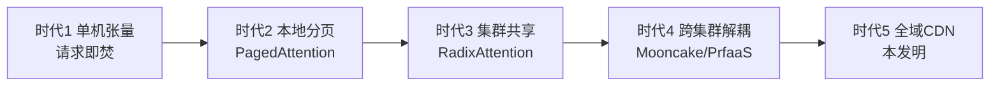
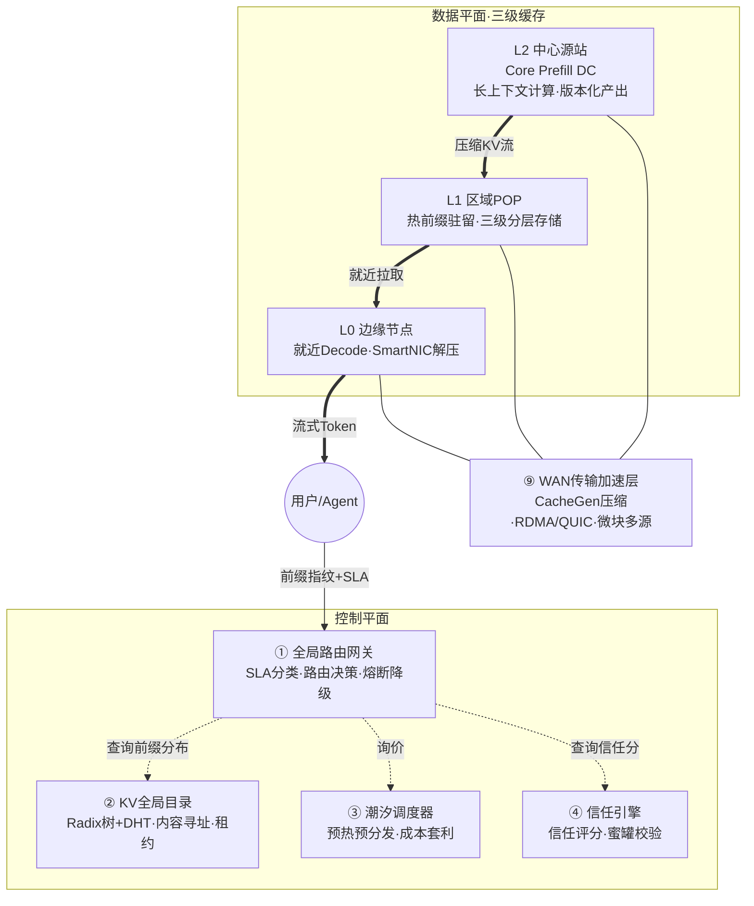
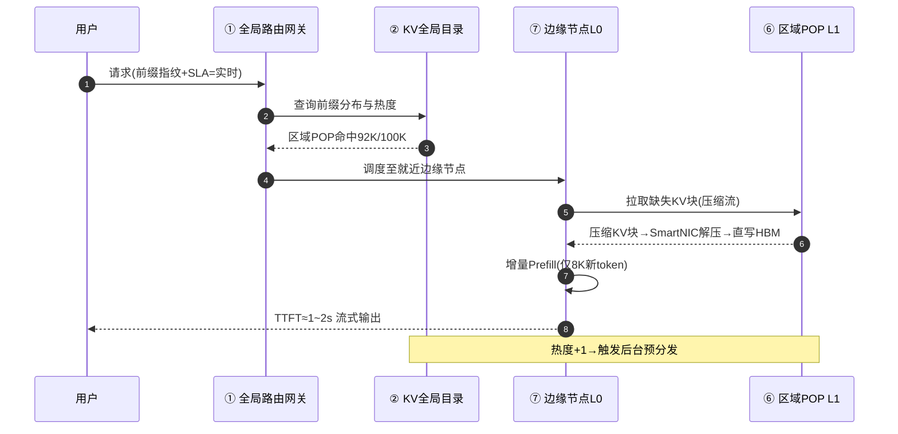
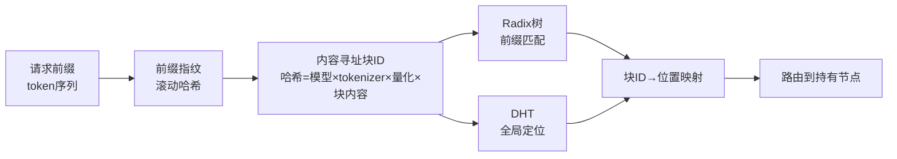
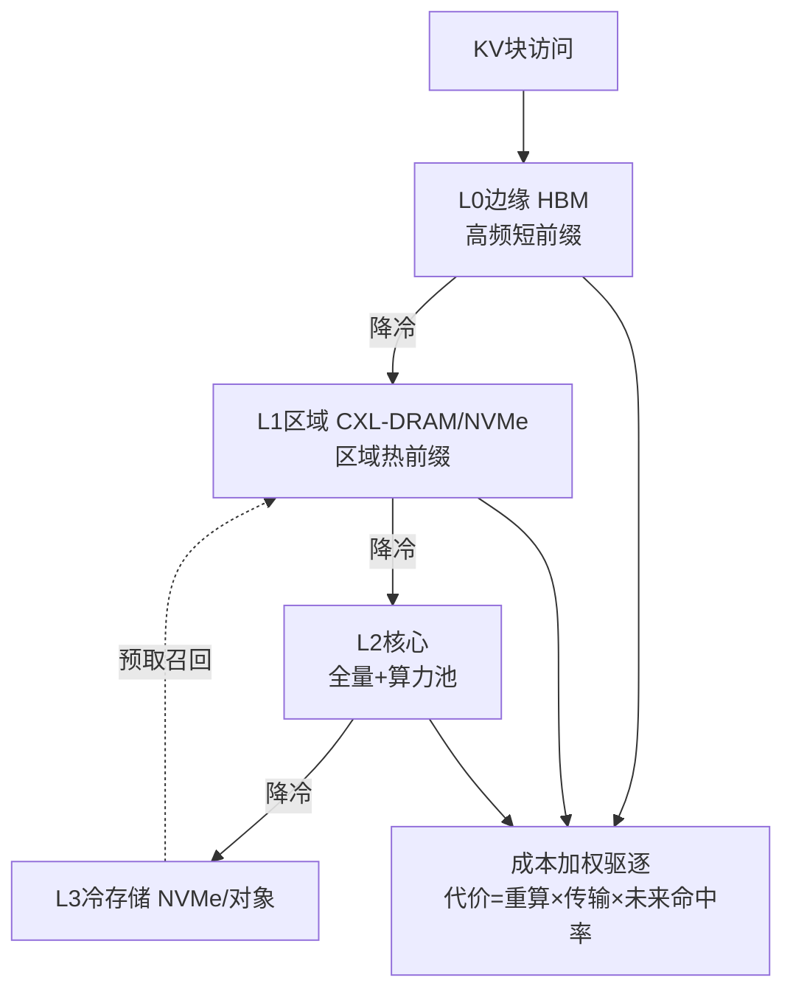
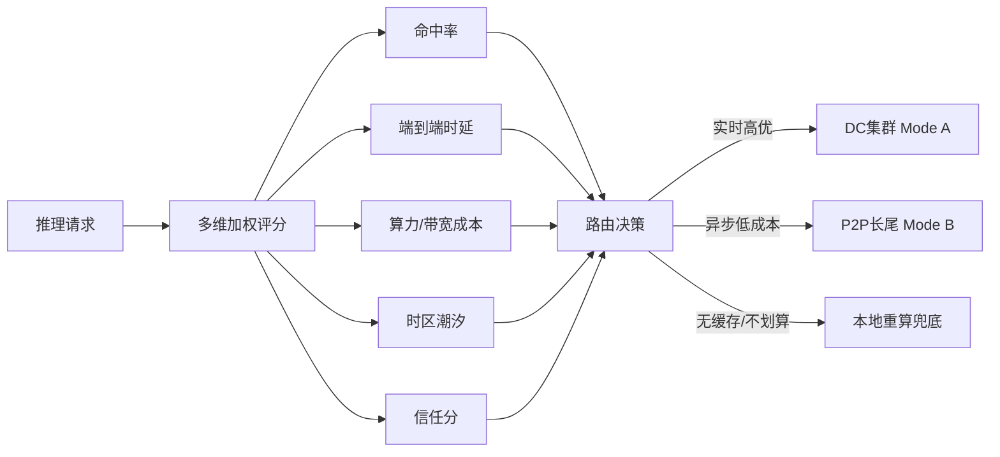
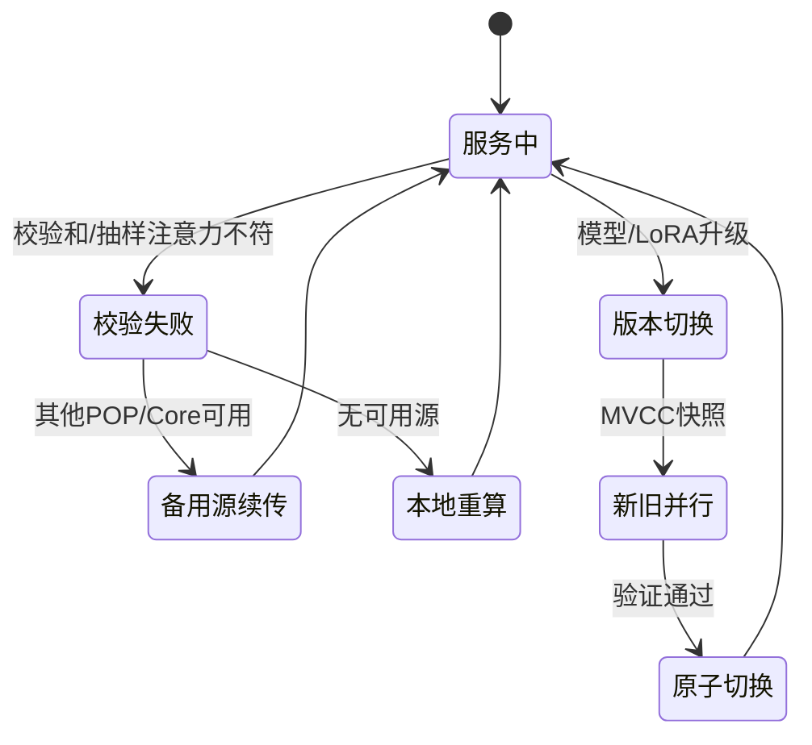

<!--
  KV Cache CDN · 专利IDEA评审材料（Markdown 版）
  · 每页以 PAGE BREAK 注释分隔，复制到PPT时按页拆分
  · 单页文字 ≤150字（图表除外）
  · 整页配图页采用左图右文：HTML 两列表格模拟
  · 图表统一使用 Mermaid 语法
-->

<!-- ═══════════════ 封面页 ═══════════════ -->

# KV Cache CDN

**专利IDEA评审材料**

> 面向大模型推理中 KV Cache 显存占用大、跨请求不可复用、首Token延迟高的难题，以 CDN 分层缓存+内容寻址思想，构建跨请求共享、就近分发的 KV Cache 内容分发网络。

<!-- PAGE BREAK -->

<!-- ═══════════════ Part 1：发明背景和现有技术（3页） ═══════════════ -->

## Part 1：发明背景和现有技术

### P1-1 问题领域宏观背景

大模型推理中，KV Cache 占显存巨大且按请求隔离，跨请求、跨用户无法复用：重复 Prefill 造成 30–70% 算力浪费，KV 相关开销占推理总成本 50%+；同时显存墙突出、首Token延迟大，推理服务商承担沉重算力成本，亟需将 KV Cache 从推理实例解耦并实现共享与就近分发。

<!-- PAGE BREAK -->

### P1-2 现有技术对比与缺陷

| 现有技术 | 出处/技术路线 | 核心机制 | 具体缺陷与不足 |
|---|---|---|---|
| PagedAttention / vLLM | SOSP'23 | OS分页思想管理KV块，消除显存碎片 | 仅单GPU/单节点，跨节点无法共享复用 |
| SGLang / RadixAttention | 2023 | 基数树组织KV，跨请求前缀复用 | 严格限定单RDMA域，无法跨集群/跨地域 |
| Mooncake 集群KV池 | FAST'25 | 集群级VRAM/DRAM/SSD三级分层调度 | 单向卸载为主，缺多级缓存与全域分发 |

上述方案复用范围均止步于单集群或单向卸载，未形成跨地域、就近服务的分发网络——这正是本发明的必要性所在。

<!-- PAGE BREAK -->

### P1-3 技术演进趋势

<table>
<tr>
<td width="55%" valign="top">

</td>
<td width="45%" valign="top">

1. 演进驱动力：上下文爆炸、算力异构、地理分布三重推动
2. 各代局限：共享范围逐代扩大，但均止步单集群或单向卸载
3. 本发明位置：时代5，补齐多级缓存+全域分发+就近服务

</td>
</tr>
</table>

<!-- PAGE BREAK -->

<!-- ═══════════════ Part 2：本发明技术方案（6页，核心） ═══════════════ -->

## Part 2：本发明技术方案

### P2-1 总体逻辑架构（逻辑架构图）

<table>
<tr>
<td width="55%" valign="top">

</td>
<td width="45%" valign="top">

1. 控制平面：路由网关、KV目录、潮汐调度、信任引擎，负责路由与缓存准入
2. 数据平面：L2中心源站（重算力）、L1区域POP（热前缀）、L0边缘（就近解码）三级
3. WAN传输层：CacheGen压缩+RDMA/QUIC双模，承载全部KV数据流

</td>
</tr>
</table>

<!-- PAGE BREAK -->

### P2-2 关键业务流程时序（时序图）

<table>
<tr>
<td width="55%" valign="top">

</td>
<td width="45%" valign="top">

1. 触发：用户提交带前缀指纹与SLA标签的推理请求
2. 关键路径：网关查目录→命中→调度就近边缘→区域POP拉缺失KV块→增量Prefill
3. 回退：未命中或链路失败时，网关降级至本地重算Prefill

</td>
</tr>
</table>

<!-- PAGE BREAK -->

### P2-3 内容寻址与全局目录

<table>
<tr>
<td width="55%" valign="top">

</td>
<td width="45%" valign="top">

1. 输入：请求前缀token序列
2. 核心：块ID=哈希(模型版本、tokenizer、量化方式、块内容)，与位置解耦
3. 输出：Radix树前缀匹配+DHT全局定位，得块→位置映射并路由

</td>
</tr>
</table>

<!-- PAGE BREAK -->

### P2-4 分层存储与成本加权驱逐

<table>
<tr>
<td width="55%" valign="top">

</td>
<td width="45%" valign="top">

1. 四级存储：HBM(边缘热)→CXL-DRAM(区域)→核心全量→NVMe冷层
2. 成本加权驱逐：代价=重算成本×传输成本×未来命中率，越上层越偏重算
3. 预取：冷层按热度预取召回至区域层，减少回源

</td>
</tr>
</table>

<!-- PAGE BREAK -->

### P2-5 潮汐调度与多维路由决策

<table>
<tr>
<td width="55%" valign="top">

</td>
<td width="45%" valign="top">

1. 输入：请求SLA标签（实时/异步）与多维特征
2. 决策：按命中率、时延、成本、潮汐、信任五维加权，取端到端最优而非命中率最优
3. 三出口：DC高速拉取 / P2P就地Decode / 本地重算兜底

</td>
</tr>
</table>

<!-- PAGE BREAK -->

### P2-6 容错与一致性管理

<table>
<tr>
<td width="55%" valign="top">

</td>
<td width="45%" valign="top">

1. 校验：块级校验和+抽样注意力验证，失败即标记块不可用
2. 回退：优先重路由备用源续传，否则仅对缺失段本地重算（已收块不重算）
3. 版本：MVCC快照，新旧并行服务，验证通过后原子切换

</td>
</tr>
</table>

<!-- PAGE BREAK -->

<!-- ═══════════════ Part 3：本发明的技术保护点（2页） ═══════════════ -->

## Part 3：本发明的技术保护点

### 保护点1：分层KV缓存网络与内容寻址目录

1. **技术特征**：KV Cache解耦为边缘/区域/中心/冷存四级，按内容哈希（模型·分词器·量化·块）寻址
2. **创新点**：CDN分层+内容寻址首次用于KV，缓存对象为模型绑定张量
3. **外部表现**：统一KV拉取接口，可观测命中不同层级缓存节点
4. **取证手段**：抓包见内容寻址块ID与层间KV流

<!-- PAGE BREAK -->

### 保护点2：前缀指纹多维加权路由与热度准入预分发

1. **技术特征**：前缀指纹+五维加权就近调度，达标者预分发
2. **创新点**：路由由地理位置变为多目标加权，先观察后准入
3. **外部表现**：同一请求随时段调度不同节点，边缘预置热前缀
4. **取证手段**：抓包见路由决策与预分发指令

**差异性总结**：最大差别——KV由单集群内存管理升级为跨地域内容寻址分发的CDN资产

<!-- PAGE BREAK -->

<!-- ═══════════════ Part 4：本发明的技术效果（1页） ═══════════════ -->

## Part 4：本发明的技术效果

### 问题 → 方案 → 效果 闭环

| 现有技术问题（Part1） | 对应技术方案（Part2） | 产生的技术效果 | 量化指标 |
|---|---|---|---|
| KV按请求隔离、跨请求无法复用，重复Prefill浪费 | 内容寻址目录+分层缓存网络 | 跨请求/跨用户共享同一前缀KV | 前缀复用率30–70%，Prefill算力节省30–70% |
| 显存占用巨大、显存墙 | 分层存储L0–L3+成本加权驱逐 | 热数据驻留边缘，冷数据下沉NVMe | 单请求TB级KV仍可服务，存储成本降低 |
| 首Token延迟大 | 就近边缘Decode+压缩流式传输 | 拉取命中KV替代本地重算 | TTFT降2.2~3.3倍；P90 TTFT −64% |
| 服务商算力成本沉重 | 潮汐调度+成本套利+双模Prefill | 闲置/低价算力承接，全局TCO优化 | 推理总成本TCO降30–45% |

**因果机制**：
- 复用：内容寻址使块ID与位置解耦，相同前缀在不同请求映射同一块ID，一次Prefill多次消费
- 显存：分层存储按热度放置，成本加权驱逐优先释放重算贵的块，冷数据廉价持久化
- 延迟：边缘就近解码，RTT从100ms级降至10ms级，TTFT由本地重算10s降为拉取约1s
- 成本：潮汐调度把Prefill放至夜间闲置/低价算力区，叠加跨模型复用，故TCO下降

<!-- PAGE BREAK -->

<!-- ═══════════════ Part 5：本发明的有益效果（1页） ═══════════════ -->

## Part 5：本发明的有益效果

| 视角 | 正向收益 | 量化预期 |
|---|---|---|
| 🧑 C端用户 | 首Token延迟降低、长上下文对话更流畅、多轮Agent响应更快 | 首Token延迟降50–90%（P90 TTFT −64%），长会话每token延迟降约90ms |
| 🏢 企业用户/服务提供商 | 推理算力成本下降、吞吐提升、跨区域服务能力增强 | 推理TCO降30–45%，吞吐+54%，同硬件多处理115%请求 |
| 🔧 设备提供商 | SmartNIC/DPU传输卸载、CXL内存池、Prefill专用芯片新需求 | 开辟KV分发新市场，拉动DPU/内存池/专用芯片出货 |
